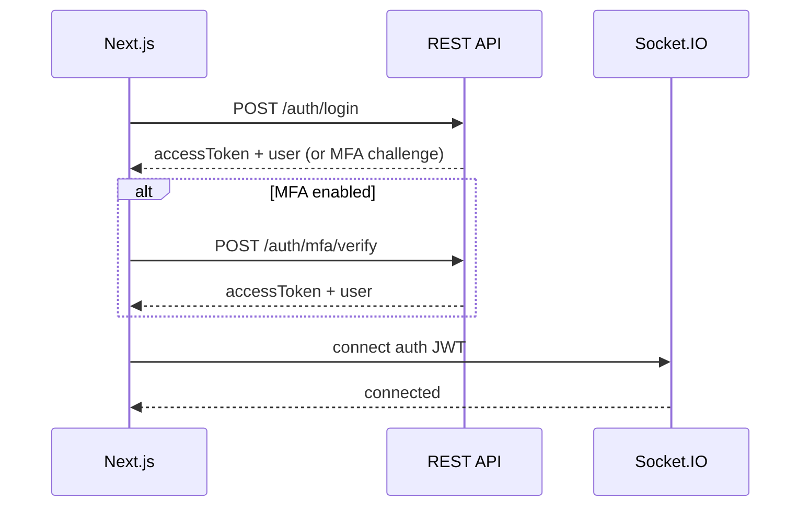
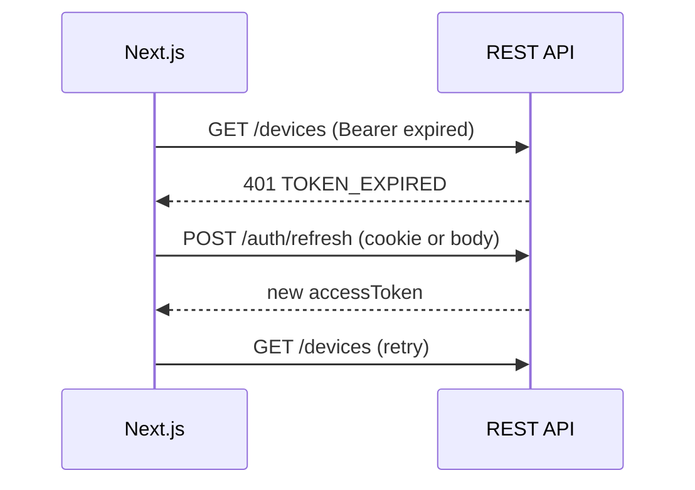
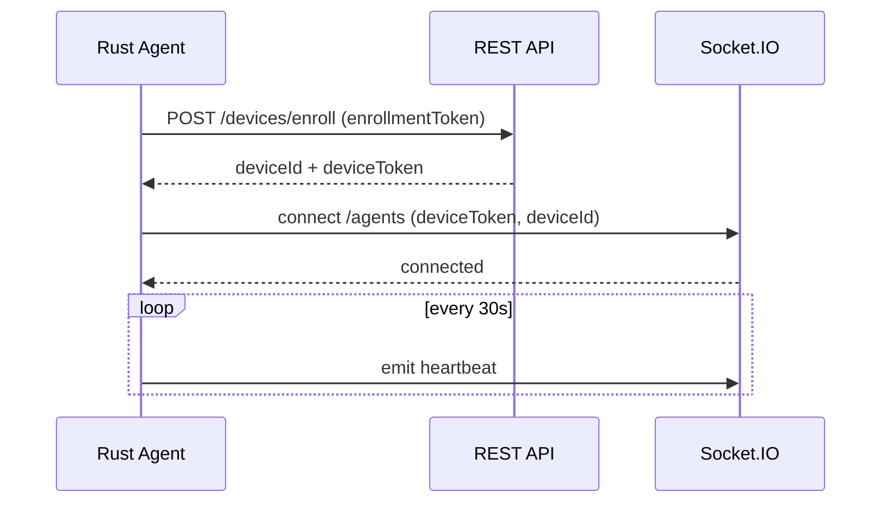

# API Specification

## remoteHask — REST + WebSocket Contracts

| Field | Value |
|-------|-------|
| **Document Version** | 1.0 |
| **Status** | API Baseline |
| **Base API Version** | `v1` |
| **Companion** | [SYSTEM_ARCHITECTURE.md](./SYSTEM_ARCHITECTURE.md), [DATABASE_SCHEMA.md](./DATABASE_SCHEMA.md), [CODING_STANDARDS.md](./CODING_STANDARDS.md) |
| **Last Updated** | 2026-05-20 |

---

## Table of Contents

1. [Overview](#1-overview)
2. [Transport and URLs](#2-transport-and-urls)
3. [Standard Response Envelope](#3-standard-response-envelope)
4. [Error Handling](#4-error-handling)
5. [Pagination](#5-pagination)
6. [Authentication and Authorization](#6-authentication-and-authorization)
7. [Shared DTOs and Enums](#7-shared-dtos-and-enums)
8. [REST API — Auth](#8-rest-api--auth)
9. [REST API — Organizations](#9-rest-api--organizations)
10. [REST API — Members and Invitations](#10-rest-api--members-and-invitations)
11. [REST API — Groups](#11-rest-api--groups)
12. [REST API — Devices](#12-rest-api--devices)
13. [REST API — Device Registration](#13-rest-api--device-registration)
14. [REST API — Remote Sessions](#14-rest-api--remote-sessions)
15. [REST API — Policies](#15-rest-api--policies)
16. [REST API — Audit](#16-rest-api--audit)
17. [REST API — File Transfers](#17-rest-api--file-transfers)
18. [REST API — Agent Releases](#18-rest-api--agent-releases)
19. [REST API — Webhooks](#19-rest-api--webhooks)
20. [REST API — Health](#20-rest-api--health)
21. [WebSocket API (Socket.IO)](#21-websocket-api-socketio)
22. [OpenAPI, Swagger, and Scalar](#22-openapi-swagger-and-scalar)
23. [Appendices](#23-appendices)

---

## 1. Overview

The **Next.js console** and **NestJS API** are fully decoupled. The frontend consumes this contract only — no server-side coupling to Next.js.

| Concern | REST (HTTPS) | WebSocket (Socket.IO) |
|---------|--------------|------------------------|
| CRUD, auth, policies | ✅ | — |
| Live presence, signaling, session control | — | ✅ |
| Desktop media (WebRTC) | TURN creds via REST; media peer-to-peer | Signaling events |

**Design standards:**

- JSON payloads, `Content-Type: application/json`
- Property names: **camelCase**
- Timestamps: **ISO 8601 UTC** (`2026-05-20T14:32:11.123Z`)
- IDs: **UUID v4** strings
- Versioning: URL prefix `/api/v1`
- Idempotency: `Idempotency-Key` header on `POST` where noted

---

## 2. Transport and URLs

| Environment | REST base | WebSocket base |
|-------------|-----------|----------------|
| Production | `https://api.remotehask.example/api/v1` | `wss://ws.remotehask.example` |
| Staging | `https://api.staging.remotehask.example/api/v1` | `wss://ws.staging.remotehask.example` |
| Local | `http://localhost:4000/api/v1` | `ws://localhost:4001` |

### 2.1 Required Headers (REST)

| Header | Required | Description |
|--------|----------|-------------|
| `Authorization` | Yes* | `Bearer <accessToken>` |
| `Content-Type` | Yes (body) | `application/json` |
| `X-Organization-Id` | Conditional | Required when user belongs to multiple orgs |
| `X-Request-Id` | Recommended | Client correlation; echoed as `meta.requestId` |
| `Idempotency-Key` | Optional | UUID; duplicate `POST` returns same result within 24h |

\* Except public auth and agent enrollment endpoints.

### 2.2 CORS

API allows origins configured per environment. Console origin must be whitelisted. Credentials mode supported for httpOnly refresh cookie variant.

---

## 3. Standard Response Envelope

All REST responses use HTTP status codes plus a **consistent JSON body**.

### 3.1 Success Envelope

```json
{
  "success": true,
  "data": {},
  "meta": {
    "requestId": "req_01HY8XK2ZQ3M4V9N2P7W6R5T4S",
    "timestamp": "2026-05-20T14:32:11.123Z"
  }
}
```

| Field | Type | Description |
|-------|------|-------------|
| `success` | boolean | Always `true` |
| `data` | object \| array \| null | Payload |
| `meta` | object | Request metadata (pagination nested here when applicable) |

### 3.2 List Envelope (Paginated)

```json
{
  "success": true,
  "data": {
    "items": []
  },
  "meta": {
    "requestId": "req_01HY8XK2ZQ3M4V9N2P7W6R5T4S",
    "timestamp": "2026-05-20T14:32:11.123Z",
    "pagination": {
      "limit": 50,
      "cursor": "eyJpZCI6Li4uLCJzIjoiMjAyNi0wNS0yMFQxNDozMjoxMS4xMjNaIn0=",
      "nextCursor": "eyJ...",
      "hasMore": true,
      "totalCount": null
    }
  }
}
```

### 3.3 Error Envelope

```json
{
  "success": false,
  "data": null,
  "error": {
    "code": "VALIDATION_FAILED",
    "message": "Request validation failed",
    "details": [
      {
        "field": "email",
        "code": "INVALID_FORMAT",
        "message": "Must be a valid email address"
      }
    ],
    "traceId": "trace_01HY8XK2ZQ3M4V9N2P7W6R5T4S"
  },
  "meta": {
    "requestId": "req_01HY8XK2ZQ3M4V9N2P7W6R5T4S",
    "timestamp": "2026-05-20T14:32:11.123Z"
  }
}
```

---

## 4. Error Handling

### 4.1 HTTP Status Mapping

| HTTP | When | `error.code` prefix |
|------|------|---------------------|
| 400 | Malformed JSON, invalid UUID | `BAD_REQUEST` |
| 401 | Missing/invalid token | `UNAUTHORIZED` |
| 403 | Valid token, insufficient permission | `FORBIDDEN` |
| 404 | Resource not found (or hidden) | `NOT_FOUND` |
| 409 | Conflict (duplicate, active session) | `CONFLICT` |
| 422 | Validation failed | `VALIDATION_FAILED` |
| 429 | Rate limited | `RATE_LIMITED` |
| 500 | Unexpected server error | `INTERNAL_ERROR` |
| 503 | Maintenance / dependency down | `SERVICE_UNAVAILABLE` |

### 4.2 Standard Error Codes

| Code | HTTP | Description |
|------|------|-------------|
| `UNAUTHORIZED` | 401 | Token missing or invalid |
| `TOKEN_EXPIRED` | 401 | Access token expired |
| `MFA_REQUIRED` | 403 | Step-up MFA needed |
| `FORBIDDEN` | 403 | RBAC denial |
| `ORG_ACCESS_DENIED` | 403 | Not member of org |
| `NOT_FOUND` | 404 | Generic not found |
| `DEVICE_NOT_FOUND` | 404 | Device ID invalid or out of scope |
| `DEVICE_OFFLINE` | 409 | Session start while offline |
| `SESSION_ALREADY_ACTIVE` | 409 | Device has active session |
| `VALIDATION_FAILED` | 422 | Field validation |
| `RATE_LIMITED` | 429 | Too many requests |
| `POLICY_DENIED` | 403 | Policy engine rejection |
| `INTERNAL_ERROR` | 500 | Unhandled exception |

### 4.3 Sample Error Response (422)

```json
{
  "success": false,
  "data": null,
  "error": {
    "code": "VALIDATION_FAILED",
    "message": "Request validation failed",
    "details": [
      {
        "field": "type",
        "code": "INVALID_ENUM",
        "message": "type must be one of: attended, unattended"
      }
    ],
    "traceId": "trace_01HY8XK2ZQ3M4V9N2P7W6R5T4S"
  },
  "meta": {
    "requestId": "req_abc",
    "timestamp": "2026-05-20T14:32:11.123Z"
  }
}
```

### 4.4 Frontend Error Handling

| Rule | Implementation |
|------|----------------|
| Always read `error.code`, not HTTP text | Map to user-friendly copy in i18n layer |
| On `401` + `TOKEN_EXPIRED` | Call refresh flow once; retry original request |
| On `403` + `MFA_REQUIRED` | Redirect to MFA step-up modal |
| On `429` | Exponential backoff; show `Retry-After` if present |
| Log `traceId` in support bundles | Attach to bug reports |

---

## 5. Pagination

**Strategy:** Keyset (cursor) pagination — not offset-based.

### 5.1 Query Parameters

| Param | Type | Default | Rules |
|-------|------|---------|-------|
| `limit` | integer | `50` | Min 1, max 100 |
| `cursor` | string | — | Opaque token from previous response |
| `sort` | string | varies | e.g. `-lastSeenAt` (minus = DESC) |

### 5.2 Cursor Format

Opaque base64url JSON (internal):

```json
{ "id": "uuid", "s": "2026-05-20T14:32:11.123Z" }
```

Clients **must not** parse cursors.

### 5.3 Frontend Integration

```text
1. First page: GET /devices?limit=50
2. Store meta.pagination.nextCursor
3. Next page: GET /devices?limit=50&cursor={nextCursor}
4. Stop when hasMore === false
```

Use infinite scroll or "Load more" — avoid offset pagination for device lists at scale.

---

## 6. Authentication and Authorization

### 6.1 Token Model

| Token | Lifetime | Storage (web) | Use |
|-------|----------|---------------|-----|
| **Access** | 15 min | Memory (preferred) or sessionStorage | `Authorization: Bearer` |
| **Refresh** | 7 days | httpOnly Secure cookie **or** secure storage | Refresh endpoint only |
| **Device** | Long-lived, rotatable | Agent keychain | Agent REST + `/agents` WS |
| **Enrollment** | 15 min, one-time | Admin UI → install script | Agent first registration |

### 6.2 JWT Access Token Claims

```json
{
  "sub": "user-uuid",
  "email": "tech@acme.com",
  "orgId": "org-uuid",
  "roles": ["technician"],
  "permissions": ["device:read", "session:create"],
  "mfa": true,
  "iat": 1716211200,
  "exp": 1716212100
}
```

### 6.3 Authentication Flow — User Login



### 6.4 Authentication Flow — Token Refresh



### 6.5 Authentication Flow — Agent Device



### 6.6 Authorization Rules

| Scope | Enforcement |
|-------|-------------|
| Organization | All tenant routes require membership; `X-Organization-Id` must match JWT `orgId` or allowed MSP scope |
| Device | Technician must have group access unless `admin`/`owner` |
| Session | `session:create` permission + device online (Redis) + policy |
| Audit | `auditor` role read-only |

---

## 7. Shared DTOs and Enums

### 7.1 Enum Strings (API)

Aligned with [DATABASE_SCHEMA.md](./DATABASE_SCHEMA.md):

| Enum | Values |
|------|--------|
| `OrganizationStatus` | `active`, `suspended`, `trial`, `churned` |
| `SubscriptionTier` | `starter`, `professional`, `enterprise`, `msp` |
| `SystemRole` | `owner`, `admin`, `device_manager`, `technician`, `viewer`, `auditor`, `msp_admin` |
| `DevicePlatform` | `windows`, `macos`, `linux`, `other` |
| `DeviceRegistrationStatus` | `pending`, `active`, `revoked`, `decommissioned` |
| `PresenceStatus` | `online`, `offline`, `stale`, `unknown` |
| `SessionStatus` | `requested`, `policy_denied`, `pending_agent`, `negotiating`, `active`, `ended`, `failed`, `cancelled` |
| `SessionType` | `attended`, `unattended` |
| `SessionEndReason` | `user_disconnect`, `technician_disconnect`, `agent_reject`, `policy_revoked`, `timeout`, `network_error`, `admin_terminate`, `error` |

### 7.2 Core DTOs

#### `UserDto`

| Field | Type | Notes |
|-------|------|-------|
| `id` | string (uuid) | |
| `email` | string | |
| `displayName` | string | |
| `avatarUrl` | string \| null | |
| `emailVerified` | boolean | |

#### `OrganizationDto`

| Field | Type | Notes |
|-------|------|-------|
| `id` | string | |
| `name` | string | |
| `slug` | string | |
| `status` | OrganizationStatus | |
| `tier` | SubscriptionTier | |
| `dataRegion` | string | |
| `parentOrganizationId` | string \| null | |

#### `DeviceDto`

| Field | Type | Notes |
|-------|------|-------|
| `id` | string | |
| `organizationId` | string | |
| `hostname` | string | |
| `friendlyName` | string \| null | |
| `platform` | DevicePlatform | |
| `osVersion` | string \| null | |
| `agentVersion` | string \| null | |
| `registrationStatus` | DeviceRegistrationStatus | |
| `presence` | PresenceStatus | From Redis-backed API |
| `lastSeenAt` | string \| null | ISO |
| `lastSeenIp` | string \| null | |
| `lastConsoleUser` | string \| null | |
| `unattendedEnabled` | boolean \| null | |
| `tags` | string[] | |
| `groupIds` | string[] | Optional embed |

#### `RemoteSessionDto`

| Field | Type | Notes |
|-------|------|-------|
| `id` | string | |
| `organizationId` | string | |
| `deviceId` | string | |
| `initiatedBy` | UserSummaryDto | |
| `device` | DeviceSummaryDto | |
| `type` | SessionType | |
| `status` | SessionStatus | |
| `endReason` | SessionEndReason \| null | |
| `requestedAt` | string | |
| `connectedAt` | string \| null | |
| `endedAt` | string \| null | |
| `webrtcTransport` | `p2p` \| `relay` \| null | |

#### `TurnCredentialsDto`

| Field | Type | Notes |
|-------|------|-------|
| `urls` | string[] | `stun:`, `turn:` |
| `username` | string | Time-scoped |
| `credential` | string | |
| `expiresAt` | string | ISO |

#### `SessionConnectionDto` (returned on session create)

| Field | Type | Notes |
|-------|------|-------|
| `session` | RemoteSessionDto | |
| `turn` | TurnCredentialsDto | |
| `socket` | object | See below |

```json
"socket": {
  "url": "wss://ws.remotehask.example",
  "namespace": "/console",
  "rooms": ["session:{sessionId}", "device:{deviceId}"]
}
```

---

## 8. REST API — Auth

---

### `POST /auth/login`

| | |
|--|--|
| **Purpose** | Authenticate user with email/password; initiate MFA if required |
| **Auth** | None (public) |

**Request payload**

```json
{
  "email": "tech@acme.com",
  "password": "••••••••"
}
```

**Validation rules**

| Field | Rules |
|-------|-------|
| `email` | Required, valid email, max 255 |
| `password` | Required, min 8, max 128 |

**Sample success (200) — MFA not required**

```json
{
  "success": true,
  "data": {
    "accessToken": "eyJhbGciOiJIUzI1NiIs...",
    "expiresIn": 900,
    "tokenType": "Bearer",
    "user": {
      "id": "a1b2c3d4-e5f6-7890-abcd-ef1234567890",
      "email": "tech@acme.com",
      "displayName": "Alex Tech",
      "avatarUrl": null,
      "emailVerified": true
    },
    "organizations": [
      {
        "id": "org-uuid",
        "name": "Acme Corp",
        "slug": "acme",
        "role": "technician"
      }
    ],
    "mfaRequired": false
  },
  "meta": { "requestId": "req_1", "timestamp": "2026-05-20T14:32:11.123Z" }
}
```

**Sample success (200) — MFA required**

```json
{
  "success": true,
  "data": {
    "mfaRequired": true,
    "mfaChallengeId": "mfa_challenge_uuid",
    "methods": ["totp", "webauthn"]
  },
  "meta": { "requestId": "req_1", "timestamp": "2026-05-20T14:32:11.123Z" }
}
```

**Sample error (401)**

```json
{
  "success": false,
  "data": null,
  "error": {
    "code": "UNAUTHORIZED",
    "message": "Invalid email or password",
    "details": [],
    "traceId": "trace_1"
  },
  "meta": { "requestId": "req_1", "timestamp": "2026-05-20T14:32:11.123Z" }
}
```

**Frontend integration notes**

- Store `accessToken` in memory; set default `Authorization` header on API client.
- If `mfaRequired`, route to `/login/mfa` with `mfaChallengeId`; do not persist partial auth as logged-in.
- If multiple `organizations`, show org picker; persist selection as `X-Organization-Id`.

---

### `POST /auth/mfa/verify`

| | |
|--|--|
| **Purpose** | Complete MFA challenge after login |
| **Auth** | None (uses `mfaChallengeId` + short-lived challenge token in body) |

**Request payload**

```json
{
  "mfaChallengeId": "mfa_challenge_uuid",
  "method": "totp",
  "code": "123456"
}
```

**Validation rules**

| Field | Rules |
|-------|-------|
| `mfaChallengeId` | Required, UUID |
| `method` | Required, `totp` \| `webauthn` |
| `code` | Required for `totp`, 6 digits |

**Sample success (200)** — Same shape as login success without MFA flag.

**Sample error (422)**

```json
{
  "success": false,
  "data": null,
  "error": {
    "code": "VALIDATION_FAILED",
    "message": "Invalid verification code",
    "details": [{ "field": "code", "code": "INVALID", "message": "Code expired or incorrect" }],
    "traceId": "trace_2"
  },
  "meta": { "requestId": "req_2", "timestamp": "2026-05-20T14:32:11.123Z" }
}
```

**Frontend integration notes**

- Rate-limit UI after 5 failures; display lockout message from `error.message`.

---

### `POST /auth/refresh`

| | |
|--|--|
| **Purpose** | Issue new access token using refresh token |
| **Auth** | Refresh token in httpOnly cookie **or** body |

**Request payload** (optional body if not cookie)

```json
{
  "refreshToken": "refresh_token_value"
}
```

**Validation rules**

| Field | Rules |
|-------|-------|
| `refreshToken` | Required if not sent as cookie |

**Sample success (200)**

```json
{
  "success": true,
  "data": {
    "accessToken": "eyJhbGciOiJIUzI1NiIs...",
    "expiresIn": 900,
    "tokenType": "Bearer"
  },
  "meta": { "requestId": "req_3", "timestamp": "2026-05-20T14:32:11.123Z" }
}
```

**Sample error (401)**

```json
{
  "success": false,
  "data": null,
  "error": {
    "code": "UNAUTHORIZED",
    "message": "Refresh token invalid or expired",
    "details": [],
    "traceId": "trace_3"
  },
  "meta": { "requestId": "req_3", "timestamp": "2026-05-20T14:32:11.123Z" }
}
```

**Frontend integration notes**

- Implement axios/fetch interceptor: on `401` + `TOKEN_EXPIRED`, serialize refresh to single flight (avoid thundering herd).
- After refresh, retry failed request once.

---

### `POST /auth/logout`

| | |
|--|--|
| **Purpose** | Revoke refresh token and invalidate session |
| **Auth** | Bearer access token |

**Request payload**

```json
{
  "allDevices": false
}
```

**Validation rules**

| Field | Rules |
|-------|-------|
| `allDevices` | Optional boolean, default false |

**Sample success (200)**

```json
{
  "success": true,
  "data": { "loggedOut": true },
  "meta": { "requestId": "req_4", "timestamp": "2026-05-20T14:32:11.123Z" }
}
```

**Sample error (401)** — Standard `UNAUTHORIZED`.

**Frontend integration notes**

- Clear access token from memory; disconnect Socket.IO; redirect to `/login`.
- Call even if access token expired (send refresh cookie only).

---

### `GET /auth/me`

| | |
|--|--|
| **Purpose** | Current user profile and org memberships |
| **Auth** | Bearer |

**Request payload** — None

**Validation rules** — N/A

**Sample success (200)**

```json
{
  "success": true,
  "data": {
    "user": {
      "id": "user-uuid",
      "email": "tech@acme.com",
      "displayName": "Alex Tech",
      "avatarUrl": null,
      "emailVerified": true
    },
    "organizations": [
      {
        "id": "org-uuid",
        "name": "Acme Corp",
        "slug": "acme",
        "role": "technician",
        "status": "active"
      }
    ],
    "currentOrganizationId": "org-uuid"
  },
  "meta": { "requestId": "req_5", "timestamp": "2026-05-20T14:32:11.123Z" }
}
```

**Sample error (401)** — Standard `UNAUTHORIZED`.

**Frontend integration notes**

- Call on app boot to hydrate auth store before rendering dashboard.
- Sync `currentOrganizationId` with `X-Organization-Id` header.

---

## 9. REST API — Organizations

---

### `GET /organizations/current`

| | |
|--|--|
| **Purpose** | Fetch organization details for `X-Organization-Id` |
| **Auth** | Bearer + org header |

**Request payload** — None

**Validation rules**

| Header | Rules |
|--------|-------|
| `X-Organization-Id` | Required UUID; user must be member |

**Sample success (200)**

```json
{
  "success": true,
  "data": {
    "organization": {
      "id": "org-uuid",
      "name": "Acme Corp",
      "slug": "acme",
      "status": "active",
      "tier": "professional",
      "dataRegion": "us-east",
      "parentOrganizationId": null
    },
    "settings": {
      "unattendedEnabled": true,
      "mfaRequired": true,
      "sessionRecordingAllowed": false,
      "maxConcurrentSessions": 50,
      "fileTransferMaxBytes": 5368709120,
      "e2eeRequired": false
    }
  },
  "meta": { "requestId": "req_10", "timestamp": "2026-05-20T14:32:11.123Z" }
}
```

**Sample error (403)**

```json
{
  "success": false,
  "data": null,
  "error": {
    "code": "ORG_ACCESS_DENIED",
    "message": "You are not a member of this organization",
    "details": [],
    "traceId": "trace_10"
  },
  "meta": { "requestId": "req_10", "timestamp": "2026-05-20T14:32:11.123Z" }
}
```

**Frontend integration notes**

- Cache in React Query with key `['org', orgId]`; invalidate on settings update.

---

### `PATCH /organizations/current`

| | |
|--|--|
| **Purpose** | Update organization name/slug (admin+) |
| **Auth** | Bearer; roles: `owner`, `admin` |

**Request payload**

```json
{
  "name": "Acme Corporation",
  "slug": "acme-corp"
}
```

**Validation rules**

| Field | Rules |
|-------|-------|
| `name` | Optional, 1–255 chars |
| `slug` | Optional, 3–63, lowercase alphanumeric + hyphen |

**Sample success (200)** — Returns updated `OrganizationDto`.

**Sample error (409)**

```json
{
  "success": false,
  "data": null,
  "error": {
    "code": "CONFLICT",
    "message": "Slug already in use",
    "details": [{ "field": "slug", "code": "DUPLICATE", "message": "Slug must be unique" }],
    "traceId": "trace_11"
  },
  "meta": { "requestId": "req_11", "timestamp": "2026-05-20T14:32:11.123Z" }
}
```

**Frontend integration notes**

- Optimistic UI disabled for slug changes; wait for server confirmation.

---

### `PATCH /organizations/current/settings`

| | |
|--|--|
| **Purpose** | Update org security and session settings |
| **Auth** | Bearer; roles: `owner`, `admin` |

**Request payload**

```json
{
  "unattendedEnabled": true,
  "mfaRequired": true,
  "maxConcurrentSessions": 25,
  "retentionAuditDays": 365
}
```

**Validation rules**

| Field | Rules |
|-------|-------|
| `maxConcurrentSessions` | Integer 1–500 |
| `fileTransferMaxBytes` | Integer ≥ 0 |
| `retentionAuditDays` | Integer 30–2555 |

**Sample success (200)** — Returns full settings object.

**Sample error (403)** — `FORBIDDEN` if role insufficient.

**Frontend integration notes**

- Show confirmation modal when enabling `unattendedEnabled`.

---

## 10. REST API — Members and Invitations

---

### `GET /organizations/current/members`

| | |
|--|--|
| **Purpose** | List organization members (paginated) |
| **Auth** | Bearer; roles: `admin`, `owner`, `auditor` (read) |

**Query:** `limit`, `cursor`, `sort=name`

**Request payload** — None

**Validation rules**

| Param | Rules |
|-------|-------|
| `limit` | 1–100 |

**Sample success (200)**

```json
{
  "success": true,
  "data": {
    "items": [
      {
        "id": "member-uuid",
        "userId": "user-uuid",
        "email": "tech@acme.com",
        "displayName": "Alex Tech",
        "role": "technician",
        "status": "active",
        "lastActiveAt": "2026-05-20T12:00:00.000Z"
      }
    ]
  },
  "meta": {
    "requestId": "req_20",
    "timestamp": "2026-05-20T14:32:11.123Z",
    "pagination": { "limit": 50, "cursor": null, "nextCursor": null, "hasMore": false, "totalCount": 12 }
  }
}
```

**Sample error (403)** — `FORBIDDEN`.

**Frontend integration notes**

- Table with cursor-based "Load more".

---

### `POST /organizations/current/members/invitations`

| | |
|--|--|
| **Purpose** | Invite user by email |
| **Auth** | Bearer; roles: `admin`, `owner` |

**Request payload**

```json
{
  "email": "newuser@acme.com",
  "role": "technician"
}
```

**Validation rules**

| Field | Rules |
|-------|-------|
| `email` | Required, valid email |
| `role` | Required, valid SystemRole (not `owner` via invite) |

**Sample success (201)**

```json
{
  "success": true,
  "data": {
    "invitation": {
      "id": "invite-uuid",
      "email": "newuser@acme.com",
      "role": "technician",
      "status": "pending",
      "expiresAt": "2026-05-27T14:32:11.123Z"
    }
  },
  "meta": { "requestId": "req_21", "timestamp": "2026-05-20T14:32:11.123Z" }
}
```

**Sample error (409)** — Email already member.

**Frontend integration notes**

- Copy invite link from separate endpoint if added; show pending state in members table.

---

### `PATCH /organizations/current/members/{memberId}`

| | |
|--|--|
| **Purpose** | Change member role or status |
| **Auth** | Bearer; roles: `admin`, `owner` |

**Request payload**

```json
{
  "role": "device_manager",
  "status": "active"
}
```

**Validation rules**

| Field | Rules |
|-------|-------|
| `role` | Optional valid SystemRole |
| `status` | Optional `active` \| `suspended` |

**Sample success (200)** — Updated member object.

**Sample error (403)** — Cannot demote last `owner`.

**Frontend integration notes**

- Prevent self-demotion from `owner` without transfer flow.

---

## 11. REST API — Groups

---

### `GET /organizations/current/groups`

| | |
|--|--|
| **Purpose** | List device/user groups |
| **Auth** | Bearer + org membership |

**Sample success (200)** — Paginated `GroupDto` items: `id`, `name`, `description`, `deviceCount`, `memberCount`.

**Sample error (401)** — Standard.

**Frontend integration notes**

- Used for filter dropdowns on device list.

---

### `POST /organizations/current/groups`

| | |
|--|--|
| **Purpose** | Create group |
| **Auth** | Bearer; roles: `admin`, `device_manager` |

**Request payload**

```json
{
  "name": "Support Tier 1",
  "description": "Help desk devices"
}
```

**Validation rules**

| Field | Rules |
|-------|-------|
| `name` | Required, 1–255, unique per org |

**Sample success (201)** — `GroupDto`.

**Sample error (409)** — Duplicate name.

**Frontend integration notes**

- Invalidate `['groups', orgId]` query cache.

---

### `PUT /organizations/current/groups/{groupId}/devices`

| | |
|--|--|
| **Purpose** | Replace device assignments for a group |
| **Auth** | Bearer; roles: `admin`, `device_manager` |

**Request payload**

```json
{
  "deviceIds": ["device-uuid-1", "device-uuid-2"]
}
```

**Validation rules**

| Field | Rules |
|-------|-------|
| `deviceIds` | Array of UUIDs, max 5000, all in org |

**Sample success (200)**

```json
{
  "success": true,
  "data": { "groupId": "group-uuid", "deviceIds": ["device-uuid-1", "device-uuid-2"], "assigned": 2 },
  "meta": { "requestId": "req_30", "timestamp": "2026-05-20T14:32:11.123Z" }
}
```

**Sample error (422)** — Invalid device ID.

**Frontend integration notes**

- Bulk assign from device table selection → call this endpoint.

---

## 12. REST API — Devices

---

### `GET /organizations/current/devices`

| | |
|--|--|
| **Purpose** | Search and list devices with presence |
| **Auth** | Bearer + org |

**Query parameters**

| Param | Type | Description |
|-------|------|-------------|
| `limit`, `cursor` | pagination | |
| `presence` | enum | Filter `online`, `offline`, `stale` |
| `platform` | enum | OS filter |
| `tag` | string | Single tag filter |
| `groupId` | uuid | Devices in group |
| `q` | string | Search hostname/friendlyName (min 2 chars) |
| `sort` | string | Default `-lastSeenAt` |

**Request payload** — None

**Validation rules**

| Param | Rules |
|-------|-------|
| `q` | Min 2, max 100 chars when provided |

**Sample success (200)**

```json
{
  "success": true,
  "data": {
    "items": [
      {
        "id": "device-uuid",
        "organizationId": "org-uuid",
        "hostname": "WORKSTATION-42",
        "friendlyName": "Alice Laptop",
        "platform": "windows",
        "osVersion": "11 23H2",
        "agentVersion": "1.2.0",
        "registrationStatus": "active",
        "presence": "online",
        "lastSeenAt": "2026-05-20T14:31:00.000Z",
        "lastSeenIp": "203.0.113.10",
        "lastConsoleUser": "alice",
        "unattendedEnabled": true,
        "tags": ["finance", "hq"]
      }
    ]
  },
  "meta": {
    "requestId": "req_40",
    "timestamp": "2026-05-20T14:32:11.123Z",
    "pagination": { "limit": 50, "cursor": null, "nextCursor": "eyJ...", "hasMore": true, "totalCount": null }
  }
}
```

**Sample error (422)** — Invalid enum in query.

**Frontend integration notes**

- Subscribe to Socket `device:presence` for live updates; merge into list cache by `device.id`.
- Show stale badge when `presence === 'stale'`.

---

### `GET /organizations/current/devices/{deviceId}`

| | |
|--|--|
| **Purpose** | Device detail with groups, policy override, recent sessions |
| **Auth** | Bearer; device scope |

**Sample success (200)**

```json
{
  "success": true,
  "data": {
    "device": { },
    "groups": [{ "id": "group-uuid", "name": "Support Tier 1" }],
    "policyOverride": null,
    "recentSessions": [
      {
        "id": "session-uuid",
        "status": "ended",
        "type": "unattended",
        "requestedAt": "2026-05-20T10:00:00.000Z",
        "endedAt": "2026-05-20T10:45:00.000Z"
      }
    ]
  },
  "meta": { "requestId": "req_41", "timestamp": "2026-05-20T14:32:11.123Z" }
}
```

**Sample error (404)**

```json
{
  "success": false,
  "data": null,
  "error": {
    "code": "DEVICE_NOT_FOUND",
    "message": "Device not found",
    "details": [],
    "traceId": "trace_41"
  },
  "meta": { "requestId": "req_41", "timestamp": "2026-05-20T14:32:11.123Z" }
}
```

**Frontend integration notes**

- Device detail page data source; join Socket room `device:{id}` only while page mounted.

---

### `PATCH /organizations/current/devices/{deviceId}`

| | |
|--|--|
| **Purpose** | Update friendly name, tags, unattended override, notes |
| **Auth** | Bearer; roles: `admin`, `device_manager` |

**Request payload**

```json
{
  "friendlyName": "Alice Laptop",
  "tags": ["finance", "hq"],
  "unattendedEnabled": false,
  "notes": "CFO workstation"
}
```

**Validation rules**

| Field | Rules |
|-------|-------|
| `tags` | Max 32 tags, each 1–64 chars |
| `unattendedEnabled` | boolean or null (inherit) |

**Sample success (200)** — Updated `DeviceDto`.

**Sample error (403)** — `FORBIDDEN`.

**Frontend integration notes**

- Debounce tag edits; send single PATCH.

---

### `DELETE /organizations/current/devices/{deviceId}`

| | |
|--|--|
| **Purpose** | Soft-delete device and revoke credentials |
| **Auth** | Bearer; roles: `admin`, `device_manager` |

**Request payload** — None

**Sample success (200)**

```json
{
  "success": true,
  "data": { "id": "device-uuid", "deleted": true },
  "meta": { "requestId": "req_42", "timestamp": "2026-05-20T14:32:11.123Z" }
}
```

**Sample error (409)** — Active session in progress.

**Frontend integration notes**

- Confirm modal; remove from list cache on success.

---

### `POST /organizations/current/devices/{deviceId}/revoke-credentials`

| | |
|--|--|
| **Purpose** | Immediately invalidate device token (force re-enroll) |
| **Auth** | Bearer; roles: `admin`, `device_manager` |

**Request payload**

```json
{
  "reason": "Security incident"
}
```

**Validation rules**

| Field | Rules |
|-------|-------|
| `reason` | Optional, max 500 chars |

**Sample success (200)**

```json
{
  "success": true,
  "data": { "deviceId": "device-uuid", "revokedAt": "2026-05-20T14:32:11.123Z" },
  "meta": { "requestId": "req_43", "timestamp": "2026-05-20T14:32:11.123Z" }
}
```

**Sample error (404)** — `DEVICE_NOT_FOUND`.

**Frontend integration notes**

- Agent will disconnect on next heartbeat failure; show "pending re-enrollment" state.

---

## 13. REST API — Device Registration

---

### `POST /organizations/current/devices/enrollment-tokens`

| | |
|--|--|
| **Purpose** | Generate one-time enrollment token for agent install (admin) |
| **Auth** | Bearer; roles: `admin`, `device_manager` |

**Request payload**

```json
{
  "label": "GPO rollout batch 1",
  "expiresInMinutes": 15,
  "maxUses": 100,
  "groupIds": ["group-uuid"],
  "defaultTags": ["windows", "hq"]
}
```

**Validation rules**

| Field | Rules |
|-------|-------|
| `expiresInMinutes` | 5–1440, default 15 |
| `maxUses` | 1–10000 |
| `groupIds` | Optional UUID array |

**Sample success (201)**

```json
{
  "success": true,
  "data": {
    "enrollmentToken": "enr_public_token_string",
    "tokenId": "token-uuid",
    "expiresAt": "2026-05-20T14:47:11.123Z",
    "installCommand": "msiexec /i RemoteHaskAgent.msi ENROLLMENT_TOKEN=enr_public_token_string"
  },
  "meta": { "requestId": "req_50", "timestamp": "2026-05-20T14:32:11.123Z" }
}
```

**Sample error (403)** — `FORBIDDEN`.

**Frontend integration notes**

- Display token once; copy-to-clipboard; do not store enrollment token in localStorage.

---

### `POST /devices/enroll`

| | |
|--|--|
| **Purpose** | Agent first-time registration (public agent endpoint) |
| **Auth** | Enrollment token in body (not Bearer) |

**Request payload**

```json
{
  "enrollmentToken": "enr_public_token_string",
  "hostname": "WORKSTATION-42",
  "platform": "windows",
  "osVersion": "11 23H2",
  "agentVersion": "1.2.0",
  "hardwareInfo": {
    "cpu": "Intel i7",
    "ramGb": 16,
    "displays": 2
  }
}
```

**Validation rules**

| Field | Rules |
|-------|-------|
| `enrollmentToken` | Required |
| `hostname` | Required, 1–255 |
| `platform` | Required enum |
| `agentVersion` | Required semver pattern |

**Sample success (201)**

```json
{
  "success": true,
  "data": {
    "deviceId": "device-uuid",
    "organizationId": "org-uuid",
    "deviceToken": "dev_secret_token_store_in_keychain",
    "deviceTokenExpiresAt": null,
    "wsUrl": "wss://ws.remotehask.example",
    "apiUrl": "https://api.remotehask.example/api/v1"
  },
  "meta": { "requestId": "req_51", "timestamp": "2026-05-20T14:32:11.123Z" }
}
```

**Sample error (410)**

```json
{
  "success": false,
  "data": null,
  "error": {
    "code": "ENROLLMENT_TOKEN_EXPIRED",
    "message": "Enrollment token has expired",
    "details": [],
    "traceId": "trace_51"
  },
  "meta": { "requestId": "req_51", "timestamp": "2026-05-20T14:32:11.123Z" }
}
```

**Frontend integration notes**

- Not used by Next.js — documented for agent developers. Admin UI only calls enrollment-token create.

---

### `POST /devices/heartbeat` (HTTP fallback)

| | |
|--|--|
| **Purpose** | Optional REST heartbeat when WebSocket unavailable |
| **Auth** | Device token + `X-Device-Id` |

**Request payload**

```json
{
  "agentVersion": "1.2.0",
  "osUser": "alice",
  "metrics": { "cpuPercent": 2.1, "memoryMb": 120 }
}
```

**Validation rules**

| Field | Rules |
|-------|-------|
| `agentVersion` | Required semver |

**Sample success (200)**

```json
{
  "success": true,
  "data": {
    "acknowledged": true,
    "nextHeartbeatSeconds": 30,
    "pendingCommands": []
  },
  "meta": { "requestId": "req_52", "timestamp": "2026-05-20T14:32:11.123Z" }
}
```

**Sample error (401)** — Invalid device token.

**Frontend integration notes**

- N/A for web console. Primary path is WebSocket `agent:heartbeat` (see [Section 21](#21-websocket-api-socketio)).

---

## 14. REST API — Remote Sessions

---

### `POST /organizations/current/sessions`

| | |
|--|--|
| **Purpose** | Request remote session; returns TURN creds and Socket rooms |
| **Auth** | Bearer; permission `session:create`; MFA step-up if policy requires |

**Headers:** `Idempotency-Key` recommended

**Request payload**

```json
{
  "deviceId": "device-uuid",
  "type": "attended",
  "mfaVerificationId": "mfa_verify_uuid"
}
```

**Validation rules**

| Field | Rules |
|-------|-------|
| `deviceId` | Required UUID, device in org |
| `type` | Required `attended` \| `unattended` |
| `mfaVerificationId` | Required if org policy requires MFA for session |

**Sample success (201)**

```json
{
  "success": true,
  "data": {
    "session": {
      "id": "session-uuid",
      "organizationId": "org-uuid",
      "deviceId": "device-uuid",
      "type": "attended",
      "status": "pending_agent",
      "requestedAt": "2026-05-20T14:32:11.123Z",
      "connectedAt": null,
      "endedAt": null
    },
    "turn": {
      "urls": ["stun:turn.remotehask.example:3478", "turn:turn.remotehask.example:3478"],
      "username": "1716212100:session-uuid",
      "credential": "base64hmac",
      "expiresAt": "2026-05-20T14:47:11.123Z"
    },
    "socket": {
      "url": "wss://ws.remotehask.example",
      "namespace": "/console",
      "rooms": ["session:session-uuid", "device:device-uuid"]
    }
  },
  "meta": { "requestId": "req_60", "timestamp": "2026-05-20T14:32:11.123Z" }
}
```

**Sample error (409) — device offline**

```json
{
  "success": false,
  "data": null,
  "error": {
    "code": "DEVICE_OFFLINE",
    "message": "Device is offline",
    "details": [{ "field": "deviceId", "code": "OFFLINE", "message": "Last seen 2 hours ago" }],
    "traceId": "trace_60"
  },
  "meta": { "requestId": "req_60", "timestamp": "2026-05-20T14:32:11.123Z" }
}
```

**Sample error (403) — policy**

```json
{
  "success": false,
  "data": null,
  "error": {
    "code": "POLICY_DENIED",
    "message": "Unattended access is not allowed for this device",
    "details": [],
    "traceId": "trace_61"
  },
  "meta": { "requestId": "req_61", "timestamp": "2026-05-20T14:32:11.123Z" }
}
```

**Frontend integration notes**

1. Call `POST /sessions` → receive `session`, `turn`, `socket`.
2. Connect Socket.IO `/console` if not connected; emit `session:join` with `sessionId`.
3. Create `RTCPeerConnection` with `turn` creds; emit `signaling:offer` (see WebSocket section).
4. Navigate to `/sessions/{id}/viewer`.

---

### `GET /organizations/current/sessions`

| | |
|--|--|
| **Purpose** | Session history (paginated) |
| **Auth** | Bearer |

**Query:** `limit`, `cursor`, `deviceId`, `status`, `type`, `from`, `to` (ISO dates, max 90d window)

**Sample success (200)** — Paginated `RemoteSessionDto[]`.

**Sample error (422)** — Date range too large.

**Frontend integration notes**

- Default sort `-requestedAt`; use date pickers with 90-day max.

---

### `GET /organizations/current/sessions/{sessionId}`

| | |
|--|--|
| **Purpose** | Session detail + live status |
| **Auth** | Bearer; session in org |

**Sample success (200)**

```json
{
  "success": true,
  "data": {
    "session": { },
    "participants": [
      { "type": "user", "userId": "user-uuid", "joinedAt": "2026-05-20T14:32:15.000Z" },
      { "type": "device", "deviceId": "device-uuid", "joinedAt": "2026-05-20T14:32:18.000Z" }
    ],
    "quality": {
      "fps": 30,
      "rttMs": 45,
      "packetLossPct": 0.1
    }
  },
  "meta": { "requestId": "req_62", "timestamp": "2026-05-20T14:32:11.123Z" }
}
```

**Sample error (404)** — `NOT_FOUND`.

**Frontend integration notes**

- Poll or subscribe to `session:stats` on Socket for live quality when active.

---

### `POST /organizations/current/sessions/{sessionId}/end`

| | |
|--|--|
| **Purpose** | Terminate active or pending session |
| **Auth** | Bearer; session initiator or admin |

**Request payload**

```json
{
  "reason": "technician_disconnect"
}
```

**Validation rules**

| Field | Rules |
|-------|-------|
| `reason` | Optional SessionEndReason |

**Sample success (200)**

```json
{
  "success": true,
  "data": {
    "session": {
      "id": "session-uuid",
      "status": "ended",
      "endReason": "technician_disconnect",
      "endedAt": "2026-05-20T15:02:11.123Z"
    }
  },
  "meta": { "requestId": "req_63", "timestamp": "2026-05-20T14:32:11.123Z" }
}
```

**Sample error (409)** — Already ended.

**Frontend integration notes**

- Also emit `session:end` on socket; REST is source of truth for DB.

---

### `GET /organizations/current/sessions/{sessionId}/events`

| | |
|--|--|
| **Purpose** | Session audit timeline (paginated) |
| **Auth** | Bearer; `auditor` or session access |

**Query:** `limit`, `cursor`

**Sample success (200)**

```json
{
  "success": true,
  "data": {
    "items": [
      {
        "id": "event-uuid",
        "eventType": "webrtc_connected",
        "occurredAt": "2026-05-20T14:32:25.000Z",
        "actorType": "system",
        "message": "WebRTC connection established",
        "metadata": { "transport": "p2p" }
      }
    ]
  },
  "meta": {
    "requestId": "req_64",
    "timestamp": "2026-05-20T14:32:11.123Z",
    "pagination": { "limit": 50, "hasMore": false, "nextCursor": null }
  }
}
```

**Sample error (403)** — `FORBIDDEN`.

**Frontend integration notes**

- Timeline UI in session detail drawer; merge with live socket events for in-progress sessions.

---

### `POST /organizations/current/sessions/{sessionId}/mfa-verify`

| | |
|--|--|
| **Purpose** | Step-up MFA before unattended session |
| **Auth** | Bearer |

**Request payload**

```json
{
  "method": "totp",
  "code": "123456"
}
```

**Sample success (200)**

```json
{
  "success": true,
  "data": { "mfaVerificationId": "mfa_verify_uuid", "validUntil": "2026-05-20T14:42:11.123Z" },
  "meta": { "requestId": "req_65", "timestamp": "2026-05-20T14:32:11.123Z" }
}
```

**Frontend integration notes**

- Pass `mfaVerificationId` into `POST /sessions` body.

---

## 15. REST API — Policies

---

### `GET /organizations/current/policies/active`

| | |
|--|--|
| **Purpose** | Get active organization policy document |
| **Auth** | Bearer |

**Sample success (200)**

```json
{
  "success": true,
  "data": {
    "policy": {
      "id": "policy-uuid",
      "version": 3,
      "isActive": true,
      "rules": {
        "unattended": { "allowed": true, "requireMfa": true },
        "fileTransfer": { "enabled": true, "maxBytes": 5368709120 },
        "clipboard": { "enabled": false, "direction": "none" }
      },
      "updatedAt": "2026-05-19T10:00:00.000Z"
    }
  },
  "meta": { "requestId": "req_70", "timestamp": "2026-05-20T14:32:11.123Z" }
}
```

**Frontend integration notes**

- Read-only for technicians; edit UI for admin only.

---

### `PUT /organizations/current/policies/active`

| | |
|--|--|
| **Purpose** | Replace active policy (bumps version) |
| **Auth** | Bearer; `owner`, `admin` |

**Request payload**

```json
{
  "rules": {
    "unattended": { "allowed": false, "requireMfa": true },
    "session": { "maxDurationMinutes": 120 }
  }
}
```

**Validation rules**

| Field | Rules |
|-------|-------|
| `rules` | Required object; schema validated server-side |

**Sample success (200)** — New policy with incremented `version`.

**Sample error (422)** — Invalid rules schema.

**Frontend integration notes**

- Show diff of changed keys before save; warn if disabling unattended.

---

## 16. REST API — Audit

---

### `GET /organizations/current/audit-events`

| | |
|--|--|
| **Purpose** | Query administrative audit log |
| **Auth** | Bearer; roles: `auditor`, `admin`, `owner` |

**Query:** `limit`, `cursor`, `category`, `action`, `actorUserId`, `from`, `to`

**Validation rules**

| Param | Rules |
|-------|-------|
| `from`, `to` | Required together; max 90-day span |

**Sample success (200)**

```json
{
  "success": true,
  "data": {
    "items": [
      {
        "id": "audit-uuid",
        "category": "device",
        "action": "device.credential_revoked",
        "severity": "warning",
        "actorType": "user",
        "actorUserId": "user-uuid",
        "targetType": "device",
        "targetId": "device-uuid",
        "payload": { "reason": "Security incident" },
        "createdAt": "2026-05-20T14:00:00.000Z"
      }
    ]
  },
  "meta": {
    "requestId": "req_80",
    "timestamp": "2026-05-20T14:32:11.123Z",
    "pagination": { "limit": 50, "hasMore": true, "nextCursor": "eyJ..." }
  }
}
```

**Sample error (422)** — Missing date bounds.

**Frontend integration notes**

- Export CSV via `GET .../audit-events/export` (future); use pagination for UI.

---

## 17. REST API — File Transfers

---

### `GET /organizations/current/sessions/{sessionId}/file-transfers`

| | |
|--|--|
| **Purpose** | List file transfers for a session |
| **Auth** | Bearer; session access |

**Sample success (200)**

```json
{
  "success": true,
  "data": {
    "items": [
      {
        "id": "transfer-uuid",
        "direction": "download_from_device",
        "status": "completed",
        "fileName": "logs.zip",
        "fileSizeBytes": 1048576,
        "sha256Hash": "abc123...",
        "startedAt": "2026-05-20T14:40:00.000Z",
        "completedAt": "2026-05-20T14:40:05.000Z"
      }
    ]
  },
  "meta": { "requestId": "req_90", "timestamp": "2026-05-20T14:32:11.123Z" }
}
```

**Frontend integration notes**

- Real-time progress via Socket `file:progress`; this endpoint for history after complete.

---

## 18. REST API — Agent Releases

---

### `GET /agent/releases`

| | |
|--|--|
| **Purpose** | List available agent installers (public) |
| **Auth** | None |

**Query:** `platform`, `channel` (`stable` \| `beta`)

**Sample success (200)**

```json
{
  "success": true,
  "data": {
    "items": [
      {
        "version": "1.2.0",
        "platform": "windows",
        "channel": "stable",
        "downloadUrl": "https://downloads.remotehask.example/agent/1.2.0/windows.msi",
        "checksumSha256": "abc...",
        "releasedAt": "2026-05-01T00:00:00.000Z"
      }
    ]
  },
  "meta": { "requestId": "req_100", "timestamp": "2026-05-20T14:32:11.123Z" }
}
```

**Frontend integration notes**

- Downloads page in console; agent calls same endpoint for update checks.

---

## 19. REST API — Webhooks

---

### `GET /organizations/current/webhooks`

| | |
|--|--|
| **Purpose** | List webhook subscriptions |
| **Auth** | Bearer; `admin` |

**Sample success (200)** — Array of `WebhookDto`: `id`, `url`, `events`, `status`, `createdAt`.

---

### `POST /organizations/current/webhooks`

| | |
|--|--|
| **Purpose** | Create webhook |
| **Auth** | Bearer; `admin` |

**Request payload**

```json
{
  "url": "https://integrations.acme.com/hooks/remotehask",
  "events": ["device.presence_changed", "session.started", "session.ended"],
  "secret": "client_provided_secret_min_16_chars"
}
```

**Validation rules**

| Field | Rules |
|-------|-------|
| `url` | HTTPS only |
| `events` | Non-empty subset of allowed event types |
| `secret` | 16–128 chars |

**Sample success (201)** — Returns `id`, `url`, `events`, `status`; secret not returned again.

**Sample error (422)** — Invalid URL or event type.

**Frontend integration notes**

- Show signing documentation link; test delivery button (future).

---

## 20. REST API — Health

---

### `GET /health`

| | |
|--|--|
| **Purpose** | Liveness probe for load balancers |
| **Auth** | None |

**Sample success (200)**

```json
{
  "success": true,
  "data": { "status": "ok" },
  "meta": { "requestId": "req_health", "timestamp": "2026-05-20T14:32:11.123Z" }
}
```

---

### `GET /health/ready`

| | |
|--|--|
| **Purpose** | Readiness (DB + Redis connected) |
| **Auth** | None |

**Sample success (200)**

```json
{
  "success": true,
  "data": {
    "status": "ok",
    "checks": {
      "postgres": "ok",
      "redis": "ok"
    }
  },
  "meta": { "requestId": "req_ready", "timestamp": "2026-05-20T14:32:11.123Z" }
}
```

**Sample error (503)**

```json
{
  "success": false,
  "data": null,
  "error": {
    "code": "SERVICE_UNAVAILABLE",
    "message": "Dependency unavailable",
    "details": [{ "field": "postgres", "code": "DOWN", "message": "Connection refused" }],
    "traceId": "trace_ready"
  },
  "meta": { "requestId": "req_ready", "timestamp": "2026-05-20T14:32:11.123Z" }
}
```

---

## 21. WebSocket API (Socket.IO)

### 21.1 Connection

| Setting | Value |
|---------|-------|
| Library | Socket.IO v4 client |
| Path | `/socket.io` |
| Transports | `websocket` preferred, `polling` fallback |

**Handshake `auth` payload**

```json
{
  "token": "access_or_device_token",
  "clientType": "console",
  "organizationId": "org-uuid",
  "deviceId": "device-uuid"
}
```

| `clientType` | Namespace | Required fields |
|--------------|-----------|-----------------|
| `console` | `/console` | `token`, `organizationId` |
| `agent` | `/agents` | `token`, `deviceId` |

**Server → Client (on connect)**

Event: `connected`

```json
{
  "socketId": "abc123",
  "serverTime": "2026-05-20T14:32:11.123Z",
  "rooms": ["org:org-uuid"]
}
```

**Connection errors**

Event: `connect_error`

```json
{
  "code": "UNAUTHORIZED",
  "message": "Invalid token"
}
```

### 21.2 Standard Event Envelope (WebSocket)

```json
{
  "eventId": "evt_uuid",
  "timestamp": "2026-05-20T14:32:11.123Z",
  "payload": {}
}
```

### 21.3 Room Join (Client → Server)

| Event | Namespace | Payload |
|-------|-----------|---------|
| `org:join` | `/console` | `{ "organizationId": "uuid" }` |
| `device:join` | `/console` | `{ "deviceId": "uuid" }` |
| `session:join` | `/console` | `{ "sessionId": "uuid" }` |
| `session:leave` | `/console` | `{ "sessionId": "uuid" }` |

**Ack response**

```json
{ "ok": true, "room": "session:uuid" }
```

---

### 21.4 Heartbeat Events (Agent)

#### Client → Server: `agent:heartbeat`

| | |
|--|--|
| **Purpose** | Report liveness and lightweight metrics |
| **Namespace** | `/agents` |
| **Auth** | Device token; room `device:{id}` auto |

**Payload**

```json
{
  "deviceId": "device-uuid",
  "agentVersion": "1.2.0",
  "osUser": "alice",
  "metrics": {
    "cpuPercent": 1.8,
    "memoryMb": 118
  }
}
```

**Validation**

| Field | Rules |
|-------|-------|
| `deviceId` | Must match authenticated device |
| `agentVersion` | Semver |

**Server → Client ack:** `agent:heartbeat:ack`

```json
{
  "eventId": "evt_1",
  "timestamp": "2026-05-20T14:32:11.123Z",
  "payload": {
    "nextHeartbeatSeconds": 30,
    "pendingCommands": []
  }
}
```

**Server → Org (broadcast):** `device:presence` on `/console`

```json
{
  "eventId": "evt_2",
  "timestamp": "2026-05-20T14:32:11.123Z",
  "payload": {
    "deviceId": "device-uuid",
    "organizationId": "org-uuid",
    "presence": "online",
    "lastSeenAt": "2026-05-20T14:32:11.123Z"
  }
}
```

**Frontend integration notes**

- Do not send heartbeats from browser; consume `device:presence` to update device list/badge.
- Treat `stale` → `offline` transitions for row styling.

---

### 21.5 Remote Session Events

#### Server → Agent: `session:invite`

```json
{
  "eventId": "evt_10",
  "timestamp": "2026-05-20T14:32:11.123Z",
  "payload": {
    "sessionId": "session-uuid",
    "type": "attended",
    "initiatedBy": { "userId": "user-uuid", "displayName": "Alex Tech" },
    "policy": { "fileTransferEnabled": true, "clipboardEnabled": false },
    "timeoutSeconds": 30
  }
}
```

#### Agent → Server: `session:accept` / `session:reject`

```json
{
  "sessionId": "session-uuid",
  "reason": "User declined"
}
```

#### Server → Console: `session:started`

```json
{
  "payload": {
    "sessionId": "session-uuid",
    "deviceId": "device-uuid",
    "status": "negotiating",
    "type": "attended"
  }
}
```

#### Server → Console: `session:ended`

```json
{
  "payload": {
    "sessionId": "session-uuid",
    "status": "ended",
    "endReason": "technician_disconnect",
    "endedAt": "2026-05-20T15:02:11.123Z"
  }
}
```

#### Client → Server: `session:end`

```json
{ "sessionId": "session-uuid", "reason": "technician_disconnect" }
```

**Frontend integration notes**

- On `session:ended`, close `RTCPeerConnection` and navigate to session summary.
- Show attended consent modal on agent before `session:accept` (agent-side).

---

### 21.6 WebRTC Signaling Events

| Event | Direction | Payload |
|-------|-----------|---------|
| `signaling:offer` | Console → Agent (via server relay) | `{ sessionId, sdp }` |
| `signaling:answer` | Agent → Console | `{ sessionId, sdp }` |
| `signaling:ice` | Bidirectional | `{ sessionId, candidate }` |

**Payload example (`signaling:offer`)**

```json
{
  "sessionId": "session-uuid",
  "sdp": {
    "type": "offer",
    "sdp": "v=0\r\n..."
  }
}
```

**Validation**

| Field | Rules |
|-------|-------|
| `sessionId` | Active session participant |
| `sdp` | Non-empty; max 100KB |

**Error (ack)**

```json
{ "ok": false, "code": "SIGNALING_FAILED", "message": "Session not in negotiating state" }
```

**Frontend integration notes**

- Apply remote description before adding ICE candidates (queue candidates until remoteDescription set).
- Do not log full SDP in production console.

---

### 21.7 Remote Control Events (Data Channel + Socket metadata)

Input travels over **WebRTC SCTP data channel** (`input` label). Socket carries policy and session control only.

#### WebRTC Data Channel — `input` (Browser → Agent)

| Message type | Payload |
|--------------|---------|
| `mouse_move` | `{ "x": 1024, "y": 768, "absolute": true }` |
| `mouse_click` | `{ "button": "left", "action": "down" }` |
| `key` | `{ "key": "Enter", "action": "down", "modifiers": ["ctrl"] }` |

Messages are **binary JSON** (UTF-8) framed per implementation guide.

#### WebRTC Data Channel — `cursor` (Agent → Browser)

```json
{ "x": 1024, "y": 768, "visible": true }
```

#### Socket — Session control: `session:control` (Console → Server → Agent)

| | |
|--|--|
| **Purpose** | Policy-gated control commands (not per-frame input) |

```json
{
  "sessionId": "session-uuid",
  "command": "ctrl_alt_del"
}
```

| `command` | Description |
|-----------|-------------|
| `ctrl_alt_del` | Secure attention sequence |
| `lock_input` | Technician-only input |
| `unlock_input` | Restore |
| `blank_screen` | Privacy mode (attended) |

**Frontend integration notes**

- Throttle `mouse_move` to ≤60/s; coalesce moves in `requestAnimationFrame`.
- Map browser key events to remote layout; handle fullscreen focus to capture keys.

---

### 21.8 File Transfer Events

#### Socket: `file:progress` (Server → Console)

```json
{
  "payload": {
    "sessionId": "session-uuid",
    "transferId": "transfer-uuid",
    "direction": "download_from_device",
    "status": "in_progress",
    "bytesTransferred": 524288,
    "fileSizeBytes": 1048576,
    "percent": 50
  }
}
```

#### Socket: `file:complete` (Server → Console)

```json
{
  "payload": {
    "transferId": "transfer-uuid",
    "status": "completed",
    "sha256Hash": "abc..."
  }
}
```

**Binary payload** flows on WebRTC `file` data channel; REST records metadata on complete.

---

### 21.9 Session Quality Events

#### Server → Console: `session:stats`

```json
{
  "payload": {
    "sessionId": "session-uuid",
    "fps": 29,
    "bitrateKbps": 4500,
    "rttMs": 42,
    "packetLossPct": 0.2
  }
}
```

**Frontend integration notes**

- Display in viewer overlay; chart last 60 samples in memory.

---

### 21.10 Agent Commands (Server → Agent)

Event: `agent:command`

```json
{
  "payload": {
    "command": "update_agent",
    "params": { "version": "1.3.0" }
  }
}
```

| `command` | Description |
|-----------|-------------|
| `revoke` | Disconnect and require re-enroll |
| `update_agent` | Trigger upgrade |
| `policy_refresh` | Pull latest policy |

---

## 22. OpenAPI, Swagger, and Scalar

### 22.1 Artifact Location

| Artifact | Path (planned) |
|----------|----------------|
| OpenAPI 3.1 spec | `apps/api/openapi/openapi.yaml` |
| Bundled JSON | `apps/api/openapi/openapi.json` (CI generated) |
| Scalar UI | Served at `https://api.remotehask.example/docs` |

### 22.2 Generation Strategy

```mermaid
flowchart LR
    CODE[NestJS Controllers + DTOs]
    DEC[@nestjs/swagger decorators]
    SPEC[openapi.yaml]
    SCALAR[Scalar UI]
    CLIENT[Optional orval client]

    CODE --> DEC --> SPEC
    SPEC --> SCALAR
    SPEC --> CLIENT
```

| Tool | Role |
|------|------|
| **@nestjs/swagger** | Generate spec from decorators at build time |
| **Scalar** | Interactive docs with try-it (staging only) |
| **orval** (optional) | Generate TypeScript client for Next.js |

### 22.3 OpenAPI Conventions

| Convention | Value |
|------------|-------|
| `info.version` | Matches API `v1` |
| Security scheme | `bearerAuth` (HTTP Bearer JWT) |
| Error response component | `#/components/schemas/ErrorEnvelope` |
| Success wrapper | `#/components/schemas/SuccessEnvelope` |
| Tags | `Auth`, `Organizations`, `Devices`, `Sessions`, `Audit`, `Webhooks` |

### 22.4 Sample OpenAPI Fragment (envelope)

```yaml
components:
  schemas:
    SuccessEnvelope:
      type: object
      required: [success, data, meta]
      properties:
        success:
          type: boolean
          enum: [true]
        data: {}
        meta:
          $ref: '#/components/schemas/ResponseMeta'
    ErrorEnvelope:
      type: object
      required: [success, error, meta]
      properties:
        success:
          type: boolean
          enum: [false]
        data:
          nullable: true
        error:
          $ref: '#/components/schemas/ApiError'
        meta:
          $ref: '#/components/schemas/ResponseMeta'
```

### 22.5 Scalar Configuration (planned)

| Setting | Value |
|---------|-------|
| Theme | Purple or brand-aligned |
| Authentication | Pre-fill Bearer from staging login |
| Environment switcher | Production (read-only) / Staging / Local |
| WebSocket | Documented separately (Scalar OpenAPI does not test WS) — link to §21 |

### 22.6 CI Validation

| Step | Command (conceptual) |
|------|----------------------|
| Lint spec | `spectral lint openapi.yaml` |
| Breaking change | `oasdiff breaking openapi.yaml openapi.prev.yaml` |
| Publish | Upload to staging on deploy |

**Frontend integration notes**

- Generate hooks: `orval --input ./openapi.json --output ./src/api/generated`
- Do not hand-write fetch URLs; use generated client with shared envelope types.

---

## 23. Appendices

### 23.1 REST Endpoint Index

| Method | Path | Tag |
|--------|------|-----|
| POST | `/auth/login` | Auth |
| POST | `/auth/mfa/verify` | Auth |
| POST | `/auth/refresh` | Auth |
| POST | `/auth/logout` | Auth |
| GET | `/auth/me` | Auth |
| GET | `/organizations/current` | Organizations |
| PATCH | `/organizations/current` | Organizations |
| PATCH | `/organizations/current/settings` | Organizations |
| GET | `/organizations/current/members` | Members |
| POST | `/organizations/current/members/invitations` | Members |
| PATCH | `/organizations/current/members/{memberId}` | Members |
| GET | `/organizations/current/groups` | Groups |
| POST | `/organizations/current/groups` | Groups |
| PUT | `/organizations/current/groups/{groupId}/devices` | Groups |
| GET | `/organizations/current/devices` | Devices |
| GET | `/organizations/current/devices/{deviceId}` | Devices |
| PATCH | `/organizations/current/devices/{deviceId}` | Devices |
| DELETE | `/organizations/current/devices/{deviceId}` | Devices |
| POST | `/organizations/current/devices/{deviceId}/revoke-credentials` | Devices |
| POST | `/organizations/current/devices/enrollment-tokens` | Devices |
| POST | `/devices/enroll` | Agent |
| POST | `/devices/heartbeat` | Agent |
| POST | `/organizations/current/sessions` | Sessions |
| GET | `/organizations/current/sessions` | Sessions |
| GET | `/organizations/current/sessions/{sessionId}` | Sessions |
| POST | `/organizations/current/sessions/{sessionId}/end` | Sessions |
| GET | `/organizations/current/sessions/{sessionId}/events` | Sessions |
| POST | `/organizations/current/sessions/{sessionId}/mfa-verify` | Sessions |
| GET | `/organizations/current/policies/active` | Policies |
| PUT | `/organizations/current/policies/active` | Policies |
| GET | `/organizations/current/audit-events` | Audit |
| GET | `/organizations/current/sessions/{sessionId}/file-transfers` | Files |
| GET | `/agent/releases` | Agent |
| GET/POST | `/organizations/current/webhooks` | Webhooks |
| GET | `/health` | Health |
| GET | `/health/ready` | Health |

### 23.2 WebSocket Event Index

| Event | Namespace | Direction |
|-------|-----------|-----------|
| `connected` | both | S→C |
| `device:presence` | `/console` | S→C |
| `agent:heartbeat` | `/agents` | C→S |
| `agent:heartbeat:ack` | `/agents` | S→C |
| `session:invite` | `/agents` | S→C |
| `session:accept` / `session:reject` | `/agents` | C→S |
| `session:started` / `session:ended` | `/console` | S→C |
| `session:join` / `session:leave` | `/console` | C→S |
| `session:end` | both | C→S |
| `signaling:offer` / `answer` / `ice` | both | C↔S |
| `session:control` | both | C→S |
| `session:stats` | `/console` | S→C |
| `file:progress` / `file:complete` | `/console` | S→C |
| `agent:command` | `/agents` | S→C |

### 23.3 Document Cross-References

| Topic | Document |
|-------|----------|
| Session state machine | [SYSTEM_ARCHITECTURE.md §8](./SYSTEM_ARCHITECTURE.md#8-remote-session-lifecycle) |
| Signaling sequence | [SYSTEM_ARCHITECTURE.md §6](./SYSTEM_ARCHITECTURE.md#6-webrtc-signaling-flow) |
| DB enums / tables | [DATABASE_SCHEMA.md](./DATABASE_SCHEMA.md) |
| Rate limits / quotas | [PRODUCT_REQUIREMENTS.md §10](./PRODUCT_REQUIREMENTS.md#10-enterprise-requirements) |

### 23.4 Document Approval

| Role | Name | Date |
|------|------|------|
| API Lead | | |
| Frontend Lead | | |
| Security | | |

---

*End of Document*
