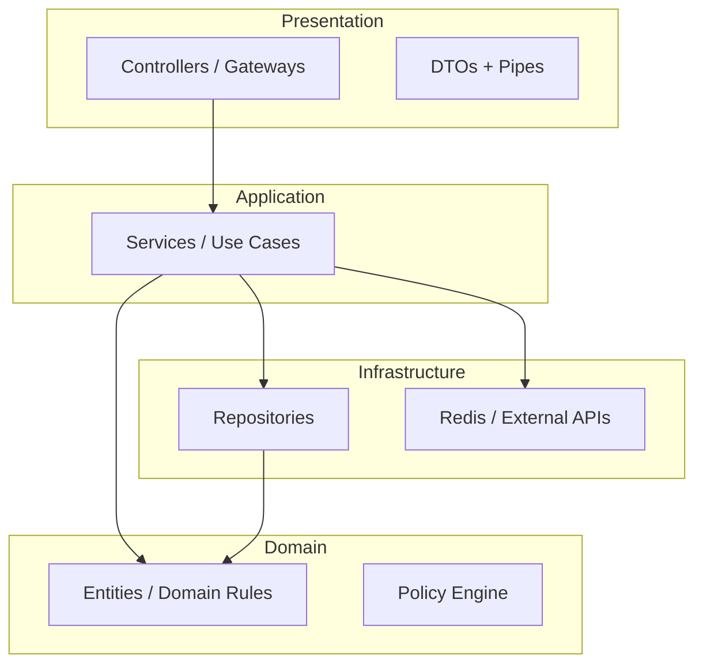

# Coding Standards

## remoteHask — Engineering Standards

| Field | Value |
|-------|-------|
| **Document Version** | 1.0 |
| **Status** | Engineering Baseline |
| **Companion** | [API_SPECIFICATION.md](./API_SPECIFICATION.md), [DATABASE_SCHEMA.md](./DATABASE_SCHEMA.md), [SYSTEM_ARCHITECTURE.md](./SYSTEM_ARCHITECTURE.md), [MIGRATIONS_PLAN.md](./MIGRATIONS_PLAN.md) |
| **Last Updated** | 2026-05-20 |

---

## Table of Contents

1. [Purpose and Scope](#1-purpose-and-scope)
2. [Repository Structure](#2-repository-structure)
3. [Strict TypeScript](#3-strict-typescript)
4. [Modular Architecture](#4-modular-architecture)
5. [Clean Code Principles](#5-clean-code-principles)
6. [SOLID Principles](#6-solid-principles)
7. [NestJS Architecture Standards](#7-nestjs-architecture-standards)
8. [React and Next.js Standards](#8-react-and-nextjs-standards)
9. [REST API Naming Conventions](#9-rest-api-naming-conventions)
10. [WebSocket Naming Conventions](#10-websocket-naming-conventions)
11. [TypeORM Conventions](#11-typeorm-conventions)
12. [Duplication Prevention](#12-duplication-prevention)
13. [Error Handling Standards](#13-error-handling-standards)
14. [Logging Standards](#14-logging-standards)
15. [Security Standards](#15-security-standards)
16. [Testing Standards](#16-testing-standards)
17. [Git, Review, and CI](#17-git-review-and-ci)
18. [Appendices](#18-appendices)

---

## 1. Purpose and Scope

This document defines **mandatory** engineering standards for remoteHask. It exists to:

- Enforce **strict TypeScript** and predictable contracts across teams.
- Scale to **enterprise** multi-tenant workloads without architectural drift.
- **Prevent duplication** through shared libraries, clear module boundaries, and DRY discipline.
- Align implementation with [API_SPECIFICATION.md](./API_SPECIFICATION.md) and [DATABASE_SCHEMA.md](./DATABASE_SCHEMA.md).

**Applies to:** `apps/api`, `apps/gateway`, `apps/web`, `packages/*`, `agent/` (Rust has a separate agent standards addendum when introduced).

**Does not replace:** product requirements, security review, or penetration test findings.

---

## 2. Repository Structure

Monorepo layout (target):

```text
remoteHask/
├── apps/
│   ├── api/              # NestJS REST + domain logic
│   ├── gateway/          # NestJS Socket.IO (may share code with api)
│   └── web/              # Next.js console
├── packages/
│   ├── shared-types/     # DTOs, enums, API contracts (Zod schemas)
│   ├── shared-utils/     # Pure helpers (date, pagination, ids)
│   ├── eslint-config/    # Shared lint rules
│   └── tsconfig/         # Base TS configs
├── agent/                # Rust desktop agent
└── docs/                 # Architecture & specs (or repo root)
```

| Rule | Rationale |
|------|-----------|
| **Apps do not import from other apps** | Only from `packages/*` |
| **Domain logic lives in `api`, not `web`** | Decoupled frontend |
| **Shared contracts in `packages/shared-types`** | Single source for REST/WS enums and DTOs |
| **No circular dependencies** | Enforced by ESLint `import/no-cycle` |

---

## 3. Strict TypeScript

### 3.1 Compiler Options (Mandatory)

Base `tsconfig` for all apps and packages:

| Option | Value |
|--------|-------|
| `strict` | `true` |
| `noImplicitAny` | `true` |
| `strictNullChecks` | `true` |
| `strictFunctionTypes` | `true` |
| `noUncheckedIndexedAccess` | `true` |
| `noImplicitReturns` | `true` |
| `noFallthroughCasesInSwitch` | `true` |
| `exactOptionalPropertyTypes` | `true` (packages); `false` only if NestJS friction documented |
| `useUnknownInCatchVariables` | `true` |
| `verbatimModuleSyntax` | `true` |
| `isolatedModules` | `true` |
| `noEmit` | `true` (web); emit per app build |

### 3.2 Prohibited Patterns

| ❌ Avoid | ✅ Use instead |
|----------|----------------|
| `any` | `unknown` + type guards |
| `@ts-ignore` | Fix types or narrow with Zod/validation |
| Non-null assertion `!` without guard | Explicit check or `assertDefined()` helper |
| `enum` for API strings (duplicate) | `const` object + `as const` in `shared-types` |
| Implicit `return` in branches | Explicit returns (enforced by `noImplicitReturns`) |
| `Function`, `{}`, `object` as types | Concrete interfaces |

### 3.3 Type Definitions

| Layer | Location | Example |
|-------|----------|---------|
| API request/response | `packages/shared-types/src/api/` | `CreateSessionRequest` |
| DB entity | `apps/api/src/modules/*/entities/` | `RemoteSession` entity |
| Domain models | `apps/api/src/modules/*/domain/` | Internal types not exposed to HTTP |
| React props | Colocated `ComponentName.types.ts` or inline `type Props` | `DeviceListProps` |

**Rule:** HTTP layer never exposes TypeORM entities directly — map to DTOs.

### 3.4 Runtime Validation

| Boundary | Tool |
|----------|------|
| HTTP body/query | `class-validator` + DTO classes **or** Zod pipe |
| External config | Zod schema at bootstrap |
| WebSocket payloads | Zod parse in gateway guards |
| Env vars | Zod in `config.module.ts` |

Types at compile time **and** validation at runtime are both required at system boundaries.

---

## 4. Modular Architecture

### 4.1 Layered Model (Backend)



| Layer | May depend on | Must not depend on |
|-------|---------------|-------------------|
| Controllers / Gateways | Services, DTOs | Repositories directly |
| Services | Repositories, domain, other services | HTTP request objects |
| Repositories | TypeORM entities | Controllers |
| Domain | Nothing infrastructure-specific | NestJS decorators (prefer pure functions) |

### 4.2 Module Boundaries (NestJS)

One **feature module** per domain area:

| Module | Responsibility |
|--------|----------------|
| `AuthModule` | Login, refresh, MFA |
| `OrgModule` | Organizations, settings |
| `MemberModule` | Members, invitations |
| `GroupModule` | Groups, assignments |
| `DeviceModule` | Device registry, enrollment |
| `SessionModule` | Remote session lifecycle |
| `PolicyModule` | Policy evaluation |
| `AuditModule` | Audit event writes |
| `GatewayModule` | Socket.IO (in `apps/gateway` or shared lib) |

**Cross-module access:** inject **public service interfaces** only; never import another module's repository.

### 4.3 Frontend Modules

| Area | Structure |
|------|-----------|
| Routes | `app/` (App Router) — thin pages |
| Features | `src/features/{feature}/` — components, hooks, api |
| Shared UI | `src/components/ui/` — design system |
| API client | `src/lib/api/` — generated + thin wrappers |
| Real-time | `src/lib/socket/` — Socket.IO client singleton |

Pages **compose** features; features **do not** import from other features' internals (use `features/*/index.ts` public API).

---

## 5. Clean Code Principles

| Principle | Standard |
|-----------|----------|
| **Small functions** | Target ≤ 40 lines; extract when doing more than one thing |
| **Single level of abstraction** | Service method orchestrates; helpers implement steps |
| **Meaningful names** | `findActiveSessionByDeviceId` not `getSession` |
| **No magic numbers/strings** | Constants in `*.constants.ts` or enums from `shared-types` |
| **Pure functions** | Policy evaluation, mappers, pagination helpers — no side effects |
| **Comments** | Explain *why*, not *what*; no commented-out code in main |
| **File length** | Soft max 300 lines; split by responsibility |
| **Early returns** | Guard clauses over deep nesting |

### 5.1 Function and Class Size

| Unit | Guideline |
|------|-----------|
| Controller method | ≤ 15 lines (delegate to service) |
| Service method | ≤ 50 lines |
| React component | ≤ 150 lines; split subcomponents |
| Custom hook | One concern per hook |

---

## 6. SOLID Principles

### 6.1 Single Responsibility (S)

- One class = one reason to change.
- `DeviceService` manages devices; `PresenceService` manages Redis presence; do not merge.

### 6.2 Open/Closed (O)

- Extend via **strategy interfaces** (e.g. `PolicyRuleEvaluator`, `MfaProvider`).
- New SSO provider = new adapter, not `if (provider === 'okta')` in auth service.

### 6.3 Liskov Substitution (L)

- Repository interfaces allow in-memory fakes in tests.
- Substitutes must honor tenant scoping contracts.

### 6.4 Interface Segregation (I)

- Small interfaces: `IDeviceReader`, `IDeviceWriter` if read/write paths diverge.
- Gateways expose narrow event handler interfaces, not god-objects.

### 6.5 Dependency Inversion (D)

- Services depend on `IDeviceRepository`, not `TypeOrmDeviceRepository` type in constructor parameter — use injection token:

```text
@Inject(DEVICE_REPOSITORY) private readonly devices: IDeviceRepository
```

| Abstraction | Implementations |
|-------------|-----------------|
| `ISessionRepository` | TypeORM |
| `IPresenceStore` | Redis |
| `ITurnCredentialService` | coturn HMAC |
| `IAuditPublisher` | DB + optional queue |

---

## 7. NestJS Architecture Standards

### 7.1 File Naming

| Artifact | Pattern | Example |
|----------|---------|---------|
| Module | `*.module.ts` | `device.module.ts` |
| Controller | `*.controller.ts` | `device.controller.ts` |
| Service | `*.service.ts` | `device.service.ts` |
| Repository | `*.repository.ts` | `device.repository.ts` |
| Entity | `*.entity.ts` | `remote-session.entity.ts` |
| DTO | `*.dto.ts` | `create-session.dto.ts` |
| Guard | `*.guard.ts` | `org-membership.guard.ts` |
| Gateway | `*.gateway.ts` | `session.gateway.ts` |

### 7.2 Controller Rules

| Rule | Detail |
|------|--------|
| Thin controllers | Validate DTO → call service → map response envelope |
| No business logic | Policy checks in `PolicyService` or domain |
| Consistent routes | See [Section 9](#9-rest-api-naming-conventions) |
| Swagger decorators | `@ApiTags`, `@ApiOperation`, `@ApiResponse` on every route |
| Guards | `@UseGuards(JwtAuthGuard, OrgGuard, RolesGuard)` at class or method |

### 7.3 Service Rules

| Rule | Detail |
|------|--------|
| Transaction boundaries | `@Transactional()` or `QueryRunner` for multi-table writes |
| Tenant scope | First line: resolve `organizationId` from `TenantContext` |
| Idempotency | Session create honors `Idempotency-Key` via Redis lock |
| Side effects | Audit writes async via event emitter or queue when possible |

### 7.4 DTOs and Validation

```text
CreateSessionDto  →  class-validator decorators
                 →  mapped to CreateSessionInput (domain)
                 →  SessionService.create(input)
                 →  SessionResponseDto (from entity mapper)
```

| Rule | Detail |
|------|--------|
| Input DTOs | `Create*`, `Update*`, `*QueryDto` |
| Output DTOs | `*ResponseDto` or shared `*Dto` from `packages/shared-types` |
| Query DTOs | Pagination fields with `@Type(() => Number)` transforms |

### 7.5 Global Concerns

| Concern | Implementation |
|---------|----------------|
| Response envelope | `TransformInterceptor` wraps success as `{ success, data, meta }` |
| Errors | `HttpExceptionFilter` maps to [API_SPECIFICATION](./API_SPECIFICATION.md#error-handling) |
| Request ID | Middleware reads `X-Request-Id` or generates |
| Tenant context | Middleware/guard sets `AsyncLocalStorage` for `organizationId` |
| Rate limiting | `@Throttle()` on auth and session endpoints |

### 7.6 Configuration

| Rule | Detail |
|------|--------|
| ConfigModule | `registerAs('database', () => ...)` per domain |
| Secrets | Env only; never commit; validate with Zod |
| Feature flags | `ConfigService` or dedicated provider |

---

## 8. React and Next.js Standards

### 8.1 Component Structure

```text
features/devices/
├── components/
│   ├── DeviceList/
│   │   ├── DeviceList.tsx
│   │   ├── DeviceList.types.ts
│   │   ├── DeviceList.test.tsx
│   │   └── index.ts
│   └── DeviceStatusBadge.tsx
├── hooks/
│   └── useDevicePresence.ts
├── api/
│   └── devices.queries.ts      # TanStack Query keys + fetchers
└── index.ts                    # Public exports only
```

### 8.2 Component Rules

| Rule | Standard |
|------|----------|
| **Default export** | One per file for page/feature component |
| **Server vs Client** | `'use client'` only when needed (hooks, browser APIs, Socket.IO) |
| **Props** | `type` not `interface` for props (team consistency); suffix `Props` |
| **No API calls in components** | Use hooks (`useDevices`, `useCreateSession`) |
| **Presentational vs container** | `DeviceList` (UI) + `DeviceListContainer` (data) when complexity warrants |
| **Styling** | Tailwind + `cn()` utility; no inline styles except dynamic values |

### 8.3 Hooks

| Hook type | Naming | Location |
|-----------|--------|----------|
| Data fetching | `useDevices`, `useSession` | `features/*/hooks/` or `api/*.queries.ts` |
| Socket | `useConsoleSocket`, `useSessionSignaling` | `lib/socket/` |
| UI state | `useDisclosure`, `usePagination` | `hooks/` shared |

**Rules:**

- Hooks return stable shapes: `{ data, isLoading, error, refetch }`.
- Cleanup Socket listeners in `useEffect` return.
- Do not store access tokens in `localStorage` unless documented exception.

### 8.4 State Management

| State type | Tool |
|------------|------|
| Server state | TanStack Query |
| Auth session | Context + secure memory / httpOnly refresh |
| UI ephemeral | `useState` / `useReducer` |
| Global UI (theme, sidebar) | Zustand (minimal) |

Avoid Redux unless a future requirement explicitly needs it.

### 8.5 API Client (Frontend)

| Rule | Detail |
|------|--------|
| Generated types | orval/openapi-typescript from spec |
| Single `apiClient` | Axios/fetch with interceptors (auth, refresh, envelope unwrap) |
| Unwrap envelope | `response.data.data` after verifying `success === true` |
| Errors | Throw typed `ApiError` from `error.code` |

---

## 9. REST API Naming Conventions

Aligned with [API_SPECIFICATION.md](./API_SPECIFICATION.md).

### 9.1 URL Patterns

| Pattern | Example |
|---------|---------|
| Version prefix | `/api/v1` |
| Tenant scope | `/organizations/current/...` |
| Resource plural | `/devices`, `/sessions` |
| Sub-resource | `/sessions/{id}/events` |
| Actions (non-CRUD) | `POST .../revoke-credentials`, `POST .../end` |

| ❌ Avoid | ✅ Prefer |
|----------|-----------|
| `/getDevices` | `GET /devices` |
| `/device/delete/{id}` | `DELETE /devices/{id}` |
| Verbs in path for CRUD | HTTP method expresses verb |

### 9.2 HTTP Methods

| Method | Use |
|--------|-----|
| `GET` | Read, list (safe, idempotent) |
| `POST` | Create, actions, enrollment |
| `PATCH` | Partial update |
| `PUT` | Full replace (e.g. group device assignment) |
| `DELETE` | Soft-delete resources |

### 9.3 Query Parameters

| Param | Convention |
|-------|------------|
| Pagination | `limit`, `cursor` |
| Sort | `sort=-lastSeenAt` (minus = DESC) |
| Filter | `presence=online`, `groupId=uuid` |
| Search | `q` |

### 9.4 Response and Error Codes

| Item | Convention |
|------|------------|
| JSON fields | camelCase |
| Error `code` | SCREAMING_SNAKE: `DEVICE_OFFLINE` |
| Resource IDs | UUID in path only |

### 9.5 NestJS Route Mapping

```text
@Controller('organizations/current/devices')
@ApiTags('Devices')
export class DeviceController {
  @Get()
  list(@Query() query: ListDevicesQueryDto) {}

  @Get(':deviceId')
  get(@Param('deviceId', ParseUUIDPipe) deviceId: string) {}
}
```

---

## 10. WebSocket Naming Conventions

Aligned with [API_SPECIFICATION.md §21](./API_SPECIFICATION.md#21-websocket-api-socketio).

### 10.1 Namespaces and Rooms

| Item | Pattern | Example |
|------|---------|---------|
| Namespace | `/{client-role}` | `/console`, `/agents` |
| Room | `{scope}:{uuid}` | `org:abc`, `device:abc`, `session:abc` |

### 10.2 Event Names

Format: **`domain:action`** (lowercase, colon-separated).

| Domain | Events |
|--------|--------|
| `agent` | `agent:heartbeat`, `agent:heartbeat:ack`, `agent:command` |
| `device` | `device:presence`, `device:join` |
| `session` | `session:invite`, `session:accept`, `session:reject`, `session:started`, `session:ended`, `session:join`, `session:leave`, `session:end`, `session:stats`, `session:control` |
| `signaling` | `signaling:offer`, `signaling:answer`, `signaling:ice` |
| `file` | `file:progress`, `file:complete` |

| ❌ Avoid | ✅ Prefer |
|----------|-----------|
| `heartbeat` | `agent:heartbeat` |
| `SessionStarted` | `session:started` |
| `onDeviceUpdate` | `device:presence` |

### 10.3 Payload Envelope

All server-emitted events use:

```text
{ eventId: string, timestamp: ISO8601, payload: T }
```

Parse and validate `payload` with Zod per event type in `packages/shared-types/src/ws/`.

### 10.4 Gateway Handler Structure

```text
@SubscribeMessage('session:join')
handleSessionJoin(
  @ConnectedSocket() client: Socket,
  @MessageBody() body: unknown,
): Promise<AckDto>
```

| Rule | Detail |
|------|--------|
| Validate body | Zod safeParse before processing |
| Auth | Connection already authenticated; re-check room access |
| No business logic duplication | Delegate to `SessionService` shared with REST |

---

## 11. TypeORM Conventions

Aligned with [DATABASE_SCHEMA.md](./DATABASE_SCHEMA.md) and [MIGRATIONS_PLAN.md](./MIGRATIONS_PLAN.md).

### 11.1 Entity Rules

| Rule | Standard |
|------|----------|
| Table names | Implicit plural snake_case via `SnakeNamingStrategy` |
| Entity class | Singular PascalCase: `RemoteSession` |
| Primary key | `@PrimaryGeneratedColumn('uuid')` |
| Timestamps | `@CreateDateColumn()`, `@UpdateDateColumn()` |
| Soft delete | `@DeleteDateColumn()` where schema specifies |
| Relations | Explicit `@JoinColumn({ name: 'organization_id' })` on owning side |
| Eager loading | **Disabled by default** — use `relations: []` explicitly |

### 11.2 Column Mapping

| TS property | DB column |
|-------------|-----------|
| `organizationId` | `organization_id` |
| `lastSeenAt` | `last_seen_at` |

Enums: Postgres `enum` type name snake_case; TS use string union from `shared-types`.

### 11.3 Repository Pattern

| Rule | Detail |
|------|--------|
| Interface | `IDeviceRepository` in domain layer |
| Implementation | `TypeOrmDeviceRepository` in `infrastructure/` |
| Queries | All list queries include `organizationId` |
| Soft delete | `withDeleted: false` default; admin trash explicit |
| QueryBuilder | Prefer for complex filters; no raw SQL strings without parameter binding |

### 11.4 Migrations

| Rule | Detail |
|------|--------|
| `synchronize` | **false** always |
| Generate | `npm run migration:generate` after entity change |
| Order | Follow [MIGRATIONS_PLAN.md](./MIGRATIONS_PLAN.md) |
| Partitions | Raw SQL migrations; not entity-driven |
| Reversible | `down` only when safe; production = forward-fix |

### 11.5 Transactions

| Operation | Transaction required |
|-----------|---------------------|
| Session create + audit | Yes |
| Device delete + credential revoke | Yes |
| Heartbeat update | No (Redis primary) |
| Read-only | No |

Use `@Transactional()` with isolation `READ COMMITTED` default.

---

## 12. Duplication Prevention

### 12.1 Shared Packages (Mandatory Reuse)

| Package | Contains | Used by |
|---------|----------|---------|
| `shared-types` | DTOs, WS payloads, error codes, enums | api, gateway, web |
| `shared-utils` | `buildCursor`, `parseCursor`, date helpers | api, web |

**Before adding a helper:** search monorepo; extend `shared-utils` if used twice.

### 12.2 DRY Boundaries

| Logic | Single owner |
|-------|--------------|
| Policy evaluation | `PolicyService.evaluate()` — REST + WS call this |
| Tenant scope check | `OrgAccessGuard` + `TenantContext` |
| Session state machine | `SessionStateMachine` domain class |
| Response envelope | Global interceptor only |
| Presence read/write | `PresenceService` (Redis) |
| TURN credentials | `TurnCredentialService` |
| Audit write | `AuditService.record()` |

### 12.3 Copy-Paste Red Flags (Reject in Review)

- Same Zod schema defined in api and gateway
- Duplicate pagination logic in controllers
- Second MFA validation implementation
- Inline `organizationId` query without guard
- Manual `{ success: true, data }` in controllers (use interceptor)

### 12.4 Abstraction Guidelines

| Situation | Action |
|-----------|--------|
| Logic used 2+ times in same module | Extract private method |
| Logic used 2+ modules | Move to service or `shared-utils` |
| Logic used api + gateway | Shared NestJS library `packages/nest-common` |
| Premature abstraction | Wait for second use case (Rule of Three) |

---

## 13. Error Handling Standards

### 13.1 Backend

| Type | Mechanism |
|------|-----------|
| Expected business errors | `throw new AppException(ErrorCode.DEVICE_OFFLINE, message, HttpStatus.CONFLICT)` |
| Validation | `ValidationPipe` → `VALIDATION_FAILED` |
| Unexpected | Log error + `INTERNAL_ERROR` (no stack to client) |

**`AppException` fields:** `code`, `message`, `details[]`, `httpStatus`.

| Rule | Detail |
|------|--------|
| Never swallow errors | Empty `catch` forbidden |
| Map DB errors | Unique violation → `CONFLICT`; FK → `BAD_REQUEST` |
| Tenant leaks | `NOT_FOUND` instead of `FORBIDDEN` when resource outside org (optional policy) |

### 13.2 Frontend

| Layer | Behavior |
|-------|----------|
| API client | Map `ApiError`; trigger refresh on `TOKEN_EXPIRED` |
| Query | `onError` toast + log `traceId` |
| Socket | `connect_error` → reauth flow |
| Error boundaries | Per-route or feature boundary in viewer |

### 13.3 WebSocket Errors

Ack failures:

```json
{ "ok": false, "code": "SIGNALING_FAILED", "message": "..." }
```

Do not throw unhandled exceptions in gateway — catch and emit structured ack.

---

## 14. Logging Standards

### 14.1 Library and Format

| App | Library |
|-----|---------|
| NestJS | `nestjs-pino` (JSON structured) |
| Next.js | `pino` / structured console in dev |

**Required fields on every log:**

| Field | Source |
|-------|--------|
| `level` | info, warn, error |
| `msg` | Human-readable |
| `requestId` | Middleware |
| `traceId` | OpenTelemetry |
| `organizationId` | When authenticated |
| `userId` / `deviceId` | When applicable |

### 14.2 Log Levels

| Level | When |
|-------|------|
| `error` | Unhandled exceptions, dependency failures |
| `warn` | Policy deny, rate limit, retry |
| `info` | Session start/end, device enroll, audit actions |
| `debug` | Dev/staging only — not heartbeat spam |
| `trace` | Local dev optional |

### 14.3 Prohibited in Logs

| Never log |
|-----------|
| Passwords, tokens, refresh tokens, device secrets |
| Full SDP, TURN credentials |
| Keyboard input, clipboard, screen content |
| Unredacted PII (email optional hash only) |

### 14.4 Correlation

Propagate `X-Request-Id` and W3C `traceparent` from ingress through services.

---

## 15. Security Standards

### 15.1 Authentication and Authorization

| Rule | Standard |
|------|----------|
| JWT | Short-lived access; rotate refresh |
| MFA | Enforced per org policy for session start |
| Device tokens | Hashed at rest; plain shown once on enroll |
| Guards | Every protected route has `JwtAuthGuard` + `OrgGuard` |
| RBAC | `@Roles('admin')` + permission checks in service for fine-grained |

### 15.2 Multi-Tenancy

| Rule | Standard |
|------|----------|
| Every query | Filtered by `organizationId` from trusted context |
| Never trust client `organizationId` in body | Header/JWT only |
| Tests | Include cross-tenant access denial cases |

### 15.3 Input and Output

| Rule | Standard |
|------|----------|
| Validate all inputs | DTO + Zod at boundaries |
| Sanitize errors | No stack traces to clients |
| UUID params | `ParseUUIDPipe` |
| Mass assignment | DTO whitelist fields only |

### 15.4 Dependencies and Secrets

| Rule | Standard |
|------|----------|
| Lockfile | Committed; `npm audit` in CI |
| Secrets | Env / secret manager; never in repo |
| CORS | Allowlist origins per environment |
| CSP | Configured on Next.js for console |

### 15.5 WebSocket Security

| Rule | Standard |
|------|----------|
| Auth before join | Reject connection without valid token |
| Room authorization | Server assigns rooms; client cannot `join` arbitrary `device:*` |
| Rate limit | Heartbeat and signaling per connection |

---

## 16. Testing Standards

### 16.1 Pyramid

```mermaid
pyramid
    title Test Pyramid
    "E2E (few)" : 10
    "Integration (some)" : 30
    "Unit (many)" : 60
```

| Layer | Scope | Tools |
|-------|-------|-------|
| Unit | Pure functions, mappers, policy rules | Jest |
| Integration | Services + DB (Testcontainers PG) or sqlite | Jest + Supertest |
| E2E | Critical flows: login, create session | Playwright (web), Supertest (api) |
| Contract | OpenAPI compliance | spectral, pact (optional) |

### 16.2 Coverage Targets

| Area | Minimum coverage |
|------|------------------|
| Policy engine | 90% |
| Session state machine | 90% |
| Auth | 85% |
| Controllers | 70% (via e2e/integration) |
| UI components | 60% (critical paths) |

### 16.3 Naming and Structure

| Type | Pattern |
|------|---------|
| Unit | `describe('PolicyService')` → `it('denies unattended when policy disabled')` |
| File | `*.spec.ts` colocated or `__tests__/` |
| Fixtures | `test/factories/device.factory.ts` |
| DB tests | Transaction rollback per test or fresh schema |

### 16.4 Required Test Cases (Security)

- Cross-tenant device access returns 404/403
- Technician without group cannot start session
- Revoked device token rejected
- Audit row written on session create

### 16.5 Frontend Testing

| Type | Tool |
|------|------|
| Unit | Vitest + Testing Library |
| Hook | `renderHook` |
| E2E | Playwright — login, device list, session viewer smoke |
| Mock API | MSW with OpenAPI-generated handlers |

### 16.6 What Not to Test

- Framework internals
- Third-party libraries
- Trivial getters with no logic

---

## 17. Git, Review, and CI

### 17.1 Branch Naming

```text
feature/short-description
fix/issue-123-description
chore/deps-update
```

### 17.2 Commit Messages

Conventional Commits:

```text
feat(sessions): add MFA step-up before unattended connect
fix(devices): scope list query by organizationId
docs(api): update session DTO examples
```

### 17.3 Pull Request Checklist

- [ ] Types strict — no `any`
- [ ] Tests added/updated for behavior change
- [ ] API changes reflected in OpenAPI + [API_SPECIFICATION.md](./API_SPECIFICATION.md) if contract change
- [ ] Migration included if entity change
- [ ] No duplicated logic — reused shared package
- [ ] Logs exclude secrets
- [ ] Tenant scoping verified

### 17.4 CI Pipeline (Required Checks)

| Check | Command |
|-------|---------|
| Lint | `eslint .` |
| Typecheck | `tsc --noEmit` |
| Unit/integration tests | `jest` |
| API breaking change | `oasdiff` (when spec changes) |
| Migration dry-run | Against ephemeral PG |

### 17.5 ESLint Policy

| Rule | Setting |
|------|---------|
| `@typescript-eslint/no-explicit-any` | error |
| `import/no-cycle` | error |
| `import/order` | enforced |
| `no-console` | warn (allow in scripts) |

---

## 18. Appendices

### 18.1 Naming Cheat Sheet

| Artifact | Convention | Example |
|----------|------------|---------|
| TS variable | camelCase | `deviceId` |
| TS class/type | PascalCase | `RemoteSession` |
| File (component) | PascalCase | `DeviceList.tsx` |
| File (service) | kebab-case | `device.service.ts` |
| DB table | snake_case plural | `remote_sessions` |
| REST path | kebab-case segments | `/enrollment-tokens` |
| WS event | domain:action | `session:started` |
| Error code | SCREAMING_SNAKE | `DEVICE_OFFLINE` |
| Env var | SCREAMING_SNAKE | `DATABASE_URL` |

### 18.2 Related Documents

| Topic | Document |
|-------|----------|
| API contracts | [API_SPECIFICATION.md](./API_SPECIFICATION.md) |
| Database | [DATABASE_SCHEMA.md](./DATABASE_SCHEMA.md) |
| Migrations | [MIGRATIONS_PLAN.md](./MIGRATIONS_PLAN.md) |
| Architecture | [SYSTEM_ARCHITECTURE.md](./SYSTEM_ARCHITECTURE.md) |
| Product | [PRODUCT_REQUIREMENTS.md](./PRODUCT_REQUIREMENTS.md) |

### 18.3 Document Approval

| Role | Name | Date |
|------|------|------|
| Engineering Lead | | |
| Frontend Lead | | |
| Security | | |

---

*End of Document*
