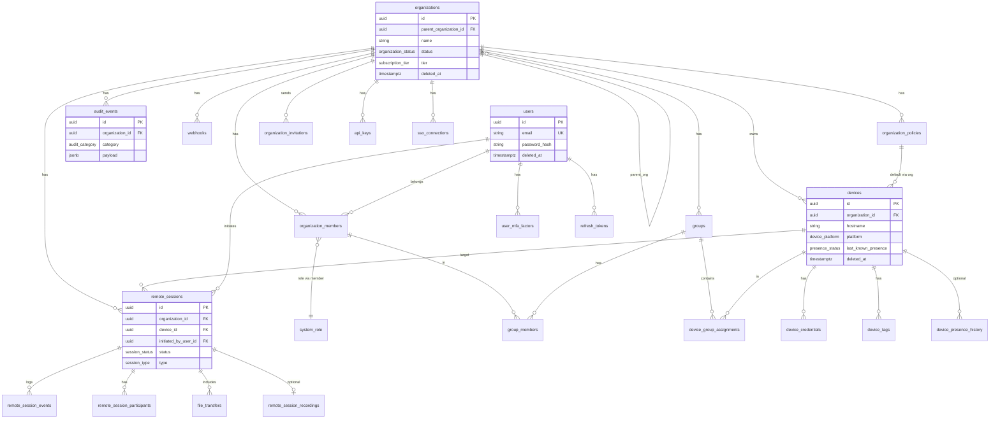
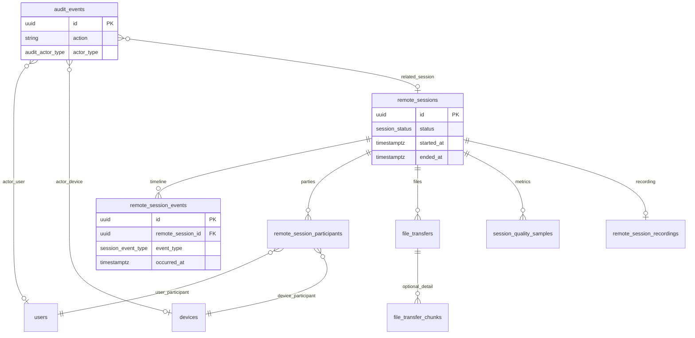
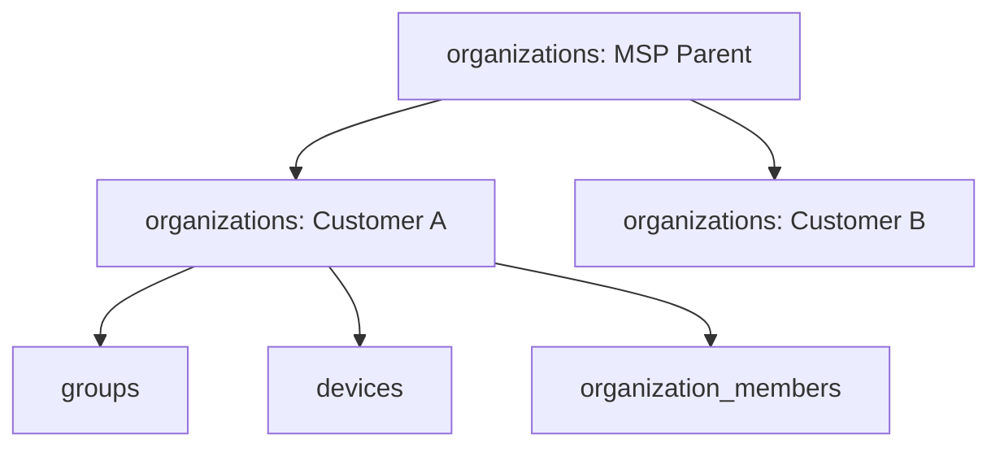
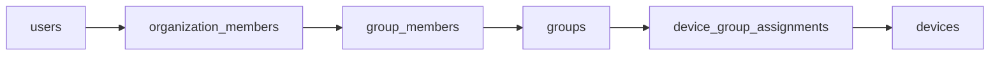
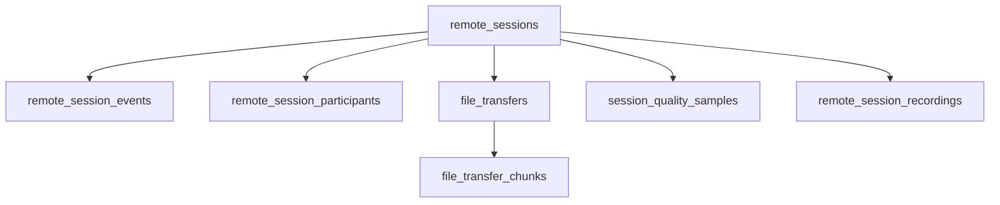

# Database Schema Document

## remoteHask — PostgreSQL + TypeORM

| Field | Value |
|-------|-------|
| **Document Version** | 1.0 |
| **Status** | Schema Baseline |
| **Companion** | [PRODUCT_REQUIREMENTS.md](./PRODUCT_REQUIREMENTS.md), [SYSTEM_ARCHITECTURE.md](./SYSTEM_ARCHITECTURE.md), [MIGRATIONS_PLAN.md](./MIGRATIONS_PLAN.md), [API_SPECIFICATION.md](./API_SPECIFICATION.md), [CODING_STANDARDS.md](./CODING_STANDARDS.md) |
| **DBMS** | PostgreSQL 16+ |
| **ORM** | TypeORM 0.3.x (NestJS integration) |
| **Last Updated** | 2026-05-20 |

---

## Table of Contents

1. [Design Principles](#1-design-principles)
2. [Naming and TypeORM Conventions](#2-naming-and-typeorm-conventions)
3. [Enumerations](#3-enumerations)
4. [Soft Delete Strategy](#4-soft-delete-strategy)
5. [Complete ERD](#5-complete-erd)
6. [Entity Catalog](#6-entity-catalog)
7. [Organization Structure](#7-organization-structure)
8. [Identity, RBAC, and Groups](#8-identity-rbac-and-groups)
9. [Devices and Agents](#9-devices-and-agents)
10. [Policies](#10-policies)
11. [Remote Sessions and Logging](#11-remote-sessions-and-logging)
12. [Audit Tables](#12-audit-tables)
13. [Integrations and Platform](#13-integrations-and-platform)
14. [Relationship Summary](#14-relationship-summary)
15. [Index Strategy](#15-index-strategy)
16. [Partitioning and Archival](#16-partitioning-and-archival)
17. [Schema Decision Rationale](#17-schema-decision-rationale)
18. [Scaling Considerations](#18-scaling-considerations)
19. [Query Optimization Recommendations](#19-query-optimization-recommendations)
20. [Appendices](#20-appendices)

---

## 1. Design Principles

| Principle | Implementation |
|-----------|----------------|
| **Tenant isolation** | Every tenant-owned row includes `organization_id` (UUID). Application layer enforces scope; DB uses composite indexes leading with `organization_id`. |
| **UUID primary keys** | Public identifiers are UUID v4 (or v7 for time-ordered inserts on high-volume tables). No sequential IDs exposed in APIs. |
| **Hot vs cold data** | Live presence in Redis; PostgreSQL stores durable device registry, session metadata, and audit. |
| **Append-only audit** | `audit_events` and completed session logs are insert-only from application perspective. |
| **Soft delete by default** | Operational entities use `deleted_at`; historical/compliance tables do not. |
| **Timestamptz everywhere** | All instants stored as `TIMESTAMPTZ` (UTC). |
| **JSONB for extensibility** | Policies, device hardware snapshots, and integration config use validated JSONB schemas. |

---

## 2. Naming and TypeORM Conventions

| Layer | Convention | Example |
|-------|------------|---------|
| **PostgreSQL tables** | `snake_case`, plural | `remote_sessions` |
| **PostgreSQL columns** | `snake_case` | `organization_id` |
| **TypeORM entities** | `PascalCase`, singular | `RemoteSession` |
| **Entity properties** | `camelCase` | `organizationId` |
| **Enums (Postgres)** | `snake_case` type names | `session_status` |
| **TypeORM enum** | TypeScript `enum` or string union mapped via `@Column({ type: 'enum' })` |

**Recommended TypeORM settings (conceptual, not code):**

- Global naming strategy: `SnakeNamingStrategy` so entity `organizationId` maps to `organization_id`.
- `synchronize: false` in all environments; migrations only.
- `@DeleteDateColumn()` on soft-deletable entities.
- `@CreateDateColumn()` / `@UpdateDateColumn()` on all mutable entities.
- Relations use explicit `@JoinColumn` on owning side for clarity.

**Standard columns (repeated across entities):**

| Column | Type | Notes |
|--------|------|-------|
| `id` | `UUID` | PK, `gen_random_uuid()` default |
| `created_at` | `TIMESTAMPTZ` | NOT NULL, default `now()` |
| `updated_at` | `TIMESTAMPTZ` | NOT NULL, default `now()` |
| `deleted_at` | `TIMESTAMPTZ` | NULL = active; soft delete when present |

---

## 3. Enumerations

PostgreSQL native `ENUM` types for stable, query-friendly domains. TypeORM registers these in migrations.

### 3.1 Enum Definitions

```sql
-- Organization & billing
CREATE TYPE organization_status AS ENUM ('active', 'suspended', 'trial', 'churned');
CREATE TYPE subscription_tier AS ENUM ('starter', 'professional', 'enterprise', 'msp');

-- Users & access
CREATE TYPE organization_member_status AS ENUM ('active', 'invited', 'suspended', 'removed');
CREATE TYPE invitation_status AS ENUM ('pending', 'accepted', 'expired', 'revoked');
CREATE TYPE system_role AS ENUM (
  'owner', 'admin', 'device_manager', 'technician',
  'viewer', 'auditor', 'msp_admin'
);

-- Devices
CREATE TYPE device_platform AS ENUM ('windows', 'macos', 'linux', 'other');
CREATE TYPE device_registration_status AS ENUM ('pending', 'active', 'revoked', 'decommissioned');
CREATE TYPE presence_status AS ENUM ('online', 'offline', 'stale', 'unknown');

-- Sessions
CREATE TYPE session_status AS ENUM (
  'requested', 'policy_denied', 'pending_agent',
  'negotiating', 'active', 'ended', 'failed', 'cancelled'
);
CREATE TYPE session_type AS ENUM ('attended', 'unattended');
CREATE TYPE session_end_reason AS ENUM (
  'user_disconnect', 'technician_disconnect', 'agent_reject',
  'policy_revoked', 'timeout', 'network_error', 'admin_terminate', 'error'
);
CREATE TYPE session_event_type AS ENUM (
  'requested', 'policy_evaluated', 'mfa_completed', 'invite_sent',
  'agent_accepted', 'agent_rejected', 'signaling_started', 'webrtc_connected',
  'webrtc_failed', 'file_transfer_started', 'file_transfer_completed',
  'recording_started', 'recording_stopped', 'terminated', 'error'
);

-- File transfer
CREATE TYPE file_transfer_direction AS ENUM ('upload_to_device', 'download_from_device');
CREATE TYPE file_transfer_status AS ENUM ('pending', 'in_progress', 'completed', 'failed', 'cancelled', 'blocked');

-- Audit
CREATE TYPE audit_actor_type AS ENUM ('user', 'device', 'system', 'api_key', 'support');
CREATE TYPE audit_category AS ENUM (
  'organization', 'user', 'device', 'policy', 'session',
  'integration', 'security', 'billing', 'agent'
);
CREATE TYPE audit_severity AS ENUM ('info', 'warning', 'critical');

-- Webhooks
CREATE TYPE webhook_status AS ENUM ('active', 'disabled');
CREATE TYPE webhook_delivery_status AS ENUM ('pending', 'success', 'failed', 'retrying');

-- Agent releases
CREATE TYPE agent_release_channel AS ENUM ('stable', 'beta');
CREATE TYPE agent_update_status AS ENUM ('pending', 'downloading', 'installed', 'failed', 'skipped');
```

### 3.2 When to Use JSONB Instead of Enums

| Use JSONB | Use ENUM |
|-----------|----------|
| Policy feature flags that evolve frequently | Session status, platform OS |
| Vendor-specific SSO metadata | Role identifiers used in RBAC queries |
| Custom fields per enterprise tenant | Audit categories |

---

## 4. Soft Delete Strategy

### 4.1 Rules

| Category | Soft delete? | Mechanism |
|----------|--------------|-----------|
| Organizations, users (membership), groups, devices, policies, webhooks | **Yes** | `deleted_at` + TypeORM `@DeleteDateColumn()` |
| Remote sessions (completed) | **No** | Immutable row; status → `ended` / `failed` |
| Audit events | **No** | Append-only; retention via partition drop/archive |
| Session events, file transfer logs | **No** | Historical facts |
| Device credentials | **Hard revoke** | `revoked_at` timestamp (not soft delete) |
| Refresh tokens / API keys | **Revoke** | `revoked_at` or delete row |

### 4.2 TypeORM Query Implications

- Default repository scope: `deleted_at IS NULL` via global filter or base repository pattern.
- **Admin “trash” views** explicitly include `WITH DELETED` scope.
- Unique constraints that should ignore soft-deleted rows use **partial unique indexes** (see [Section 15](#15-index-strategy)).

### 4.3 Cascade Behavior on Soft Delete

| Parent soft-deleted | Child behavior |
|-------------------|----------------|
| `organizations` | Cascade soft-delete devices, groups, memberships (batch job); block if active `remote_sessions` |
| `devices` | Revoke credentials immediately; soft-delete device row |
| `users` (global) | Do not soft-delete user; soft-delete `organization_members` per org |

### 4.4 Restoration

- `deleted_at` cleared by admin action → writes `audit_events` with `action = restored`.
- Devices restored only if credentials not rotated post-delete.

---

## 5. Complete ERD

### 5.1 Core Domain ERD



### 5.2 Session and Audit Detail ERD



---

## 6. Entity Catalog

The following sections define **all production tables**. TypeORM entity names appear in **bold** beside table names.

---

### 6.1 `organizations` — **Organization**

| Column | Type | Constraints | Description |
|--------|------|-------------|-------------|
| `id` | UUID | PK | Tenant root identifier |
| `parent_organization_id` | UUID | FK → organizations, NULL | MSP child org hierarchy |
| `name` | VARCHAR(255) | NOT NULL | Display name |
| `slug` | VARCHAR(63) | NOT NULL, unique per parent | URL-safe identifier |
| `status` | organization_status | NOT NULL, default `trial` | Billing / access state |
| `tier` | subscription_tier | NOT NULL, default `starter` | Feature gating |
| `data_region` | VARCHAR(16) | NOT NULL, default `us-east` | Residency (enterprise) |
| `settings` | JSONB | NOT NULL, default `{}` | Feature flags, retention overrides |
| `created_at` | TIMESTAMPTZ | NOT NULL | |
| `updated_at` | TIMESTAMPTZ | NOT NULL | |
| `deleted_at` | TIMESTAMPTZ | NULL | Soft delete |

---

### 6.2 `organization_settings` — **OrganizationSettings** (1:1)

| Column | Type | Constraints | Description |
|--------|------|-------------|-------------|
| `organization_id` | UUID | PK, FK → organizations | |
| `unattended_enabled` | BOOLEAN | NOT NULL, default false | Org-wide gate |
| `mfa_required` | BOOLEAN | NOT NULL, default true | |
| `session_recording_allowed` | BOOLEAN | NOT NULL, default false | |
| `max_concurrent_sessions` | INT | NOT NULL, default 10 | |
| `file_transfer_max_bytes` | BIGINT | NOT NULL | |
| `ip_allowlist` | INET[] | NULL | Enterprise CIDR list |
| `retention_audit_days` | INT | NOT NULL, default 90 | |
| `retention_session_days` | INT | NOT NULL, default 90 | |
| `e2ee_required` | BOOLEAN | NOT NULL, default false | |
| `created_at` | TIMESTAMPTZ | NOT NULL | |
| `updated_at` | TIMESTAMPTZ | NOT NULL | |

---

### 6.3 `users` — **User** (global identity)

| Column | Type | Constraints | Description |
|--------|------|-------------|-------------|
| `id` | UUID | PK | |
| `email` | CITEXT | NOT NULL, UNIQUE | Case-insensitive login |
| `email_verified_at` | TIMESTAMPTZ | NULL | |
| `password_hash` | VARCHAR(255) | NULL | Null when SSO-only |
| `display_name` | VARCHAR(255) | NOT NULL | |
| `avatar_url` | TEXT | NULL | |
| `is_platform_admin` | BOOLEAN | NOT NULL, default false | Break-glass only |
| `last_login_at` | TIMESTAMPTZ | NULL | |
| `created_at` | TIMESTAMPTZ | NOT NULL | |
| `updated_at` | TIMESTAMPTZ | NOT NULL | |
| `deleted_at` | TIMESTAMPTZ | NULL | Soft delete (GDPR erasure workflow) |

---

### 6.4 `organization_members` — **OrganizationMember**

| Column | Type | Constraints | Description |
|--------|------|-------------|-------------|
| `id` | UUID | PK | |
| `organization_id` | UUID | FK, NOT NULL | Tenant scope |
| `user_id` | UUID | FK → users, NOT NULL | |
| `role` | system_role | NOT NULL | Primary RBAC role |
| `status` | organization_member_status | NOT NULL, default `active` | |
| `custom_permissions` | JSONB | NULL | Enterprise additive perms |
| `last_active_at` | TIMESTAMPTZ | NULL | |
| `created_at` | TIMESTAMPTZ | NOT NULL | |
| `updated_at` | TIMESTAMPTZ | NOT NULL | |
| `deleted_at` | TIMESTAMPTZ | NULL | Removed from org |

**Unique:** `(organization_id, user_id)` WHERE `deleted_at IS NULL`

---

### 6.5 `organization_invitations` — **OrganizationInvitation**

| Column | Type | Constraints | Description |
|--------|------|-------------|-------------|
| `id` | UUID | PK | |
| `organization_id` | UUID | FK, NOT NULL | |
| `email` | CITEXT | NOT NULL | Invitee |
| `role` | system_role | NOT NULL | |
| `invited_by_user_id` | UUID | FK → users | |
| `token_hash` | VARCHAR(64) | NOT NULL | SHA-256 of invite token |
| `status` | invitation_status | NOT NULL, default `pending` | |
| `expires_at` | TIMESTAMPTZ | NOT NULL | |
| `accepted_at` | TIMESTAMPTZ | NULL | |
| `created_at` | TIMESTAMPTZ | NOT NULL | |

---

### 6.6 `groups` — **Group**

| Column | Type | Constraints | Description |
|--------|------|-------------|-------------|
| `id` | UUID | PK | |
| `organization_id` | UUID | FK, NOT NULL | |
| `name` | VARCHAR(255) | NOT NULL | |
| `description` | TEXT | NULL | |
| `is_default` | BOOLEAN | NOT NULL, default false | Catch-all group |
| `created_at` | TIMESTAMPTZ | NOT NULL | |
| `updated_at` | TIMESTAMPTZ | NOT NULL | |
| `deleted_at` | TIMESTAMPTZ | NULL | |

**Unique:** `(organization_id, name)` WHERE `deleted_at IS NULL`

---

### 6.7 `group_members` — **GroupMember**

| Column | Type | Constraints | Description |
|--------|------|-------------|-------------|
| `id` | UUID | PK | |
| `group_id` | UUID | FK → groups | |
| `organization_member_id` | UUID | FK → organization_members | User scoped via member |
| `created_at` | TIMESTAMPTZ | NOT NULL | |

**Unique:** `(group_id, organization_member_id)`

---

### 6.8 `devices` — **Device**

| Column | Type | Constraints | Description |
|--------|------|-------------|-------------|
| `id` | UUID | PK | |
| `organization_id` | UUID | FK, NOT NULL | |
| `hostname` | VARCHAR(255) | NOT NULL | |
| `friendly_name` | VARCHAR(255) | NULL | |
| `platform` | device_platform | NOT NULL | |
| `os_version` | VARCHAR(64) | NULL | |
| `agent_version` | VARCHAR(32) | NULL | Last reported |
| `registration_status` | device_registration_status | NOT NULL, default `pending` | |
| `last_known_presence` | presence_status | NOT NULL, default `unknown` | Synced from Redis periodically |
| `last_seen_at` | TIMESTAMPTZ | NULL | Throttled persistence |
| `last_seen_ip` | INET | NULL | |
| `last_console_user` | VARCHAR(255) | NULL | OS logged-in user |
| `hardware_info` | JSONB | NULL | CPU, RAM, displays snapshot |
| `unattended_enabled` | BOOLEAN | NULL | NULL = inherit org policy |
| `notes` | TEXT | NULL | Technician notes |
| `registered_at` | TIMESTAMPTZ | NULL | First successful pairing |
| `created_at` | TIMESTAMPTZ | NOT NULL | |
| `updated_at` | TIMESTAMPTZ | NOT NULL | |
| `deleted_at` | TIMESTAMPTZ | NULL | |

---

### 6.9 `device_credentials` — **DeviceCredential**

| Column | Type | Constraints | Description |
|--------|------|-------------|-------------|
| `id` | UUID | PK | |
| `device_id` | UUID | FK → devices, NOT NULL | |
| `credential_hash` | VARCHAR(255) | NOT NULL | bcrypt/argon2 of device secret |
| `public_key_fingerprint` | VARCHAR(64) | NULL | mTLS optional |
| `label` | VARCHAR(64) | NOT NULL, default `primary` | |
| `revoked_at` | TIMESTAMPTZ | NULL | Instant revoke |
| `expires_at` | TIMESTAMPTZ | NULL | Rotation policy |
| `created_at` | TIMESTAMPTZ | NOT NULL | |
| `last_used_at` | TIMESTAMPTZ | NULL | |

**Index:** One active credential per device: `(device_id)` WHERE `revoked_at IS NULL`

---

### 6.10 `device_tags` — **DeviceTag**

| Column | Type | Constraints | Description |
|--------|------|-------------|-------------|
| `id` | UUID | PK | |
| `device_id` | UUID | FK, NOT NULL | |
| `organization_id` | UUID | FK, NOT NULL | Denormalized for index |
| `tag` | VARCHAR(64) | NOT NULL | |
| `created_at` | TIMESTAMPTZ | NOT NULL | |

**Unique:** `(device_id, tag)`

---

### 6.11 `device_group_assignments` — **DeviceGroupAssignment**

| Column | Type | Constraints | Description |
|--------|------|-------------|-------------|
| `id` | UUID | PK | |
| `device_id` | UUID | FK | |
| `group_id` | UUID | FK | |
| `assigned_at` | TIMESTAMPTZ | NOT NULL, default now() | |

**Unique:** `(device_id, group_id)`

---

### 6.12 `device_presence_history` — **DevicePresenceHistory** (enterprise / optional)

| Column | Type | Constraints | Description |
|--------|------|-------------|-------------|
| `id` | UUID | PK | |
| `device_id` | UUID | FK, NOT NULL | |
| `organization_id` | UUID | FK, NOT NULL | |
| `previous_status` | presence_status | NOT NULL | |
| `new_status` | presence_status | NOT NULL | |
| `observed_at` | TIMESTAMPTZ | NOT NULL | Edge transition time |
| `source` | VARCHAR(32) | NOT NULL | `heartbeat`, `disconnect`, `batch` |

*Partitioned by `observed_at` monthly.*

---

### 6.13 `organization_policies` — **OrganizationPolicy**

| Column | Type | Constraints | Description |
|--------|------|-------------|-------------|
| `id` | UUID | PK | |
| `organization_id` | UUID | FK, NOT NULL | |
| `name` | VARCHAR(255) | NOT NULL | |
| `version` | INT | NOT NULL, default 1 | Increment on change |
| `is_active` | BOOLEAN | NOT NULL, default true | One active per org (enforced app + index) |
| `rules` | JSONB | NOT NULL | See [Section 10](#10-policies) |
| `created_by_user_id` | UUID | FK → users | |
| `created_at` | TIMESTAMPTZ | NOT NULL | |
| `updated_at` | TIMESTAMPTZ | NOT NULL | |
| `deleted_at` | TIMESTAMPTZ | NULL | |

---

### 6.14 `device_policy_overrides` — **DevicePolicyOverride** (optional per device)

| Column | Type | Constraints | Description |
|--------|------|-------------|-------------|
| `device_id` | UUID | PK, FK | |
| `organization_id` | UUID | FK | |
| `rules` | JSONB | NOT NULL | Merged over org policy |
| `updated_at` | TIMESTAMPTZ | NOT NULL | |

---

## 7. Organization Structure

### 7.1 Hierarchy Model



| Concept | Storage |
|---------|---------|
| **MSP parent** | `organizations.parent_organization_id IS NULL` (or points to platform root) |
| **Child tenant** | `parent_organization_id` → MSP org UUID |
| **Data isolation** | All queries filter `organization_id = current tenant`; MSP cross-tenant via explicit `msp_access_grants` (Phase 2) or application role |

### 7.2 Future: `msp_access_grants` (Phase 2)

| Column | Type | Description |
|--------|------|-------------|
| `msp_organization_id` | UUID | Parent |
| `child_organization_id` | UUID | Customer |
| `granted_roles` | JSONB | Scoped permissions |

---

## 8. Identity, RBAC, and Groups

### 8.1 Access Path for Technicians



**Session authorization** checks:

1. `organization_members.role` permits `session.create`
2. Device in group assigned to member (unless role is `admin` / `owner`)

### 8.2 Supporting Auth Tables

#### `refresh_tokens` — **RefreshToken**

| Column | Type | Description |
|--------|------|-------------|
| `id` | UUID | PK |
| `user_id` | UUID | FK |
| `token_hash` | VARCHAR(64) | |
| `expires_at` | TIMESTAMPTZ | |
| `revoked_at` | TIMESTAMPTZ | |
| `user_agent` | TEXT | |
| `ip_address` | INET | |
| `created_at` | TIMESTAMPTZ | |

#### `user_mfa_factors` — **UserMfaFactor**

| Column | Type | Description |
|--------|------|-------------|
| `id` | UUID | PK |
| `user_id` | UUID | FK |
| `type` | VARCHAR(16) | `totp`, `webauthn` |
| `secret_encrypted` | TEXT | KMS-wrapped |
| `webauthn_credential` | JSONB | |
| `verified_at` | TIMESTAMPTZ | |
| `created_at` | TIMESTAMPTZ | |

#### `sso_connections` — **SsoConnection**

| Column | Type | Description |
|--------|------|-------------|
| `id` | UUID | PK |
| `organization_id` | UUID | FK |
| `provider` | VARCHAR(32) | `oidc`, `saml` |
| `issuer` | TEXT | |
| `metadata` | JSONB | Encrypted client secrets |
| `domain` | VARCHAR(255) | Verified domain |
| `enforced` | BOOLEAN | |
| `created_at` | TIMESTAMPTZ | |

#### `api_keys` — **ApiKey**

| Column | Type | Description |
|--------|------|-------------|
| `id` | UUID | PK |
| `organization_id` | UUID | FK |
| `name` | VARCHAR(255) | |
| `key_prefix` | VARCHAR(16) | Display only |
| `key_hash` | VARCHAR(64) | |
| `scopes` | JSONB | |
| `expires_at` | TIMESTAMPTZ | |
| `revoked_at` | TIMESTAMPTZ | |
| `created_by_user_id` | UUID | FK |
| `created_at` | TIMESTAMPTZ | |

---

## 9. Devices and Agents

### 9.1 Agent Release Tables

#### `agent_releases` — **AgentRelease**

| Column | Type | Description |
|--------|------|-------------|
| `id` | UUID | PK |
| `version` | VARCHAR(32) | Semver, UNIQUE |
| `channel` | agent_release_channel | |
| `platform` | device_platform | |
| `download_url` | TEXT | |
| `checksum_sha256` | CHAR(64) | |
| `signature` | TEXT | Ed25519 |
| `released_at` | TIMESTAMPTZ | |
| `min_os_version` | VARCHAR(32) | |

#### `device_agent_updates` — **DeviceAgentUpdate**

| Column | Type | Description |
|--------|------|-------------|
| `id` | UUID | PK |
| `device_id` | UUID | FK |
| `agent_release_id` | UUID | FK |
| `status` | agent_update_status | |
| `started_at` | TIMESTAMPTZ | |
| `completed_at` | TIMESTAMPTZ | |

---

## 10. Policies

### 10.1 `organization_policies.rules` JSONB Schema

| Key | Type | Description |
|-----|------|-------------|
| `unattended.allowed` | boolean | |
| `unattended.require_mfa` | boolean | |
| `unattended.allowed_hours` | object | `{ tz, windows[] }` |
| `session.max_duration_minutes` | number | |
| `session.require_attended_consent` | boolean | |
| `file_transfer.enabled` | boolean | |
| `file_transfer.max_bytes` | number | |
| `clipboard.enabled` | boolean | |
| `clipboard.direction` | string | `both`, `to_device`, `to_viewer`, `none` |
| `recording.enabled` | boolean | |

**Rationale:** JSONB avoids migration per policy flag; `version` column supports audit diff. Critical gates (unattended) also mirrored on `organization_settings` for fast reads.

---

## 11. Remote Sessions and Logging

### 11.1 Structure Overview



| Table | Role |
|-------|------|
| `remote_sessions` | Session header: who, what device, status, timing, network summary |
| `remote_session_events` | Fine-grained timeline for compliance and debugging |
| `remote_session_participants` | Users/devices involved (multi-tech handoff future) |
| `file_transfers` | Audit of files moved during session |
| `session_quality_samples` | Periodic FPS/RTT (optional, sampled) |
| `remote_session_recordings` | Metadata for stored recordings (S3 path) |

### 11.2 `remote_sessions` — **RemoteSession**

| Column | Type | Constraints | Description |
|--------|------|-------------|-------------|
| `id` | UUID | PK | Public session ID |
| `organization_id` | UUID | FK, NOT NULL | Tenant |
| `device_id` | UUID | FK → devices, NOT NULL | Target |
| `initiated_by_user_id` | UUID | FK → users, NOT NULL | Technician |
| `type` | session_type | NOT NULL | attended / unattended |
| `status` | session_status | NOT NULL, default `requested` | State machine |
| `end_reason` | session_end_reason | NULL | Set on terminal states |
| `policy_snapshot` | JSONB | NULL | Evaluated rules at start |
| `mfa_verified_at` | TIMESTAMPTZ | NULL | Step-up auth |
| `client_ip` | INET | NULL | Technician IP |
| `user_agent` | TEXT | NULL | Browser |
| `webrtc_transport` | VARCHAR(16) | NULL | `p2p`, `relay` |
| `turn_allocation_id` | VARCHAR(64) | NULL | coturn correlation |
| `bytes_sent` | BIGINT | NULL | Aggregate media |
| `bytes_received` | BIGINT | NULL | |
| `requested_at` | TIMESTAMPTZ | NOT NULL, default now() | |
| `agent_accepted_at` | TIMESTAMPTZ | NULL | |
| `connected_at` | TIMESTAMPTZ | NULL | First WebRTC frame |
| `ended_at` | TIMESTAMPTZ | NULL | |
| `duration_seconds` | INT | GENERATED | `ended_at - connected_at` (stored or computed) |
| `error_code` | VARCHAR(64) | NULL | Structured failure |
| `error_message` | TEXT | NULL | Sanitized |
| `trace_id` | VARCHAR(32) | NULL | OpenTelemetry correlation |
| `created_at` | TIMESTAMPTZ | NOT NULL | |
| `updated_at` | TIMESTAMPTZ | NOT NULL | |

**No `deleted_at`** — sessions are permanent audit records.

### 11.3 `remote_session_events` — **RemoteSessionEvent**

| Column | Type | Constraints | Description |
|--------|------|-------------|-------------|
| `id` | UUID | PK | |
| `remote_session_id` | UUID | FK, NOT NULL | |
| `organization_id` | UUID | FK, NOT NULL | Denormalized partition key |
| `event_type` | session_event_type | NOT NULL | |
| `occurred_at` | TIMESTAMPTZ | NOT NULL, default now() | |
| `actor_type` | audit_actor_type | NULL | |
| `actor_user_id` | UUID | FK, NULL | |
| `metadata` | JSONB | NULL | ICE state, SDP type (never full SDP in prod) |
| `message` | TEXT | NULL | Human-readable |

*High insert rate — partition by `occurred_at`.*

### 11.4 `remote_session_participants` — **RemoteSessionParticipant**

| Column | Type | Description |
|--------|------|-------------|
| `id` | UUID | PK |
| `remote_session_id` | UUID | FK |
| `participant_type` | VARCHAR(16) | `user`, `device` |
| `user_id` | UUID | FK, NULL |
| `device_id` | UUID | FK, NULL |
| `joined_at` | TIMESTAMPTZ | |
| `left_at` | TIMESTAMPTZ | |

### 11.5 `file_transfers` — **FileTransfer**

| Column | Type | Description |
|--------|------|-------------|
| `id` | UUID | PK |
| `remote_session_id` | UUID | FK |
| `organization_id` | UUID | FK |
| `device_id` | UUID | FK |
| `initiated_by_user_id` | UUID | FK |
| `direction` | file_transfer_direction | |
| `status` | file_transfer_status | |
| `file_name` | VARCHAR(512) | |
| `file_size_bytes` | BIGINT | |
| `sha256_hash` | CHAR(64) | |
| `mime_type` | VARCHAR(128) | |
| `source_path` | TEXT | Redacted in exports |
| `destination_path` | TEXT | |
| `blocked_reason` | TEXT | Policy / AV |
| `started_at` | TIMESTAMPTZ | |
| `completed_at` | TIMESTAMPTZ | |
| `created_at` | TIMESTAMPTZ | |

### 11.6 `file_transfer_chunks` — **FileTransferChunk** (optional detail)

| Column | Type | Description |
|--------|------|-------------|
| `id` | UUID | PK |
| `file_transfer_id` | UUID | FK |
| `chunk_index` | INT | |
| `bytes` | INT | |
| `checksum` | VARCHAR(64) | |

*Use only if byte-level audit required; otherwise omit to save space.*

### 11.7 `session_quality_samples` — **SessionQualitySample**

| Column | Type | Description |
|--------|------|-------------|
| `id` | UUID | PK |
| `remote_session_id` | UUID | FK |
| `sampled_at` | TIMESTAMPTZ | |
| `fps` | REAL | |
| `bitrate_kbps` | INT | |
| `rtt_ms` | INT | |
| `packet_loss_pct` | REAL | |

*Sample every 30s during active session; partition and archive aggressively.*

### 11.8 `remote_session_recordings` — **RemoteSessionRecording**

| Column | Type | Description |
|--------|------|-------------|
| `id` | UUID | PK |
| `remote_session_id` | UUID | FK, UNIQUE |
| `organization_id` | UUID | FK |
| `storage_bucket` | VARCHAR(255) | |
| `storage_key` | TEXT | |
| `duration_seconds` | INT | |
| `size_bytes` | BIGINT | |
| `encryption_key_id` | VARCHAR(64) | KMS ref |
| `consent_recorded_at` | TIMESTAMPTZ | |
| `created_at` | TIMESTAMPTZ | |

### 11.9 Session Status State Machine (DB Perspective)

| status | Terminal? | Next states |
|--------|-----------|-------------|
| `requested` | No | `policy_denied`, `pending_agent`, `cancelled` |
| `pending_agent` | No | `negotiating`, `failed`, `cancelled` |
| `negotiating` | No | `active`, `failed` |
| `active` | No | `ended` |
| `ended`, `failed`, `policy_denied`, `cancelled` | Yes | — |

---

## 12. Audit Tables

### 12.1 `audit_events` — **AuditEvent** (immutable)

| Column | Type | Constraints | Description |
|--------|------|-------------|-------------|
| `id` | UUID | PK | |
| `organization_id` | UUID | FK, NULL | Null for platform-level |
| `category` | audit_category | NOT NULL | |
| `action` | VARCHAR(128) | NOT NULL | e.g. `device.created`, `policy.updated` |
| `severity` | audit_severity | NOT NULL, default `info` | |
| `actor_type` | audit_actor_type | NOT NULL | |
| `actor_user_id` | UUID | FK, NULL | |
| `actor_device_id` | UUID | FK, NULL | |
| `actor_api_key_id` | UUID | FK, NULL | |
| `target_type` | VARCHAR(64) | NULL | `device`, `user`, etc. |
| `target_id` | UUID | NULL | |
| `remote_session_id` | UUID | FK, NULL | |
| `ip_address` | INET | NULL | |
| `user_agent` | TEXT | NULL | |
| `payload` | JSONB | NOT NULL, default `{}` | Before/after diff |
| `trace_id` | VARCHAR(32) | NULL | |
| `created_at` | TIMESTAMPTZ | NOT NULL, default now() | **Immutable** |

**Rules:**

- No `updated_at`, no `deleted_at`.
- Application role: `INSERT` only; DB trigger optional to block `UPDATE`/`DELETE`.
- PII minimized in `payload`; use IDs and redacted fields.

### 12.2 Example Audit Actions

| action | category |
|--------|----------|
| `organization.created` | organization |
| `member.role_changed` | user |
| `device.registered` | device |
| `device.credential_revoked` | security |
| `policy.updated` | policy |
| `session.started` | session |
| `session.terminated` | session |
| `unattended.enabled` | security |

### 12.3 Audit vs Session Event Tables

| Concern | `audit_events` | `remote_session_events` |
|---------|----------------|-------------------------|
| **Scope** | All admin and security actions | Single remote session lifecycle |
| **Audience** | Compliance, SecOps | Support, session debugging |
| **Retention** | Long (years) | Medium (90d–1y default) |
| **Volume** | Moderate | High during active sessions |

---

## 13. Integrations and Platform

### 13.1 `webhooks` — **Webhook**

| Column | Type | Description |
|--------|------|-------------|
| `id` | UUID | PK |
| `organization_id` | UUID | FK |
| `url` | TEXT | HTTPS only |
| `secret_hash` | VARCHAR(64) | Signing secret |
| `events` | TEXT[] | Subscribed event types |
| `status` | webhook_status | |
| `created_at` | TIMESTAMPTZ | |
| `deleted_at` | TIMESTAMPTZ | |

### 13.2 `webhook_deliveries` — **WebhookDelivery**

| Column | Type | Description |
|--------|------|-------------|
| `id` | UUID | PK |
| `webhook_id` | UUID | FK |
| `event_type` | VARCHAR(64) | |
| `payload` | JSONB | |
| `status` | webhook_delivery_status | |
| `attempt_count` | INT | |
| `next_retry_at` | TIMESTAMPTZ | |
| `response_status` | INT | |
| `created_at` | TIMESTAMPTZ | |

### 13.3 `custom_field_definitions` / `device_custom_field_values` (Enterprise)

**CustomFieldDefinition:** `organization_id`, `entity_type`, `key`, `data_type`, `required`

**DeviceCustomFieldValue:** `device_id`, `field_id`, `value` (JSONB)

---

## 14. Relationship Summary

| Parent | Child | Cardinality | FK on child |
|--------|-------|-------------|-------------|
| organizations | organizations | 1:N | parent_organization_id |
| organizations | organization_members | 1:N | organization_id |
| organizations | groups | 1:N | organization_id |
| organizations | devices | 1:N | organization_id |
| organizations | remote_sessions | 1:N | organization_id |
| organizations | audit_events | 1:N | organization_id |
| users | organization_members | 1:N | user_id |
| users | remote_sessions | 1:N | initiated_by_user_id |
| groups | group_members | 1:N | group_id |
| groups | device_group_assignments | 1:N | group_id |
| devices | device_credentials | 1:N | device_id |
| devices | device_tags | 1:N | device_id |
| devices | remote_sessions | 1:N | device_id |
| remote_sessions | remote_session_events | 1:N | remote_session_id |
| remote_sessions | file_transfers | 1:N | remote_session_id |
| remote_sessions | remote_session_recordings | 1:1 | remote_session_id |

**TypeORM relation tips:**

- Use `ManyToOne` / `OneToMany` with `onDelete: 'RESTRICT'` for audit and sessions (prevent orphaning history).
- Use `onDelete: 'CASCADE'` only for pure junction tables (`device_group_assignments`, `group_members`).

---

## 15. Index Strategy

### 15.1 Primary and Foreign Key Indexes

PostgreSQL indexes FK columns automatically in some setups; **explicitly index** all FK columns used in joins.

### 15.2 Tenant-Scoped Composite Indexes

| Table | Index | Purpose |
|-------|-------|---------|
| devices | `(organization_id, deleted_at, last_seen_at DESC)` | Device list dashboard |
| devices | `(organization_id, registration_status)` WHERE `deleted_at IS NULL` | Active fleet |
| devices | `(organization_id, last_known_presence)` WHERE `deleted_at IS NULL` | Online filter |
| remote_sessions | `(organization_id, requested_at DESC)` | Session history |
| remote_sessions | `(device_id, status)` WHERE `status IN ('pending_agent','negotiating','active')` | One active session check |
| remote_sessions | `(initiated_by_user_id, requested_at DESC)` | User activity |
| audit_events | `(organization_id, created_at DESC)` | Audit viewer |
| audit_events | `(organization_id, category, created_at DESC)` | Filtered audit |
| organization_members | `(organization_id, user_id)` UNIQUE partial | Membership |
| device_tags | `(organization_id, tag)` | Tag filter |
| group_members | `(organization_member_id)` | User's groups |

### 15.3 Partial Unique Indexes (Soft Delete)

```sql
CREATE UNIQUE INDEX uq_org_member_active
  ON organization_members (organization_id, user_id)
  WHERE deleted_at IS NULL;

CREATE UNIQUE INDEX uq_org_slug_active
  ON organizations (parent_organization_id, slug)
  WHERE deleted_at IS NULL;

CREATE UNIQUE INDEX uq_group_name_active
  ON groups (organization_id, name)
  WHERE deleted_at IS NULL;
```

### 15.4 Search Indexes (Phase 2)

| Table | Index | Extension |
|-------|-------|-----------|
| devices | GIN on `to_tsvector('simple', hostname \|\| ' ' \|\| coalesce(friendly_name,''))` | Full-text search |
| devices | `(organization_id, hostname varchar_pattern_ops)` | Prefix search MVP |

### 15.5 BRIN for Time-Series

| Table | Index |
|-------|-------|
| `remote_session_events` | BRIN (`occurred_at`) |
| `audit_events` | BRIN (`created_at`) |
| `device_presence_history` | BRIN (`observed_at`) |

---

## 16. Partitioning and Archival

### 16.1 Partitioned Tables (Production Scale)

| Table | Strategy | Key |
|-------|----------|-----|
| `audit_events` | RANGE monthly | `created_at` |
| `remote_session_events` | RANGE monthly | `occurred_at` |
| `session_quality_samples` | RANGE monthly | `sampled_at` |
| `device_presence_history` | RANGE monthly | `observed_at` |
| `webhook_deliveries` | RANGE monthly | `created_at` |

### 16.2 Retention Jobs

| Table | Default retention | Action |
|-------|-------------------|--------|
| audit_events | 90d – 7y (org setting) | Detach partition → cold storage |
| remote_session_events | Match session retention | Archive with session |
| session_quality_samples | 30 days | Drop partition |
| remote_sessions | Never delete | Anonymize on GDPR erasure request |

### 16.3 TypeORM Note

TypeORM does not natively manage partitioned tables; use raw SQL migrations for partition creation and attach `@Entity` to parent table with `synchronize: false`.

---

## 17. Schema Decision Rationale

| Decision | Alternatives considered | Why chosen |
|----------|-------------------------|------------|
| **UUID PKs** | BIGINT serial | Non-enumerable, safe in multi-region merge, consistent public API |
| **Global `users` + `organization_members`** | User per org duplicate | Single login across orgs (MSP technicians) |
| **Presence in Redis, not PG** | Poll `devices` every 30s | PRD scale: 150K heartbeats/sec would crush PostgreSQL |
| **`last_seen_at` on devices** | Separate presence table only | Fast dashboard sort without Redis on every read |
| **Separate `remote_session_events`** | Only JSON array on session row | Append-friendly, partitionable, queryable timeline |
| **JSONB policies** | Wide column per flag | Rapid product iteration; version column for audit |
| **Immutable sessions** | Soft-delete sessions | Compliance: tamper-evident history |
| **Denormalize `organization_id` on child tables** | Join only via parent | Partition pruning, tenant-scoped indexes |
| **CITEXT for email** | VARCHAR + lower() | Correct uniqueness; TypeORM `citext` extension |
| **Credential hash separate table** | Inline on device | Rotation history, revoke without device delete |
| **No SDP in `metadata`** | Full WebRTC dump | Security: reduces sensitive data in DB |

---

## 18. Scaling Considerations

### 18.1 Load Profile

| Workload | Growth driver | Mitigation |
|----------|---------------|------------|
| Device registry reads | Dashboard, API | Read replicas, Redis cache `device:{id}` |
| Device list writes | `last_seen_at` throttle | Update ≤ every 5 min unless status edge |
| Session creates | Concurrent support | Connection pool, short transactions |
| Session events inserts | Active sessions | Partitioning, async batch insert from worker |
| Audit inserts | All mutations | Append-only batch via Redis Stream worker |
| Audit / session history reads | Compliance export | Read replica, cursor pagination, date bounds required |

### 18.2 Connection Pooling

| Setting | Recommendation |
|---------|----------------|
| Pool size per API instance | 20–50 |
| PgBouncer | Transaction mode for API; session mode for migrations |
| Statement timeout | 30s API; 0 for batch jobs |

### 18.3 Multi-Region

| Data | Strategy |
|------|----------|
| Tenant org and devices | Pin to `organizations.data_region` |
| Global email uniqueness | `users.email` unique globally — consider regional shards later |
| Sessions | Must not cross regions (device and API in same region) |

### 18.4 Read Models (Future)

| View | Source |
|------|--------|
| Device search | OpenSearch synced from `devices` + tags |
| Analytics | ClickHouse from `remote_sessions` + presence history |
| Real-time online count | Redis `SCARD presence:org:{id}:online` |

---

## 19. Query Optimization Recommendations

### 19.1 Mandatory Query Patterns

| Pattern | Rule |
|---------|------|
| **Tenant filter** | Every query includes `organization_id = :orgId` from JWT — never trust client-supplied org alone |
| **Pagination** | Keyset (`created_at`, `id`) not OFFSET for lists &gt; 10K rows |
| **Date bounds** | Audit and session history require `from` / `to` (max 90-day window default) |
| **Eager loading** | Avoid `relations: ['tags', 'groups']` on large lists; use DTO queries or DataLoader |

### 19.2 High-Traffic Queries

#### Device dashboard list

```sql
SELECT d.id, d.hostname, d.friendly_name, d.platform,
       d.last_known_presence, d.last_seen_at, d.agent_version
FROM devices d
WHERE d.organization_id = $1
  AND d.deleted_at IS NULL
  AND ($2::presence_status IS NULL OR d.last_known_presence = $2)
ORDER BY d.last_seen_at DESC NULLS LAST
LIMIT $3;
```

**Index:** `(organization_id, deleted_at, last_seen_at DESC)`

#### Active session guard

```sql
SELECT 1 FROM remote_sessions
WHERE device_id = $1
  AND status IN ('pending_agent', 'negotiating', 'active')
LIMIT 1;
```

**Index:** partial on `(device_id, status)`

#### Technician session history

```sql
SELECT rs.id, rs.status, rs.type, rs.requested_at, rs.ended_at,
       d.hostname, u.display_name AS technician
FROM remote_sessions rs
JOIN devices d ON d.id = rs.device_id
JOIN users u ON u.id = rs.initiated_by_user_id
WHERE rs.organization_id = $1
  AND rs.requested_at >= $2 AND rs.requested_at < $3
ORDER BY rs.requested_at DESC, rs.id DESC
LIMIT 50;
```

### 19.3 Anti-Patterns to Avoid

| Anti-pattern | Impact |
|--------------|--------|
| `SELECT *` on `audit_events` without time bound | Full table scan |
| Updating `remote_sessions` every second for stats | Write amplification — use Redis → sample to `session_quality_samples` |
| Storing heartbeat in PostgreSQL | Table bloat — use Redis per architecture doc |
| `OR organization_id = ...` across tenants | Cross-tenant leak risk |
| N+1 group membership checks | Use single query with `EXISTS` subquery |

### 19.4 EXISTS Pattern for Group-Scoped Access

```sql
SELECT d.*
FROM devices d
WHERE d.organization_id = $orgId
  AND d.deleted_at IS NULL
  AND (
    $role IN ('owner', 'admin')
    OR EXISTS (
      SELECT 1
      FROM device_group_assignments dga
      JOIN group_members gm ON gm.group_id = dga.group_id
      JOIN organization_members om ON om.id = gm.organization_member_id
      WHERE dga.device_id = d.id
        AND om.user_id = $userId
        AND om.deleted_at IS NULL
    )
  );
```

### 19.5 Materialized Views (Optional)

| View | Refresh | Use |
|------|---------|-----|
| `mv_org_device_stats` | Hourly | Total devices, online count snapshot |
| `mv_session_daily_summary` | Nightly | Billing / usage dashboards |

### 19.6 TypeORM-Specific Guidance

| Topic | Recommendation |
|-------|----------------|
| Migrations | One migration per logical change; never `synchronize: true` |
| Transactions | Wrap session create + audit insert in single transaction |
| Bulk insert | `repository.insert()` or `queryBuilder` for `remote_session_events` batches |
| Query cache | Avoid global second-level cache; use Redis for device/policy |
| Logging | Log slow queries &gt; 100ms in staging |

---

## 20. Appendices

### 20.1 Entity-to-Table Quick Reference

| TypeORM Entity | Table |
|----------------|-------|
| Organization | organizations |
| OrganizationSettings | organization_settings |
| User | users |
| OrganizationMember | organization_members |
| OrganizationInvitation | organization_invitations |
| Group | groups |
| GroupMember | group_members |
| Device | devices |
| DeviceCredential | device_credentials |
| DeviceTag | device_tags |
| DeviceGroupAssignment | device_group_assignments |
| DevicePresenceHistory | device_presence_history |
| OrganizationPolicy | organization_policies |
| DevicePolicyOverride | device_policy_overrides |
| RemoteSession | remote_sessions |
| RemoteSessionEvent | remote_session_events |
| RemoteSessionParticipant | remote_session_participants |
| FileTransfer | file_transfers |
| SessionQualitySample | session_quality_samples |
| RemoteSessionRecording | remote_session_recordings |
| AuditEvent | audit_events |
| RefreshToken | refresh_tokens |
| UserMfaFactor | user_mfa_factors |
| SsoConnection | sso_connections |
| ApiKey | api_keys |
| AgentRelease | agent_releases |
| DeviceAgentUpdate | device_agent_updates |
| Webhook | webhooks |
| WebhookDelivery | webhook_deliveries |

### 20.2 Migration Order (Bootstrap)

Full numbered registry, DDL sketches, partition ops, and CI/CD: **[MIGRATIONS_PLAN.md](./MIGRATIONS_PLAN.md)**.

Summary:

1. Extensions: `pgcrypto`, `citext` (M001)
2. ENUM types (M002)
3. `organizations`, `users` (M004–M006)
4. `organization_members`, `groups`, junction tables (M007–M009)
5. `devices`, `device_credentials`, tags (M010–M013)
6. `organization_policies`, settings (M005, M014–M015)
7. `remote_sessions` + partitioned events + file transfers (M016–M022)
8. `audit_events` (partitioned) + immutability triggers (M023–M025)
9. Auth, webhooks, agent releases (M026–M031)
10. Concurrent indexes (M032–M036)

### 20.3 GDPR / Erasure Mapping

| Data subject request | Action |
|---------------------|--------|
| Delete user | Anonymize `users.email`, revoke tokens; keep `audit_events` actor as `redacted:{id}` |
| Delete device | Soft-delete; revoke credentials; retain session history with device_id |
| Export org data | Join devices, sessions, audit for `organization_id` |

### 20.4 Document Approval

| Role | Name | Date |
|------|------|------|
| Principal Architect | | |
| Backend Lead | | |
| DBA / SRE | | |
| Security | | |

---

*End of Document*
