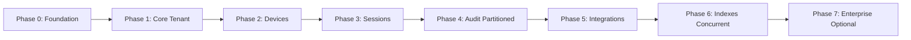
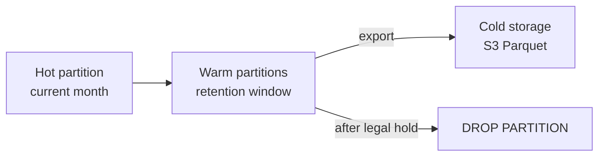
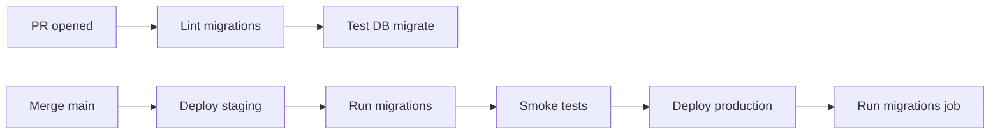
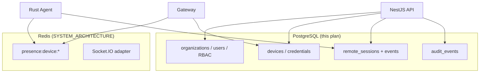

# Database Migrations Plan

## remoteHask — PostgreSQL + TypeORM

| Field | Value |
|-------|-------|
| **Document Version** | 1.0 |
| **Status** | Migration Baseline |
| **Companion** | [DATABASE_SCHEMA.md](./DATABASE_SCHEMA.md), [SYSTEM_ARCHITECTURE.md](./SYSTEM_ARCHITECTURE.md), [PRODUCT_REQUIREMENTS.md](./PRODUCT_REQUIREMENTS.md), [API_SPECIFICATION.md](./API_SPECIFICATION.md), [CODING_STANDARDS.md](./CODING_STANDARDS.md) |
| **Last Updated** | 2026-05-20 |

---

## Table of Contents

1. [Purpose](#1-purpose)
2. [Tooling and Conventions](#2-tooling-and-conventions)
3. [Migration Phases Overview](#3-migration-phases-overview)
4. [Ordered Migration Registry](#4-ordered-migration-registry)
5. [Migration DDL Sketches](#5-migration-ddl-sketches)
6. [Partitioning Strategy and DDL](#6-partitioning-strategy-and-ddl)
7. [Index Migrations](#7-index-migrations)
8. [Triggers and Database Roles](#8-triggers-and-database-roles)
9. [Seed and Reference Data](#9-seed-and-reference-data)
10. [Rollback Policy](#10-rollback-policy)
11. [CI/CD and Deployment](#11-cicd-and-deployment)
12. [Operational Runbooks](#12-operational-runbooks)
13. [Document Cross-Reference Map](#13-document-cross-reference-map)

---

## 1. Purpose

This document defines **how** the schema in [DATABASE_SCHEMA.md](./DATABASE_SCHEMA.md) is applied to PostgreSQL over time:

- Numbered, ordered TypeORM migrations (file naming and dependencies).
- SQL DDL sketches for each migration (review artifacts — not generated application code).
- Partition creation, retention, and archival procedures.
- Production-safe rollout, rollback limits, and operational jobs.

**Goal:** Any engineer can implement migrations in NestJS without ambiguity about order, idempotency, or production impact.

---

## 2. Tooling and Conventions

### 2.1 TypeORM Migration Setup (Planned)

| Setting | Value |
|---------|-------|
| CLI | `typeorm migration:run` via NestJS `package.json` script |
| Config | Dedicated `typeorm.config.ts` (data source only) |
| Path | `apps/api/src/database/migrations/` |
| Naming | `{timestamp}-{PascalCaseName}.ts` |
| `synchronize` | **false** in all environments |
| `migrationsRun` | **false** on app boot — explicit job only |

### 2.2 Migration File Structure (Pattern)

Each migration exports `up` and `down`:

- **`up`:** Forward DDL via `queryRunner.query()` with raw SQL (preferred for partitions and enums).
- **`down`:** Reverse only when safe; partitioned tables may have **non-reversible** `down` (documented).

### 2.3 Naming Convention

```
{UnixMsTimestamp}{Description}.ts

Examples:
  1716200000000-InitExtensionsAndEnums.ts
  1716200100000-CreateOrganizationsAndUsers.ts
```

### 2.4 Idempotency Rules

| Rule | Detail |
|------|--------|
| Extensions | `CREATE EXTENSION IF NOT EXISTS` |
| Enums | Create once in early migration; later values use `ALTER TYPE ... ADD VALUE` |
| Partitions | Check `pg_class` or use dedicated ops script before `CREATE TABLE ... PARTITION OF` |
| Indexes | `CREATE INDEX CONCURRENTLY` **outside** transaction in production (separate migration) |

### 2.5 Transaction Boundaries

| Migration type | In transaction? |
|----------------|-----------------|
| Tables, FKs, enums | Yes (single transaction) |
| `CREATE INDEX CONCURRENTLY` | **No** — one index per migration file |
| Partition detach/drop | **No** — manual ops window |
| Large backfill | **No** — batch job, not migration |

---

## 3. Migration Phases Overview



| Phase | Migrations | Deploy target | Blocking? |
|-------|------------|---------------|-----------|
| **0 — Foundation** | M001–M003 | All envs | Yes — empty DB |
| **1 — Core tenant** | M004–M009 | MVP | Yes |
| **2 — Devices** | M010–M015 | MVP | Yes |
| **3 — Sessions** | M016–M022 | MVP | Yes |
| **4 — Audit (partitioned)** | M023–M025 | MVP | Yes |
| **5 — Integrations** | M026–M031 | MVP+ | No |
| **6 — Concurrent indexes** | M032–M036 | Pre-GA load test | No (online) |
| **7 — Enterprise** | M037–M040 | Enterprise tier | No |

---

## 4. Ordered Migration Registry

| ID | Migration class name | Description | Depends on |
|----|----------------------|-------------|------------|
| **M001** | `InitExtensions` | `pgcrypto`, `citext` | — |
| **M002** | `CreateEnumTypes` | All PostgreSQL ENUMs | M001 |
| **M003** | `CreateUpdatedAtTrigger` | Shared `set_updated_at()` function | M001 |
| **M004** | `CreateOrganizations` | `organizations` + self-FK | M002 |
| **M005** | `CreateOrganizationSettings` | 1:1 settings table | M004 |
| **M006** | `CreateUsers` | Global `users` | M002 |
| **M007** | `CreateOrganizationMembers` | Membership + partial unique | M004, M006 |
| **M008** | `CreateOrganizationInvitations` | Invite tokens | M004, M006 |
| **M009** | `CreateGroupsAndMembers` | `groups`, `group_members` | M007 |
| **M010** | `CreateDevices` | Device registry | M004 |
| **M011** | `CreateDeviceCredentials` | Rotatable secrets | M010 |
| **M012** | `CreateDeviceTags` | Tagging | M010 |
| **M013** | `CreateDeviceGroupAssignments` | Device ↔ group junction | M009, M010 |
| **M014** | `CreateOrganizationPolicies` | JSONB policies | M004, M006 |
| **M015** | `CreateDevicePolicyOverrides` | Per-device overrides | M010 |
| **M016** | `CreateRemoteSessions` | Session header | M010, M006 |
| **M017** | `CreateRemoteSessionParticipants` | Participants | M016 |
| **M018** | `CreateRemoteSessionEventsPartitionedParent` | Partitioned parent table | M016 |
| **M019** | `CreateRemoteSessionEventsInitialPartitions` | Current + next month | M018 |
| **M020** | `CreateFileTransfers` | File audit | M016 |
| **M021** | `CreateSessionQualitySamplesPartitioned` | Sampled metrics | M016 |
| **M022** | `CreateRemoteSessionRecordings` | Recording metadata | M016 |
| **M023** | `CreateAuditEventsPartitionedParent` | Immutable audit parent | M002 |
| **M024** | `CreateAuditEventsInitialPartitions` | Current + next month | M023 |
| **M025** | `CreateAuditImmutabilityTriggers` | Block UPDATE/DELETE | M023 |
| **M026** | `CreateAuthTables` | `refresh_tokens`, `user_mfa_factors` | M006 |
| **M027** | `CreateSsoConnections` | Per-org SSO | M004 |
| **M028** | `CreateApiKeys` | Automation keys | M004, M006 |
| **M029** | `CreateWebhooks` | Webhook config | M004 |
| **M030** | `CreateWebhookDeliveriesPartitioned` | Delivery log | M029 |
| **M031** | `CreateAgentReleases` | Agent packages + device updates | M010 |
| **M032** | `AddDevicesDashboardIndexes` | Concurrent indexes | M010 |
| **M033** | `AddRemoteSessionsIndexes` | Concurrent indexes | M016 |
| **M034** | `AddAuditEventsIndexes` | Concurrent indexes | M023 |
| **M035** | `AddDeviceTagsGinIndex` | Search (optional MVP) | M012 |
| **M036** | `AddBrinIndexesTimeSeries` | BRIN on partition parents | M018, M023 |
| **M037** | `CreateDevicePresenceHistoryPartitioned` | Enterprise uptime | M010 |
| **M038** | `CreateCustomFieldDefinitions` | Enterprise metadata | M004 |
| **M039** | `CreateMspAccessGrants` | MSP child access | M004 |
| **M040** | `CreateFileTransferChunks` | Byte-level audit (optional) | M020 |

---

## 5. Migration DDL Sketches

> **Note:** These are reference SQL sketches for review and ops. TypeORM migrations will embed equivalent statements. Adjust types to match exact [DATABASE_SCHEMA.md](./DATABASE_SCHEMA.md) definitions.

### M001 — InitExtensions

```sql
CREATE EXTENSION IF NOT EXISTS "pgcrypto";
CREATE EXTENSION IF NOT EXISTS "citext";
```

### M002 — CreateEnumTypes

```sql
-- See DATABASE_SCHEMA.md Section 3 for full list
CREATE TYPE organization_status AS ENUM ('active', 'suspended', 'trial', 'churned');
CREATE TYPE subscription_tier AS ENUM ('starter', 'professional', 'enterprise', 'msp');
CREATE TYPE organization_member_status AS ENUM ('active', 'invited', 'suspended', 'removed');
CREATE TYPE invitation_status AS ENUM ('pending', 'accepted', 'expired', 'revoked');
CREATE TYPE system_role AS ENUM (
  'owner', 'admin', 'device_manager', 'technician', 'viewer', 'auditor', 'msp_admin'
);
CREATE TYPE device_platform AS ENUM ('windows', 'macos', 'linux', 'other');
CREATE TYPE device_registration_status AS ENUM ('pending', 'active', 'revoked', 'decommissioned');
CREATE TYPE presence_status AS ENUM ('online', 'offline', 'stale', 'unknown');
CREATE TYPE session_status AS ENUM (
  'requested', 'policy_denied', 'pending_agent', 'negotiating',
  'active', 'ended', 'failed', 'cancelled'
);
CREATE TYPE session_type AS ENUM ('attended', 'unattended');
CREATE TYPE session_end_reason AS ENUM (
  'user_disconnect', 'technician_disconnect', 'agent_reject', 'policy_revoked',
  'timeout', 'network_error', 'admin_terminate', 'error'
);
CREATE TYPE session_event_type AS ENUM (
  'requested', 'policy_evaluated', 'mfa_completed', 'invite_sent',
  'agent_accepted', 'agent_rejected', 'signaling_started', 'webrtc_connected',
  'webrtc_failed', 'file_transfer_started', 'file_transfer_completed',
  'recording_started', 'recording_stopped', 'terminated', 'error'
);
CREATE TYPE file_transfer_direction AS ENUM ('upload_to_device', 'download_from_device');
CREATE TYPE file_transfer_status AS ENUM (
  'pending', 'in_progress', 'completed', 'failed', 'cancelled', 'blocked'
);
CREATE TYPE audit_actor_type AS ENUM ('user', 'device', 'system', 'api_key', 'support');
CREATE TYPE audit_category AS ENUM (
  'organization', 'user', 'device', 'policy', 'session',
  'integration', 'security', 'billing', 'agent'
);
CREATE TYPE audit_severity AS ENUM ('info', 'warning', 'critical');
CREATE TYPE webhook_status AS ENUM ('active', 'disabled');
CREATE TYPE webhook_delivery_status AS ENUM ('pending', 'success', 'failed', 'retrying');
CREATE TYPE agent_release_channel AS ENUM ('stable', 'beta');
CREATE TYPE agent_update_status AS ENUM ('pending', 'downloading', 'installed', 'failed', 'skipped');
```

**Rollback (M002):** `DROP TYPE` only if no dependent tables — typically **no rollback** after M004+.

---

### M003 — CreateUpdatedAtTrigger

```sql
CREATE OR REPLACE FUNCTION set_updated_at()
RETURNS TRIGGER AS $$
BEGIN
  NEW.updated_at = NOW();
  RETURN NEW;
END;
$$ LANGUAGE plpgsql;
```

---

### M004 — CreateOrganizations

```sql
CREATE TABLE organizations (
  id                    UUID PRIMARY KEY DEFAULT gen_random_uuid(),
  parent_organization_id UUID REFERENCES organizations(id) ON DELETE RESTRICT,
  name                  VARCHAR(255) NOT NULL,
  slug                  VARCHAR(63) NOT NULL,
  status                organization_status NOT NULL DEFAULT 'trial',
  tier                  subscription_tier NOT NULL DEFAULT 'starter',
  data_region           VARCHAR(16) NOT NULL DEFAULT 'us-east',
  settings              JSONB NOT NULL DEFAULT '{}',
  created_at            TIMESTAMPTZ NOT NULL DEFAULT NOW(),
  updated_at            TIMESTAMPTZ NOT NULL DEFAULT NOW(),
  deleted_at            TIMESTAMPTZ
);

CREATE UNIQUE INDEX uq_org_slug_active
  ON organizations (parent_organization_id, slug)
  WHERE deleted_at IS NULL;

CREATE TRIGGER trg_organizations_updated_at
  BEFORE UPDATE ON organizations
  FOR EACH ROW EXECUTE FUNCTION set_updated_at();
```

---

### M005 — CreateOrganizationSettings

```sql
CREATE TABLE organization_settings (
  organization_id           UUID PRIMARY KEY REFERENCES organizations(id) ON DELETE CASCADE,
  unattended_enabled        BOOLEAN NOT NULL DEFAULT FALSE,
  mfa_required              BOOLEAN NOT NULL DEFAULT TRUE,
  session_recording_allowed BOOLEAN NOT NULL DEFAULT FALSE,
  max_concurrent_sessions   INT NOT NULL DEFAULT 10,
  file_transfer_max_bytes   BIGINT NOT NULL DEFAULT 5368709120,
  ip_allowlist              INET[],
  retention_audit_days      INT NOT NULL DEFAULT 90,
  retention_session_days    INT NOT NULL DEFAULT 90,
  e2ee_required             BOOLEAN NOT NULL DEFAULT FALSE,
  created_at                TIMESTAMPTZ NOT NULL DEFAULT NOW(),
  updated_at                TIMESTAMPTZ NOT NULL DEFAULT NOW()
);

CREATE TRIGGER trg_organization_settings_updated_at
  BEFORE UPDATE ON organization_settings
  FOR EACH ROW EXECUTE FUNCTION set_updated_at();
```

---

### M006 — CreateUsers

```sql
CREATE TABLE users (
  id                UUID PRIMARY KEY DEFAULT gen_random_uuid(),
  email             CITEXT NOT NULL,
  email_verified_at TIMESTAMPTZ,
  password_hash     VARCHAR(255),
  display_name      VARCHAR(255) NOT NULL,
  avatar_url        TEXT,
  is_platform_admin BOOLEAN NOT NULL DEFAULT FALSE,
  last_login_at     TIMESTAMPTZ,
  created_at        TIMESTAMPTZ NOT NULL DEFAULT NOW(),
  updated_at        TIMESTAMPTZ NOT NULL DEFAULT NOW(),
  deleted_at        TIMESTAMPTZ
);

CREATE UNIQUE INDEX uq_users_email_active ON users (email) WHERE deleted_at IS NULL;
```

---

### M007 — CreateOrganizationMembers

```sql
CREATE TABLE organization_members (
  id                  UUID PRIMARY KEY DEFAULT gen_random_uuid(),
  organization_id     UUID NOT NULL REFERENCES organizations(id) ON DELETE RESTRICT,
  user_id             UUID NOT NULL REFERENCES users(id) ON DELETE RESTRICT,
  role                system_role NOT NULL,
  status              organization_member_status NOT NULL DEFAULT 'active',
  custom_permissions  JSONB,
  last_active_at      TIMESTAMPTZ,
  created_at          TIMESTAMPTZ NOT NULL DEFAULT NOW(),
  updated_at          TIMESTAMPTZ NOT NULL DEFAULT NOW(),
  deleted_at          TIMESTAMPTZ
);

CREATE UNIQUE INDEX uq_org_member_active
  ON organization_members (organization_id, user_id)
  WHERE deleted_at IS NULL;

CREATE INDEX idx_org_members_org ON organization_members (organization_id) WHERE deleted_at IS NULL;
CREATE INDEX idx_org_members_user ON organization_members (user_id) WHERE deleted_at IS NULL;
```

---

### M010 — CreateDevices

```sql
CREATE TABLE devices (
  id                    UUID PRIMARY KEY DEFAULT gen_random_uuid(),
  organization_id       UUID NOT NULL REFERENCES organizations(id) ON DELETE RESTRICT,
  hostname              VARCHAR(255) NOT NULL,
  friendly_name         VARCHAR(255),
  platform              device_platform NOT NULL,
  os_version            VARCHAR(64),
  agent_version         VARCHAR(32),
  registration_status   device_registration_status NOT NULL DEFAULT 'pending',
  last_known_presence   presence_status NOT NULL DEFAULT 'unknown',
  last_seen_at          TIMESTAMPTZ,
  last_seen_ip          INET,
  last_console_user     VARCHAR(255),
  hardware_info         JSONB,
  unattended_enabled    BOOLEAN,
  notes                 TEXT,
  registered_at         TIMESTAMPTZ,
  created_at            TIMESTAMPTZ NOT NULL DEFAULT NOW(),
  updated_at            TIMESTAMPTZ NOT NULL DEFAULT NOW(),
  deleted_at            TIMESTAMPTZ
);

CREATE INDEX idx_devices_org_last_seen
  ON devices (organization_id, last_seen_at DESC)
  WHERE deleted_at IS NULL;
```

---

### M016 — CreateRemoteSessions

```sql
CREATE TABLE remote_sessions (
  id                    UUID PRIMARY KEY DEFAULT gen_random_uuid(),
  organization_id       UUID NOT NULL REFERENCES organizations(id) ON DELETE RESTRICT,
  device_id             UUID NOT NULL REFERENCES devices(id) ON DELETE RESTRICT,
  initiated_by_user_id  UUID NOT NULL REFERENCES users(id) ON DELETE RESTRICT,
  type                  session_type NOT NULL,
  status                session_status NOT NULL DEFAULT 'requested',
  end_reason            session_end_reason,
  policy_snapshot       JSONB,
  mfa_verified_at       TIMESTAMPTZ,
  client_ip             INET,
  user_agent            TEXT,
  webrtc_transport      VARCHAR(16),
  turn_allocation_id    VARCHAR(64),
  bytes_sent            BIGINT,
  bytes_received        BIGINT,
  requested_at          TIMESTAMPTZ NOT NULL DEFAULT NOW(),
  agent_accepted_at     TIMESTAMPTZ,
  connected_at          TIMESTAMPTZ,
  ended_at              TIMESTAMPTZ,
  error_code            VARCHAR(64),
  error_message         TEXT,
  trace_id              VARCHAR(32),
  created_at            TIMESTAMPTZ NOT NULL DEFAULT NOW(),
  updated_at            TIMESTAMPTZ NOT NULL DEFAULT NOW()
);

CREATE INDEX idx_remote_sessions_org_requested
  ON remote_sessions (organization_id, requested_at DESC);

CREATE UNIQUE INDEX uq_remote_sessions_device_active
  ON remote_sessions (device_id)
  WHERE status IN ('pending_agent', 'negotiating', 'active');
```

---

### M018–M019 — Partitioned Session Events (see [Section 6](#6-partitioning-strategy-and-ddl))

### M023–M025 — Partitioned Audit Events (see [Section 6](#6-partitioning-strategy-and-ddl))

---

## 6. Partitioning Strategy and DDL

### 6.1 Partitioned Tables

| Table | Partition key | Interval | Managed by |
|-------|---------------|----------|------------|
| `audit_events` | `created_at` | MONTHLY | Ops cron + migration bootstrap |
| `remote_session_events` | `occurred_at` | MONTHLY | Ops cron |
| `session_quality_samples` | `sampled_at` | MONTHLY | Ops cron |
| `webhook_deliveries` | `created_at` | MONTHLY | Ops cron |
| `device_presence_history` | `observed_at` | MONTHLY | Ops cron (enterprise) |

### 6.2 Parent Table Pattern — `audit_events`

**M023 sketch:**

```sql
CREATE TABLE audit_events (
  id                  UUID NOT NULL DEFAULT gen_random_uuid(),
  organization_id     UUID REFERENCES organizations(id) ON DELETE RESTRICT,
  category            audit_category NOT NULL,
  action              VARCHAR(128) NOT NULL,
  severity            audit_severity NOT NULL DEFAULT 'info',
  actor_type          audit_actor_type NOT NULL,
  actor_user_id       UUID REFERENCES users(id) ON DELETE SET NULL,
  actor_device_id     UUID REFERENCES devices(id) ON DELETE SET NULL,
  actor_api_key_id    UUID,
  target_type         VARCHAR(64),
  target_id           UUID,
  remote_session_id   UUID REFERENCES remote_sessions(id) ON DELETE SET NULL,
  ip_address          INET,
  user_agent          TEXT,
  payload             JSONB NOT NULL DEFAULT '{}',
  trace_id            VARCHAR(32),
  created_at          TIMESTAMPTZ NOT NULL DEFAULT NOW(),
  PRIMARY KEY (id, created_at)
) PARTITION BY RANGE (created_at);
```

> Composite PK `(id, created_at)` satisfies PostgreSQL partition key requirement.

**M024 — Initial partitions:**

```sql
-- Example: bootstrap for May and June 2026
CREATE TABLE audit_events_2026_05 PARTITION OF audit_events
  FOR VALUES FROM ('2026-05-01 00:00:00+00') TO ('2026-06-01 00:00:00+00');

CREATE TABLE audit_events_2026_06 PARTITION OF audit_events
  FOR VALUES FROM ('2026-06-01 00:00:00+00') TO ('2026-07-01 00:00:00+00');
```

**Per-partition indexes** (inherit or attach):

```sql
CREATE INDEX idx_audit_events_2026_05_org_created
  ON audit_events_2026_05 (organization_id, created_at DESC);

CREATE INDEX idx_audit_events_2026_05_category
  ON audit_events_2026_05 (organization_id, category, created_at DESC);
```

### 6.3 Parent Table Pattern — `remote_session_events`

**M018 sketch:**

```sql
CREATE TABLE remote_session_events (
  id                  UUID NOT NULL DEFAULT gen_random_uuid(),
  remote_session_id   UUID NOT NULL REFERENCES remote_sessions(id) ON DELETE RESTRICT,
  organization_id     UUID NOT NULL REFERENCES organizations(id) ON DELETE RESTRICT,
  event_type          session_event_type NOT NULL,
  occurred_at         TIMESTAMPTZ NOT NULL DEFAULT NOW(),
  actor_type          audit_actor_type,
  actor_user_id       UUID REFERENCES users(id) ON DELETE SET NULL,
  metadata            JSONB,
  message             TEXT,
  PRIMARY KEY (id, occurred_at)
) PARTITION BY RANGE (occurred_at);
```

### 6.4 Monthly Partition Provisioning (Ops Script)

Run **on the 1st of each month** (or 15 days ahead via cron):

```sql
-- Template: audit_events_YYYY_MM
DO $$
DECLARE
  start_ts TIMESTAMPTZ := date_trunc('month', NOW() + INTERVAL '1 month');
  end_ts   TIMESTAMPTZ := date_trunc('month', NOW() + INTERVAL '2 months');
  part_name TEXT := 'audit_events_' || to_char(start_ts, 'YYYY_MM');
BEGIN
  IF NOT EXISTS (SELECT 1 FROM pg_class WHERE relname = part_name) THEN
    EXECUTE format(
      'CREATE TABLE %I PARTITION OF audit_events FOR VALUES FROM (%L) TO (%L)',
      part_name, start_ts, end_ts
    );
  END IF;
END $$;
```

Duplicate template for `remote_session_events`, `session_quality_samples`, `webhook_deliveries`.

### 6.5 Retention and Archival



| Table | Default retention | Archive action |
|-------|-------------------|----------------|
| `audit_events` | `organization_settings.retention_audit_days` | `pg_dump` partition → S3 → `DETACH` → `DROP` |
| `remote_session_events` | Match session retention | Same |
| `session_quality_samples` | 30 days | `DROP` without archive |
| `webhook_deliveries` | 90 days | Optional archive |

**Detach sketch:**

```sql
ALTER TABLE audit_events DETACH PARTITION audit_events_2025_01;
-- export offline
DROP TABLE audit_events_2025_01;
```

### 6.6 TypeORM and Partitions

| Concern | Approach |
|---------|----------|
| Entity mapping | `@Entity('audit_events')` on parent; inserts target parent — PostgreSQL routes to partition |
| Migrations | Partition **creation** via raw SQL migrations (M024, monthly ops job) |
| Queries | Always include `created_at` / `occurred_at` range for partition pruning |
| `synchronize` | Never — partitions managed explicitly |

---

## 7. Index Migrations

Concurrent index migrations run **after** table creation, in dedicated files (M032–M036).

### M032 — Devices dashboard (CONCURRENTLY)

```sql
-- Run outside transaction in production
CREATE INDEX CONCURRENTLY IF NOT EXISTS idx_devices_org_presence
  ON devices (organization_id, last_known_presence)
  WHERE deleted_at IS NULL;

CREATE INDEX CONCURRENTLY IF NOT EXISTS idx_devices_org_registration
  ON devices (organization_id, registration_status)
  WHERE deleted_at IS NULL;
```

### M034 — Audit BRIN + btree

```sql
CREATE INDEX CONCURRENTLY IF NOT EXISTS idx_audit_events_brin_created
  ON audit_events USING BRIN (created_at);
```

### Index Migration Checklist

| Step | Action |
|------|--------|
| 1 | Deploy during low-traffic window |
| 2 | `SET statement_timeout = 0` for session |
| 3 | Monitor `pg_stat_progress_create_index` |
| 4 | Verify with `EXPLAIN` on critical queries |

---

## 8. Triggers and Database Roles

### M025 — Audit Immutability

```sql
CREATE OR REPLACE FUNCTION deny_audit_mutation()
RETURNS TRIGGER AS $$
BEGIN
  RAISE EXCEPTION 'audit_events is immutable';
END;
$$ LANGUAGE plpgsql;

CREATE TRIGGER trg_audit_events_deny_update
  BEFORE UPDATE ON audit_events
  FOR EACH ROW EXECUTE FUNCTION deny_audit_mutation();

CREATE TRIGGER trg_audit_events_deny_delete
  BEFORE DELETE ON audit_events
  FOR EACH ROW EXECUTE FUNCTION deny_audit_mutation();
```

> Apply triggers on **parent** table; they propagate to partitions in PostgreSQL 11+.

### Application Database Roles

| Role | Permissions |
|------|-------------|
| `remotehask_api` | `SELECT, INSERT, UPDATE` on app tables; no `DELETE` on `audit_events` |
| `remotehask_api_ro` | `SELECT` only — analytics replica |
| `remotehask_migrator` | DDL for migrations job only |
| `remotehask_gateway` | `SELECT` limited tables + `UPDATE devices.last_seen_at` |

```sql
-- Example (run once in ops bootstrap)
CREATE ROLE remotehask_api LOGIN PASSWORD '...';
GRANT CONNECT ON DATABASE remotehask TO remotehask_api;
GRANT USAGE ON SCHEMA public TO remotehask_api;
-- table grants per migration completion
REVOKE DELETE ON audit_events FROM remotehask_api;
```

---

## 9. Seed and Reference Data

### S001 — Platform bootstrap (SQL seed, not auto-migration in prod)

| Data | Purpose |
|------|---------|
| Platform org (optional) | Internal dogfooding |
| Default `agent_releases` | Latest stable per platform |
| Feature flag defaults | In `organizations.settings` template |

**Run:** `pnpm db:seed` in dev/staging only — **never** auto-run in production.

### S002 — Demo tenant (staging)

- 1 MSP org, 2 child orgs, 50 synthetic devices (scripted).

---

## 10. Rollback Policy

| Migration range | Rollback allowed? | Notes |
|-----------------|-------------------|-------|
| M001–M015 (pre-production) | Yes | `migration:revert` in dev |
| M016+ with session data | **No down** | Forward-only fixes |
| Partition creation (M019, M024) | Detach manually | Not via TypeORM `down` |
| Concurrent indexes | `DROP INDEX CONCURRENTLY` | Safe with care |
| Enum value addition | N/A | Postgres cannot remove enum values easily |

**Production rule:** Broken migration → **forward-fix migration** (`M041-FixXyz`), never revert in place.

---

## 11. CI/CD and Deployment

### 11.1 Pipeline Stages



### 11.2 CI Test Database

| Step | Command (conceptual) |
|------|----------------------|
| Create empty DB | `createdb remotehask_ci` |
| Run all migrations | `npm run migration:run` |
| Run integration tests | NestJS e2e |
| Tear down | Drop DB |

### 11.3 Coolify Deployment Order

Aligns with [SYSTEM_ARCHITECTURE.md §13](./SYSTEM_ARCHITECTURE.md#13-coolify-readiness):

| Order | Job | Service |
|-------|-----|---------|
| 1 | **Pre-deploy migration** | One-off `remotehask-migrator` container |
| 2 | Deploy API | `remotehask-api` |
| 3 | Deploy Gateway | `remotehask-gateway` |
| 4 | Deploy Web | `remotehask-web` |

**Environment variables:**

| Var | Used by |
|-----|---------|
| `DATABASE_URL` | migrator, API, gateway |
| `MIGRATION_LOCK_TIMEOUT_MS` | migrator (advisory lock) |

### 11.4 Advisory Lock (Prevent Concurrent Migrations)

```sql
-- At start of migrator job
SELECT pg_advisory_lock(hashtext('remotehask_migrations'));
-- run migrations
SELECT pg_advisory_unlock(hashtext('remotehask_migrations'));
```

---

## 12. Operational Runbooks

### 12.1 Monthly Checklist

| Task | Owner | When |
|------|-------|------|
| Create next month partitions (all partitioned tables) | SRE | 15th prior month |
| Verify partition bounds vs app clock | SRE | 1st of month |
| Review slow queries on `remote_sessions` | Backend | Weekly |
| Retention job (drop/export old partitions) | SRE | Per org policy batch |

### 12.2 Failure: Insert hits missing partition

**Symptom:** `ERROR: no partition of relation "audit_events" found for row`

**Fix:**

```sql
-- Emergency partition for current timestamp
CREATE TABLE audit_events_emergency_2026_05 PARTITION OF audit_events
  FOR VALUES FROM ('2026-05-01') TO ('2026-06-01');
```

Then run scheduled provisioning script.

### 12.3 Failure: Migration lock timeout

**Symptom:** Deploy stuck on migrator

**Fix:** Identify blocker:

```sql
SELECT pid, state, query
FROM pg_stat_activity
WHERE datname = 'remotehask' AND state != 'idle';
```

Terminate long-running blocking query or reschedule migration window.

### 12.4 Schema Drift Detection

| Check | Frequency |
|-------|-----------|
| Compare TypeORM metadata vs live schema (custom script) | Weekly staging |
| `pg_dump --schema-only` diff vs git | Release candidate |

---

## 13. Document Cross-Reference Map

| Topic | Primary doc | Related |
|-------|-------------|---------|
| Table columns & ERD | [DATABASE_SCHEMA.md](./DATABASE_SCHEMA.md) | §5–§14 |
| Enums | [DATABASE_SCHEMA.md §3](./DATABASE_SCHEMA.md#3-enumerations) | M002 |
| Soft delete | [DATABASE_SCHEMA.md §4](./DATABASE_SCHEMA.md#4-soft-delete-strategy) | M004–M015 |
| Session tables | [DATABASE_SCHEMA.md §11](./DATABASE_SCHEMA.md#11-remote-sessions-and-logging) | M016–M022 |
| Audit tables | [DATABASE_SCHEMA.md §12](./DATABASE_SCHEMA.md#12-audit-tables) | M023–M025 |
| Presence (Redis, not PG) | [SYSTEM_ARCHITECTURE.md §7](./SYSTEM_ARCHITECTURE.md#7-device-heartbeat-architecture) | M010 `last_seen_at` only |
| Session lifecycle | [SYSTEM_ARCHITECTURE.md §8](./SYSTEM_ARCHITECTURE.md#8-remote-session-lifecycle) | M016 state machine |
| Scaling / indexes | [DATABASE_SCHEMA.md §15–19](./DATABASE_SCHEMA.md#15-index-strategy) | M032–M036 |
| Coolify deploy | [SYSTEM_ARCHITECTURE.md §13](./SYSTEM_ARCHITECTURE.md#13-coolify-readiness) | §11.3 here |
| Product retention | [PRODUCT_REQUIREMENTS.md §5.9](./PRODUCT_REQUIREMENTS.md#59-session-logs-and-audit) | §6.5 here |

### Architecture Data Store Summary



---

## Appendix A — Migration Timeline (Suggested)

| Week | Deliverable |
|------|-------------|
| W1 | M001–M009 (tenant + RBAC) |
| W2 | M010–M015 (devices + policies) |
| W3 | M016–M022 (sessions) |
| W4 | M023–M031 (audit + integrations) |
| W5 | M032–M036 (perf indexes) + partition cron |
| W6+ | M037–M040 (enterprise) as needed |

---

## Appendix B — Document Approval

| Role | Name | Date |
|------|------|------|
| Principal Architect | | |
| Backend Lead | | |
| DBA / SRE | | |

---

*End of Document*
