# System Architecture Document

## remoteHask — Remote Desktop & Device Management Platform

| Field | Value |
|-------|-------|
| **Document Version** | 1.0 |
| **Status** | Architecture Baseline |
| **Companion** | [PRODUCT_REQUIREMENTS.md](./PRODUCT_REQUIREMENTS.md), [DATABASE_SCHEMA.md](./DATABASE_SCHEMA.md), [MIGRATIONS_PLAN.md](./MIGRATIONS_PLAN.md), [API_SPECIFICATION.md](./API_SPECIFICATION.md), [CODING_STANDARDS.md](./CODING_STANDARDS.md) |
| **Last Updated** | 2026-05-20 |

---

## Table of Contents

1. [Purpose and Scope](#1-purpose-and-scope)
2. [Technology Stack](#2-technology-stack)
3. [High-Level Architecture](#3-high-level-architecture)
4. [Service Communication](#4-service-communication)
5. [WebSocket Flow (Socket.IO)](#5-websocket-flow-socketio)
6. [WebRTC Signaling Flow](#6-webrtc-signaling-flow)
7. [Device Heartbeat Architecture](#7-device-heartbeat-architecture)
8. [Remote Session Lifecycle](#8-remote-session-lifecycle)
9. [Scaling Strategy](#9-scaling-strategy)
10. [Redis Pub/Sub Strategy](#10-redis-pubsub-strategy)
11. [Security Boundaries](#11-security-boundaries)
12. [Deployment Topology](#12-deployment-topology)
13. [Coolify Readiness](#13-coolify-readiness)
14. [Monitoring Architecture](#14-monitoring-architecture)
15. [Observability Strategy](#15-observability-strategy)
16. [Data Layer Reference](#16-data-layer-reference)
17. [Appendices](#17-appendices)

---

## 1. Purpose and Scope

This document describes the **production system architecture** for remoteHask: how components are decomposed, how they communicate, and how the platform scales, secures, deploys, and is observed.

**In scope:** control plane (Next.js + NestJS), data stores (PostgreSQL, Redis), real-time layer (Socket.IO), media path (WebRTC + coturn), endpoint agent (Rust), deployment on Coolify, and operational tooling.

**Out of scope:** implementation source code, specific library versions, and vendor contract SLAs.

**Architectural principles:**

| Principle | Application |
|-----------|---------------|
| **Separation of control and media** | Signaling and policy ride Socket.IO/HTTPS; desktop pixels ride WebRTC (never through PostgreSQL). |
| **Stateful at the edge, stateless in the core** | Session affinity for Socket.IO; horizontal API scaling behind load balancers. |
| **Redis as coordination bus** | Cross-instance events (presence, signaling relay, session fan-out). |
| **PostgreSQL as source of truth** | Devices, orgs, users, audit, session history metadata. |
| **Defense in depth** | TLS everywhere, tenant-scoped tokens, E2EE option on WebRTC data channels. |

---

## 2. Technology Stack

| Layer | Technology | Role |
|-------|------------|------|
| **Console** | Next.js (App Router) | Operator UI, SSR for auth pages, client-side WebRTC viewer — consumes [API_SPECIFICATION.md](./API_SPECIFICATION.md) |
| **API & Real-Time** | NestJS | REST/GraphQL, RBAC, session orchestration, Socket.IO gateway |
| **Primary DB** | PostgreSQL 16+ | Relational data, audit, tenancy — see [DATABASE_SCHEMA.md](./DATABASE_SCHEMA.md) and [MIGRATIONS_PLAN.md](./MIGRATIONS_PLAN.md) |
| **Cache / Coordination** | Redis 7+ | Cache, presence, pub/sub, rate limits, Socket.IO adapter |
| **Real-Time Transport** | Socket.IO over WebSocket | Agent + technician control channels, signaling relay |
| **Media** | WebRTC (browser + agent) | Encoded desktop stream, input datachannels, file transfer |
| **NAT Traversal** | coturn (STUN/TURN) | ICE candidates, relay when UDP P2P fails |
| **Endpoint** | Rust agent | Capture, encode, persistent connection, OS integration |
| **Reverse Proxy** | Traefik / Caddy (via Coolify) | TLS termination, sticky sessions, WebSocket upgrade |
| **Observability** | OpenTelemetry, Prometheus, Grafana, Loki (or equivalent) | Metrics, traces, logs |

---

## 3. High-Level Architecture

The platform splits into three planes: **Experience**, **Control**, and **Media**.

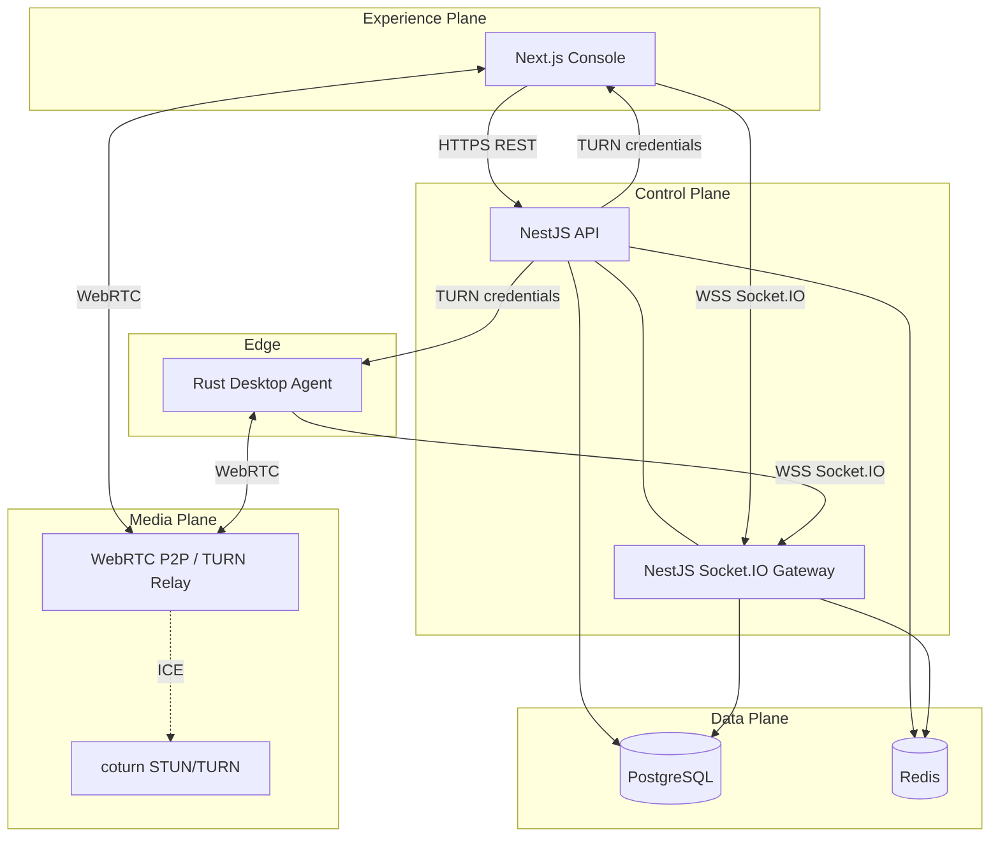

### 3.1 Component Responsibilities

| Component | Responsibilities |
|-----------|------------------|
| **Next.js** | Auth UI, device dashboard, session viewer (WebRTC peer), admin settings, audit export UI |
| **NestJS API** | CRUD, policy engine, session token issuance, TURN credential minting, webhooks, SCIM |
| **NestJS Gateway** | Socket.IO namespaces, agent/technician routing, signaling relay, heartbeat ingest |
| **PostgreSQL** | Organizations, users, devices, policies, session records, audit events |
| **Redis** | Presence cache, pub/sub bus, distributed locks, rate limiting, Socket.IO cluster adapter |
| **Rust agent** | Registration, heartbeat, screen capture/encode, input injection, local policy enforcement |
| **coturn** | STUN binding, TURN allocation with time-limited credentials |

### 3.2 NestJS Module Mapping (Logical)

NestJS ships as a **modular monolith** at MVP with clear module boundaries for future extraction.

| NestJS Module | PRD Module | Notes |
|---------------|------------|-------|
| `AuthModule` | M2 | JWT, SSO, MFA, API keys |
| `OrgModule` | M3 | Tenants, groups, RBAC |
| `DeviceModule` | M4 | Registry, tags, search |
| `SessionModule` | M5 | Lifecycle, policy gates |
| `GatewayModule` | M6 | Socket.IO, heartbeats |
| `SignalingModule` | M7 (control half) | SDP/ICE relay via Redis |
| `FileTransferModule` | M8 | Metadata + datachannel policy |
| `AuditModule` | M9 | Append-only event writes |
| `PlatformModule` | M10 | Feature flags, billing hooks |

### 3.3 Network Zones

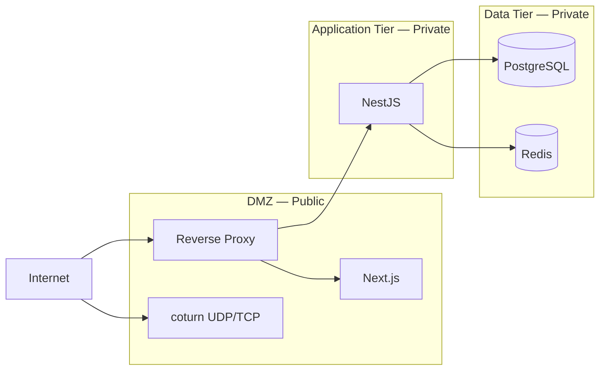

---

## 4. Service Communication

### 4.1 Communication Matrix

| From | To | Protocol | Payload | Auth |
|------|-----|----------|---------|------|
| Browser | NestJS API | HTTPS REST / JSON | CRUD, session start | Bearer JWT (httpOnly cookie optional) |
| Browser | Socket.IO Gateway | WSS (Socket.IO) | Signaling, live updates | JWT in handshake `auth` |
| Rust agent | NestJS API | HTTPS | Register, config pull, update manifest | mTLS or device credential |
| Rust agent | Socket.IO Gateway | WSS | Heartbeat, commands, signaling | Device token |
| NestJS API | PostgreSQL | TCP (TLS) | SQL | Connection pool, app role |
| NestJS API / Gateway | Redis | TCP (TLS) | Commands, pub/sub | ACL per service account |
| Browser ↔ Agent | WebRTC | UDP (+ TCP fallback via TURN) | SRTP video, SCTP data | Session-scoped DTLS (E2EE optional) |
| Browser / Agent | coturn | STUN/TURN | ICE | Short-lived HMAC credentials from API |

### 4.2 Synchronous vs Asynchronous

| Pattern | Use Case |
|---------|----------|
| **Sync REST** | User actions, device CRUD, session authorization |
| **Socket.IO events** | Low-latency signaling, heartbeat, session commands |
| **Redis pub/sub** | Cross-replica gateway fan-out, presence broadcast |
| **PostgreSQL writes** | Durable audit, session history (async queue acceptable) |
| **WebRTC** | Media and bulk file chunks (never block API thread) |

### 4.3 API Gateway and Routing

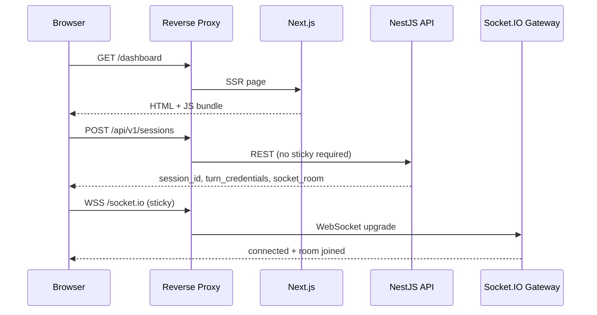

**Sticky sessions** apply only to Socket.IO (see [Section 9](#9-scaling-strategy)). REST remains stateless.

### 4.4 Internal Event Bus (Application Level)

Within each NestJS process, an in-process event emitter handles module decoupling (e.g., `SessionStarted` → `AuditModule`). Cross-process/cross-replica events use **Redis pub/sub** (see [Section 10](#10-redis-pubsub-strategy)).

---

## 5. WebSocket Flow (Socket.IO)

### 5.1 Namespace Design

| Namespace | Clients | Purpose |
|-----------|---------|---------|
| `/agents` | Rust agent | Heartbeat, session offers, signaling from agent side |
| `/console` | Next.js technician | Presence updates, signaling from browser, session UI events |
| `/internal` | NestJS workers (optional) | Cross-service hooks (secured, not public) |

### 5.2 Connection and Authentication Flow

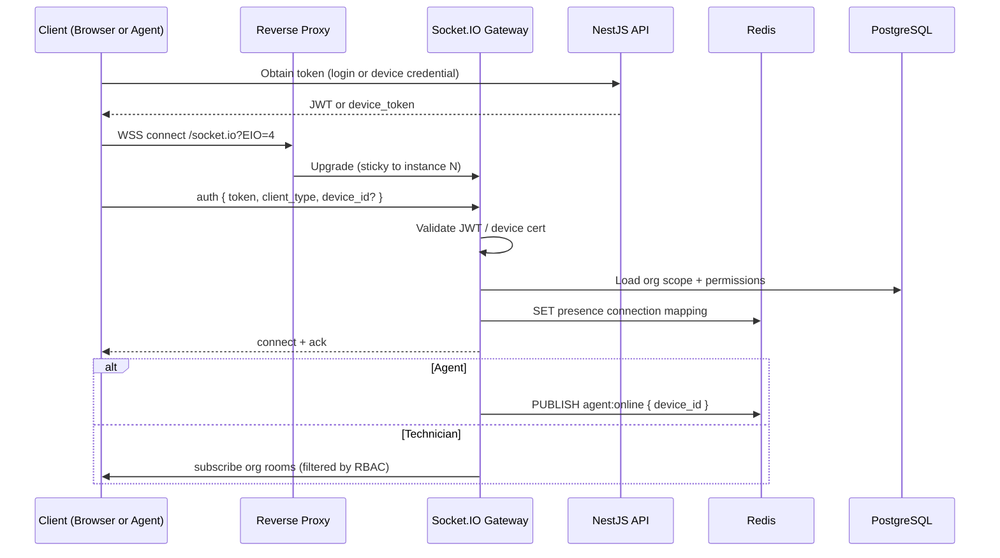

**Rules:**

- Reject connection on invalid/expired token before joining rooms.
- Agents join room `device:{device_id}` only.
- Technicians join `org:{org_id}` and dynamically subscribe `device:{id}` when viewing detail or starting session.
- Never broadcast signaling to org-wide room without session binding.

### 5.3 Room and Event Model

| Room | Members | Events (examples) |
|------|---------|-------------------|
| `device:{uuid}` | Agent for device, technicians in active session | `signaling:offer`, `signaling:answer`, `signaling:ice`, `session:command` |
| `org:{uuid}` | Technicians with org access | `device:presence`, `session:started`, `session:ended` |
| `session:{uuid}` | Agent + initiating technician | `signaling:*`, `session:stats`, `file:progress` |

### 5.4 Cross-Replica Message Flow

When agent and technician land on different Socket.IO instances, messages route through Redis adapter:

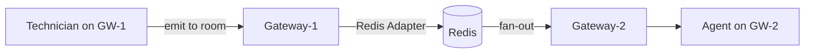

Socket.IO `@socket.io/redis-adapter` synchronizes rooms and events across NestJS replicas.

### 5.5 Reconnection and Resilience

| Scenario | Behavior |
|----------|----------|
| Agent disconnect | Exponential backoff reconnect; presence → `stale` after missed heartbeats |
| Technician refresh | Rejoin rooms; resume `session:{id}` if session still active |
| Gateway instance loss | Client reconnects to another instance via LB; Redis rehydrates room membership |
| Token expiry mid-session | Grace period (30s) to refresh; else controlled session teardown |

---

## 6. WebRTC Signaling Flow

Signaling **does not** traverse PostgreSQL. SDP and ICE candidates exchange over Socket.IO; media flows peer-to-peer or via coturn.

### 6.1 Roles

| Peer | WebRTC Role | Sends |
|------|-------------|-------|
| **Next.js viewer** | Browser RTCPeerConnection | Offer or answer (negotiation profile), ICE candidates |
| **Rust agent** | Native WebRTC stack (e.g., webrtc-rs / libwebrtc FFI) | Answer or offer, encoded video track, input datachannel |

**Recommended negotiation:** Technician browser creates **offer** after session authorized; agent returns **answer** (allows browser to pre-allocate viewer constraints).

### 6.2 End-to-End Signaling Sequence

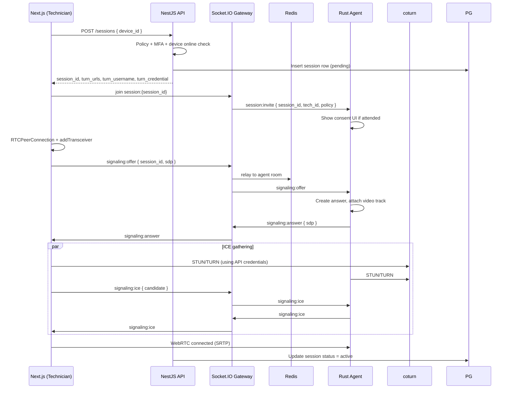

### 6.3 TURN Credential Minting

NestJS `SessionModule` generates **time-limited coturn credentials** (HMAC-SHA1 or REST API per coturn config):

| Field | Source |
|-------|--------|
| `username` | `{expiry}:{session_id}` or `{expiry}:{device_id}` |
| `credential` | HMAC(shared_secret, username) |
| TTL | 5–15 minutes (renewable during session) |

Credentials are scoped per session; relay bandwidth quotas enforced at coturn (`user-quota`, `total-quota`).

### 6.4 Media Path Topology

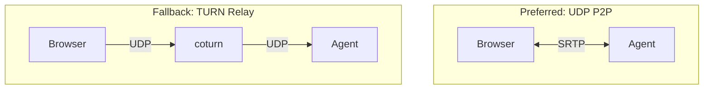

**Note:** When organizational **E2EE** is enabled, TURN relays encrypted SRTP only; coturn cannot inspect payload (DTLS-SRTP end-to-end).

### 6.5 Data Channels

| Channel | Label | Direction | Purpose |
|---------|-------|-----------|---------|
| Reliable ordered | `input` | Browser → Agent | Mouse, keyboard events |
| Reliable ordered | `cursor` | Agent → Browser | Cursor position overlay |
| Partial reliable | `file` | Bidirectional | Chunked file transfer (policy-gated) |
| Unreliable | `stats` | Agent → Browser | FPS, RTT samples for UI |

---

## 7. Device Heartbeat Architecture

### 7.1 Goals

- Accurate **online / offline / stale** presence for dashboard and session gating.
- Minimal write load on PostgreSQL at fleet scale.
- Sub-minute detection for operations; configurable tradeoffs.

### 7.2 Heartbeat Pipeline

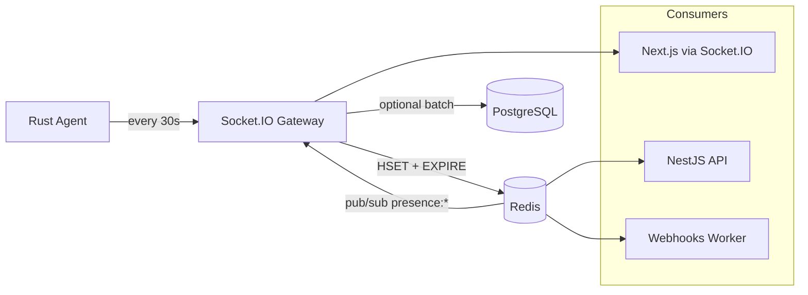

### 7.3 Redis Key Schema (Presence)

| Key | Type | TTL | Value |
|-----|------|-----|-------|
| `presence:device:{id}` | HASH | 120s (refreshed each heartbeat) | `status`, `last_seen`, `agent_version`, `ip`, `user`, `gateway_id` |
| `presence:org:{org_id}:online` | SET | — | Device IDs currently online (maintained by gateway) |
| `device:conn:{id}` | STRING | 120s | `gateway_instance_id` for routing commands |

**Status derivation:**

| Condition | Status |
|-----------|--------|
| Heartbeat within TTL | `online` |
| TTL expired, no disconnect event | `offline` |
| Disconnect received, within grace | `stale` (30s) then `offline` |

### 7.4 PostgreSQL Persistence Strategy

| Data | Frequency | Rationale |
|------|-----------|-----------|
| `devices.last_seen_at` | Every 5 min per device (or on transition) | Dashboard sort, reporting |
| `device_presence_history` (optional) | On online/offline edge | Uptime analytics (enterprise) |
| Full heartbeat payload | Not stored | Avoid DB bloat |

### 7.5 Heartbeat Message Schema (Conceptual)

Agent emits on `/agents` namespace:

| Field | Type | Description |
|-------|------|-------------|
| `device_id` | UUID | Registered device |
| `ts` | ISO8601 | Agent clock (server validates skew) |
| `agent_version` | string | Semver |
| `os_user` | string | Current console user |
| `metrics` | object | CPU%, memory (lightweight) |

Gateway validates `device_id` matches authenticated connection.

### 7.6 Presence Broadcast

On status edge detection (online→offline or reverse):

1. Gateway updates Redis.
2. Publishes `presence:change` on Redis channel.
3. All gateways emit `device:presence` to `org:{org_id}` room (RBAC-filtered on join, not on emit).

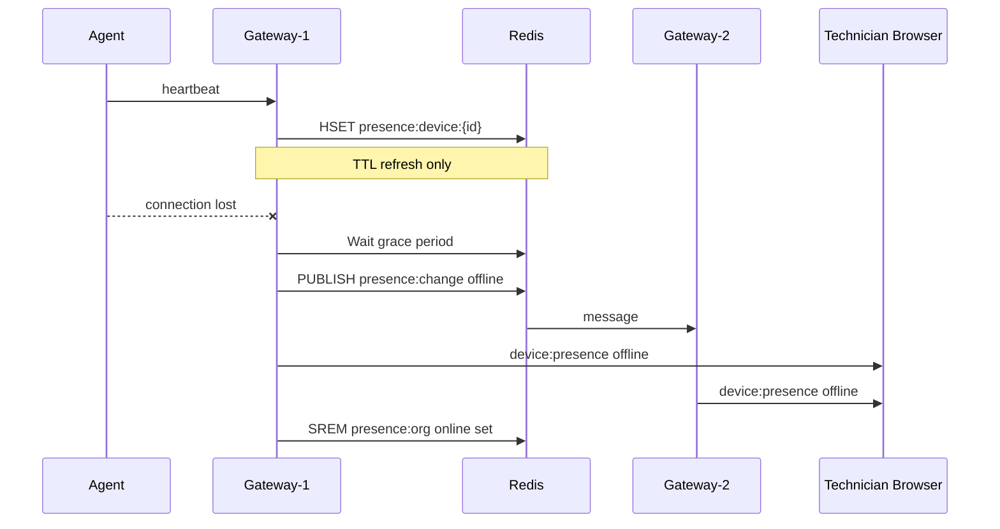

---

## 8. Remote Session Lifecycle

### 8.1 State Machine

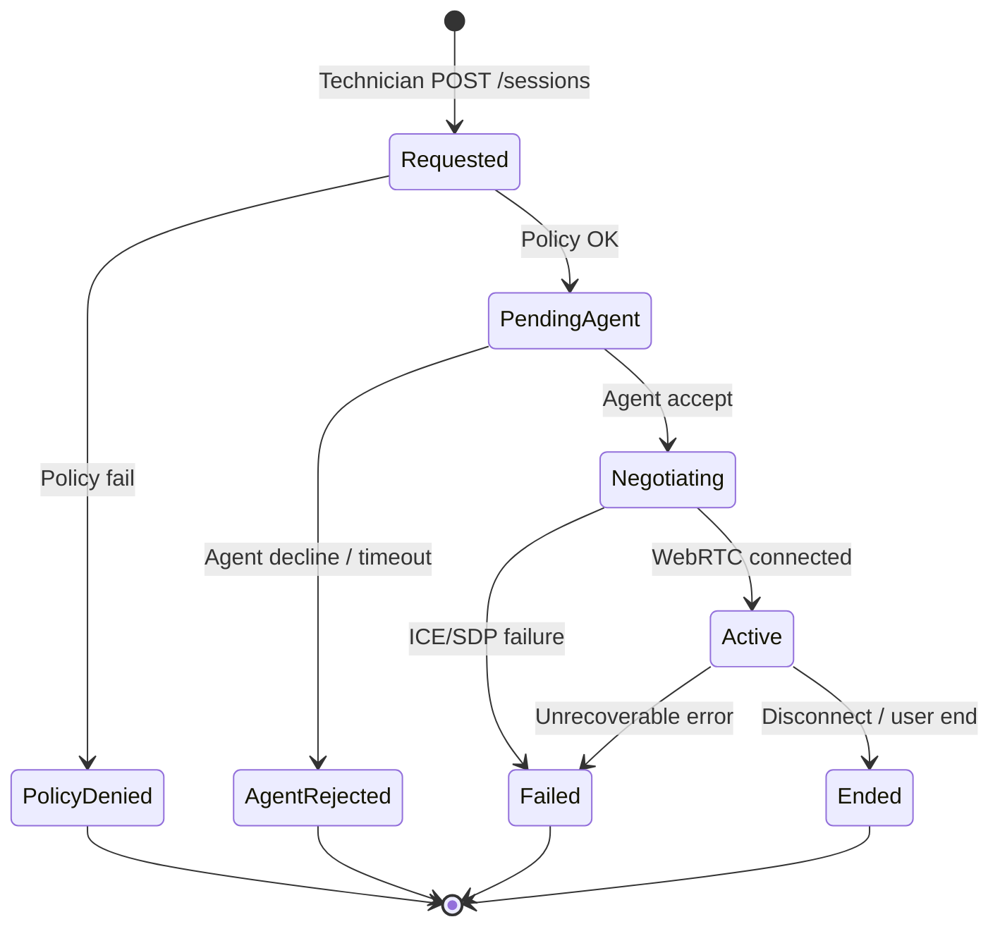

### 8.2 Lifecycle Stages (Detailed)

| Stage | Owner | Actions |
|-------|-------|---------|
| **1. Request** | API `SessionModule` | Validate RBAC, MFA step-up, device online (Redis), unattended policy, quotas |
| **2. Provision** | API | Create `sessions` row (`requested`), mint TURN creds, return `session_id` |
| **3. Invite** | Gateway | Emit `session:invite` to agent; attended → wait for `session:accept` |
| **4. Signaling** | Gateway + Redis | Exchange SDP/ICE via `session:{id}` room |
| **5. Media** | WebRTC | SRTP video + datachannels; stats to UI |
| **6. Active ops** | Agent / Browser | Input, clipboard (policy), file transfer |
| **7. Terminate** | Any party | `session:end` event; API finalizes row, audit log, revoke TURN |

### 8.3 Session Lifecycle Sequence (Consolidated)

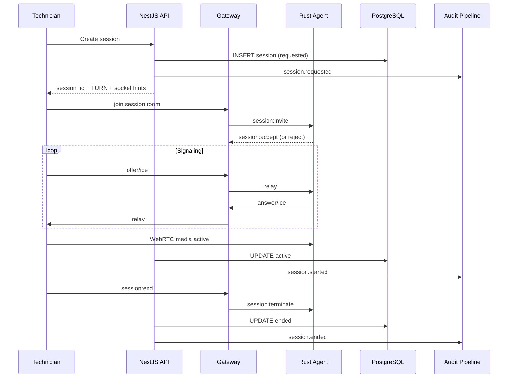

### 8.4 Failure and Timeout Policy

| Failure | Timeout | Recovery |
|---------|---------|----------|
| Agent no response to invite | 30s | Session → `failed`, notify technician |
| ICE connection | 60s | Retry TURN-only gathering once |
| Mid-session disconnect | 15s grace | Auto-reconnect signaling; else end |
| Policy revocation mid-session | Immediate | Gateway sends `session:terminate` |

### 8.5 Concurrent Session Rules

- One **active media session** per device by default (configurable per org).
- Redis lock key `lock:session:device:{id}` during stages PendingAgent → Active.

---

## 9. Scaling Strategy

### 9.1 Scaling Dimensions

| Dimension | Bottleneck | Scale lever |
|-----------|------------|-------------|
| **REST API** | CPU on policy/CRUD | Horizontal NestJS replicas (stateless) |
| **Socket.IO** | Connection memory | Horizontal gateways + Redis adapter + sticky LB |
| **Heartbeats** | Redis write rate | Shard Redis; aggregate writes; tune interval |
| **PostgreSQL** | Read queries on device list | Read replicas, connection pooling (PgBouncer) |
| **WebRTC / TURN** | UDP bandwidth | Regional coturn pools, separate from app tier |
| **Audit ingest** | Write IOPS | Async worker + batch insert / partitioning |

### 9.2 Horizontal Scaling Topology

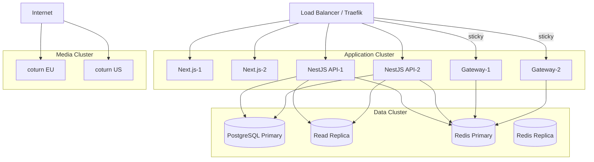

### 9.3 Scale Targets (Aligned with PRD)

| Metric | MVP single region | Growth |
|--------|-------------------|--------|
| Registered devices | 50K | 5M (sharded Redis + PG) |
| Concurrent Socket.IO connections | 20K | 500K+ |
| Concurrent WebRTC sessions | 500 | 100K (coturn fleet) |
| Heartbeats/sec | 2K | 150K+ (dedicated presence workers) |

### 9.4 Evolution Path

| Phase | Architecture change |
|-------|---------------------|
| **MVP** | Modular monolith NestJS + single Redis + single PG |
| **Growth** | Split `Gateway` to dedicated deployment; PgBouncer; read replicas |
| **Scale** | Presence ingestion microservice; regional stacks; CQRS for device search (OpenSearch) |
| **Enterprise** | Per-tenant dedicated coturn; single-tenant PG schema |

### 9.5 Sticky Session Configuration

Required headers for Socket.IO through Traefik/Coolify:

- Cookie-based affinity `SERVERID` or Traefik `sticky.cookie`
- WebSocket pass-through enabled
- Idle timeout ≥ 3600s for long sessions

---

## 10. Redis Pub/Sub Strategy

### 10.1 Dual Use of Redis

| Use | Mechanism | Client |
|-----|-----------|--------|
| **Socket.IO cluster** | Redis adapter (pub/sub under the hood) | Gateway only |
| **Application events** | Explicit channels | API + Gateway + workers |
| **Cache** | Key-value with TTL | API + Gateway |
| **Rate limiting** | INCR + EXPIRE | API middleware |
| **Distributed locks** | Redlock pattern | SessionModule |

### 10.2 Channel Catalog

| Channel | Publishers | Subscribers | Payload |
|---------|------------|-------------|---------|
| `presence:change` | Gateway | Gateway, Webhook worker | `{ device_id, org_id, status, ts }` |
| `session:signal:{session_id}` | Gateway | Gateway | SDP/ICE relay (if not using Socket.IO adapter alone) |
| `session:control` | API | Gateway | `{ session_id, action: terminate }` |
| `org:config:invalidate` | API | Gateway, API instances | `{ org_id }` policy cache bust |
| `audit:ingest` | All services | Audit worker | Audit event envelope |
| `agent:command:{device_id}` | API | Gateway | Remote commands (update, revoke) |

**Design rule:** Prefer **Socket.IO Redis adapter** for signaling fan-out between gateways; use **explicit channels** for business events and cache invalidation to keep observability clear.

### 10.3 Pub/Sub Flow Diagram

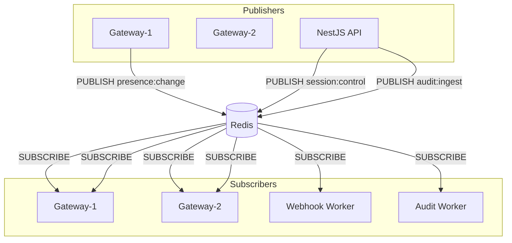

### 10.4 Message Delivery Semantics

| Pattern | Guarantee | Use |
|---------|-----------|-----|
| Redis pub/sub | Fire-and-forget | Presence broadcasts, cache invalidation |
| Redis Streams (Phase 2) | Consumer groups, ACK | Audit pipeline, webhook retries |
| PostgreSQL | ACID | Source of truth |

**At-least-once audit:** Migrate `audit:ingest` from pub/sub to **Redis Streams** or job queue (BullMQ on Redis) before GA if loss on subscriber crash is unacceptable.

### 10.5 Cache Invalidation

| Cache Key | Invalidation trigger |
|-----------|---------------------|
| `policy:org:{id}` | `org:config:invalidate` |
| `device:{id}` | Device update API |
| `user:perms:{id}` | Role change API |

---

## 11. Security Boundaries

### 11.1 Trust Zones

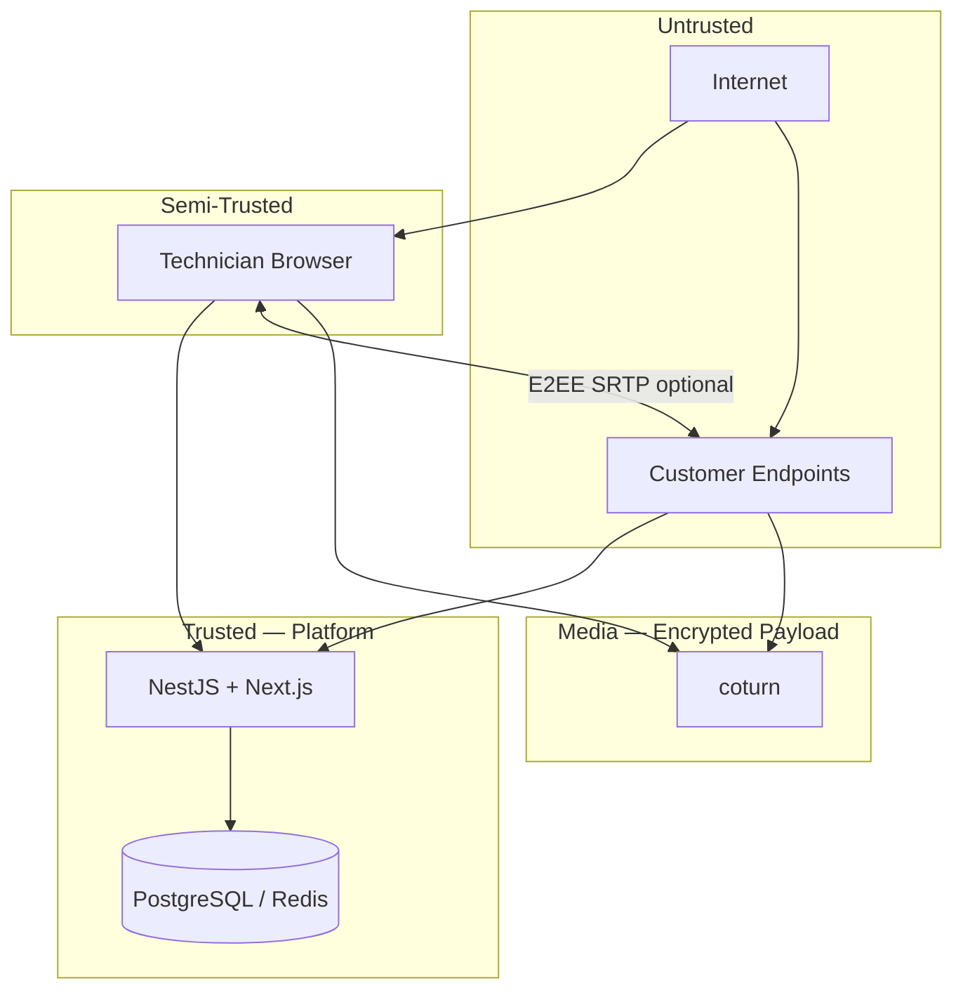

### 11.2 Authentication Boundaries

| Boundary | Mechanism |
|----------|-----------|
| Browser → API | OIDC/SAML → JWT (short-lived) + refresh rotation |
| Browser → Socket.IO | Same JWT in handshake; room join re-validates `org_id` |
| Agent → API/Gateway | Per-device credential (rotatable) + optional mTLS |
| Service → PostgreSQL | Role with least privilege; no superuser from app |
| Service → Redis | ACL: gateway vs API vs worker separation |
| TURN | Time-limited HMAC credentials; no shared long-term password in clients |

### 11.3 Authorization Enforcement Points

| Layer | Enforcement |
|-------|-------------|
| **API middleware** | JWT validation, org scope, RBAC guards |
| **Session create** | Policy engine: unattended, MFA, group membership |
| **Socket room join** | Server-side only; client cannot self-join arbitrary `device:*` |
| **Agent** | Accepts invites only for its `device_id`; local policy cache |

### 11.4 Data Classification

| Class | Examples | Storage | In transit |
|-------|----------|---------|------------|
| **Critical** | Device private keys, TURN secret | KMS / secrets manager | mTLS |
| **Sensitive** | Session recordings, file transfer content | Object storage (optional) | E2EE WebRTC |
| **Internal** | Audit logs, device metadata | PostgreSQL | TLS |
| **Public** | Agent download manifests | CDN | TLS |

### 11.5 Network Policies (Kubernetes / Docker)

| From | To | Port | Default |
|------|-----|------|---------|
| Proxy | Next.js, NestJS | 3000, 4000 | Allow |
| NestJS | PostgreSQL | 5432 | Allow |
| NestJS, Gateway | Redis | 6379 | Allow |
| Internet | coturn | 3478, 5349, relay UDP | Allow |
| Internet | PostgreSQL, Redis | * | **Deny** |
| Gateway | PostgreSQL | 5432 | Allow (minimal queries) |

### 11.6 E2EE Mode

When enabled for an organization:

- DTLS keys negotiated only between browser and agent.
- NestJS sees signaling metadata only (not media keys).
- TURN relays opaque UDP; compliance documented in security whitepaper.

---

## 12. Deployment Topology

### 12.1 Environment Tiers

| Environment | Purpose | Topology |
|-------------|---------|----------|
| **local** | Developer | Docker Compose: all-in-one |
| **staging** | QA, load smoke | Coolify, single node, scaled-down |
| **production** | Live | Coolify multi-service or multi-node |

### 12.2 Production Service Layout

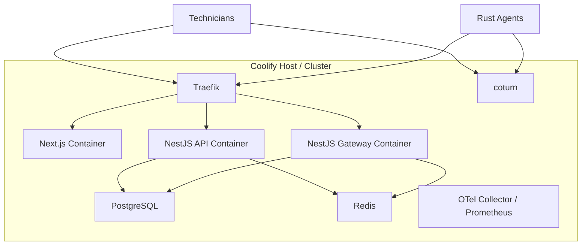

### 12.3 Container Inventory

| Service | Image base | Replicas (prod start) | Persistent volume |
|---------|------------|----------------------|-------------------|
| `remotehask-web` | Node 22 Alpine | 2 | No |
| `remotehask-api` | Node 22 Alpine | 2 | No |
| `remotehask-gateway` | Node 22 Alpine | 2 | No |
| `remotehask-postgres` | postgres:16 | 1 (+ replica ext.) | Yes |
| `remotehask-redis` | redis:7 | 1 (+ sentinel later) | Optional AOF |
| `remotehask-coturn` | coturn/coturn | 1 per region | No |
| `remotehask-otel` | otel-collector | 1 | No |

**Note:** Gateway may share NestJS codebase with API but runs as **separate process** to scale connection memory independently.

### 12.4 DNS and Ports

| Record | Target | Ports |
|--------|--------|-------|
| `app.remotehask.example` | Next.js via Traefik | 443 |
| `api.remotehask.example` | NestJS API | 443 |
| `ws.remotehask.example` | Socket.IO Gateway (optional dedicated host) | 443 |
| `turn.remotehask.example` | coturn | 3478 UDP/TCP, 5349 TLS |

Dedicated `ws.*` hostname simplifies sticky routing and timeout tuning.

### 12.5 Rust Agent Distribution

| Artifact | Delivery |
|----------|----------|
| Windows MSI / macOS PKG / Linux deb | Hosted on `downloads.*` (S3 or proxied static) |
| Update manifest | `GET /api/v1/agent/releases` (signed JSON) |
| Auto-update | Agent polls manifest; verifies Ed25519 signature |

Agent communicates only with `api.*` and `ws.*` (and `turn.*` for ICE)—no direct DB access.

---

## 13. Coolify Readiness

Coolify is the target **self-hosted PaaS** for staging and production. Architecture choices below ensure smooth deployment.

### 13.1 Coolify Compatibility Checklist

| Requirement | Implementation |
|-------------|----------------|
| **12-factor config** | All secrets via Coolify environment variables |
| **Health endpoints** | `GET /health` on API, Gateway; `GET /api/health` on Next.js |
| **Dockerfile per service** | `web`, `api`, `gateway` separate images |
| **Traefik labels** | WebSocket support, sticky cookie for gateway service |
| **Database** | Coolify-managed PostgreSQL plugin or external managed PG |
| **Redis** | Coolify Redis service or Upstash external |
| **Persistent volumes** | PostgreSQL data, Redis AOF (optional) |
| **Zero-downtime deploy** | Rolling update with health check grace (30s) |
| **coturn** | Deploy as Coolify service with `network_mode: host` or published UDP range |

### 13.2 Recommended Coolify Service Definitions

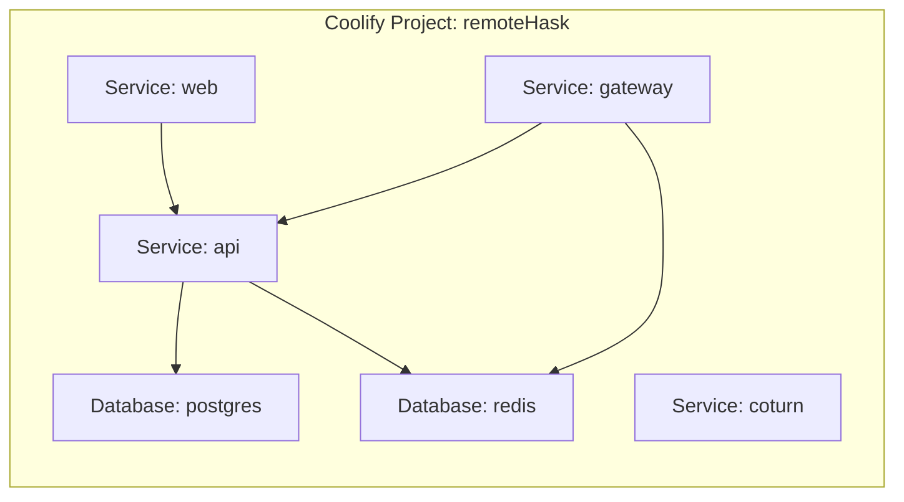

### 13.3 Environment Variable Groups

| Group | Examples | Attached to |
|-------|----------|-------------|
| `shared` | `NODE_ENV`, `LOG_LEVEL`, `OTEL_EXPORTER_OTLP_ENDPOINT` | All app services |
| `auth` | `JWT_SECRET`, `OIDC_*` | API, Gateway, Web |
| `data` | `DATABASE_URL`, `REDIS_URL` | API, Gateway |
| `turn` | `TURN_SECRET`, `TURN_REALM`, `TURN_EXTERNAL_IP` | API, coturn |
| `web` | `NEXT_PUBLIC_API_URL`, `NEXT_PUBLIC_WS_URL` | Web only |

### 13.4 Traefik / Coolify Routing Rules

| Path / Host | Backend | Notes |
|-------------|---------|-------|
| `app.*` | Next.js:3000 | Standard HTTPS |
| `api.*` | NestJS API:4000 | REST |
| `ws.*` | Gateway:4001 | WebSocket, **sticky sessions** |
| `turn.*` | coturn | UDP not via Traefik—use DNS to host IP |

### 13.5 Backup and DR on Coolify

| Asset | Method | RPO |
|-------|--------|-----|
| PostgreSQL | Coolify scheduled backup or `pg_dump` to S3 | 15 min |
| Redis | RDB snapshots (presence rebuilds from agents) | 5 min acceptable |
| Secrets | Coolify vault + offline break-glass | — |
| Agent binaries | Versioned object storage | N/A |

### 13.6 Local Parity

`docker-compose.yml` (not documented here as code) mirrors Coolify services for dev: same env var names, same port mapping, coturn with `--external-ip` for LAN testing.

---

## 14. Monitoring Architecture

### 14.1 Observability Pillars

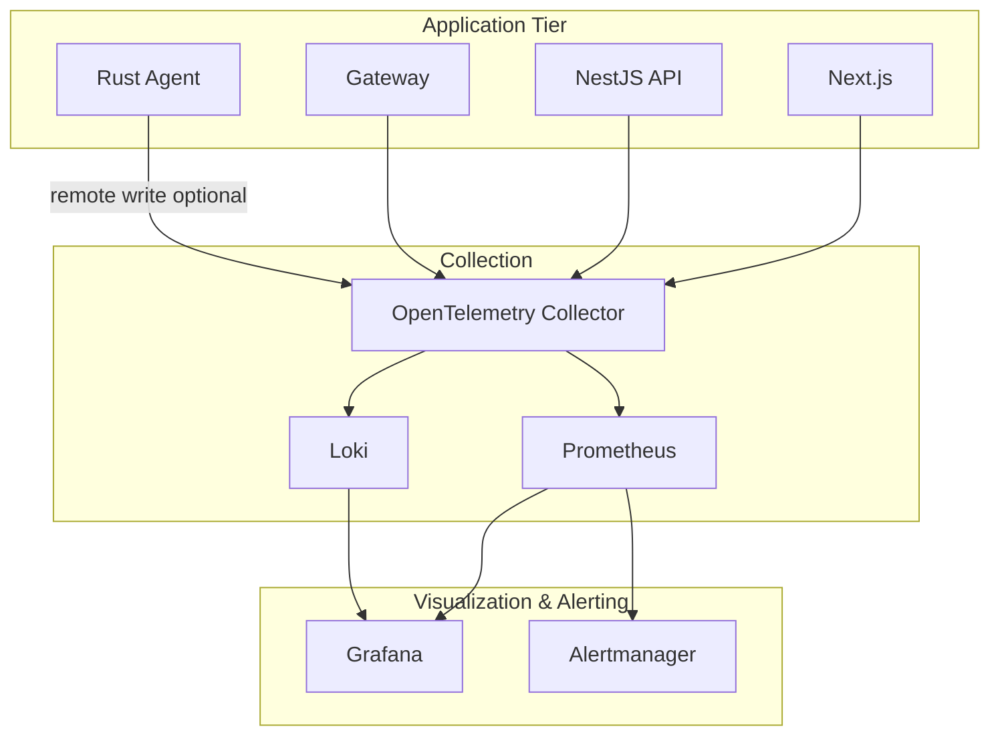

### 14.2 Golden Signals by Component

| Component | Latency | Traffic | Errors | Saturation |
|-----------|---------|---------|--------|------------|
| **Next.js** | TTFB, page load | RPS | 5xx, hydration errors | CPU/memory |
| **API** | P95 REST latency | req/s | 4xx/5xx rate | Pool wait, event loop lag |
| **Gateway** | Signal round-trip | connections, msgs/s | auth failures, disconnect rate | connections/instance |
| **PostgreSQL** | query duration | transactions | deadlocks | connections, disk |
| **Redis** | command latency | ops/s | evictions, OOM | memory |
| **coturn** | allocation time | allocations/s | auth failures | bandwidth |
| **Agent** | encode latency | sessions | crash rate | CPU, GPU encoder |

### 14.3 Critical Dashboards

| Dashboard | Audience | Key panels |
|-----------|----------|------------|
| **Platform Overview** | Ops | Active sessions, online devices, error budget |
| **Real-Time** | Engineering | Socket.IO connections, Redis pub/sub lag |
| **Sessions** | Support | Connect success rate, ICE failure reasons |
| **Database** | DBA | Slow queries, replication lag |
| **TURN** | Network | Relay vs P2P ratio, bandwidth per region |
| **Security** | SecOps | Auth failures, revoked device attempts |

### 14.4 Alerting Tiers

| Severity | Example | Response |
|----------|---------|----------|
| **P1** | API availability &lt; 99.9% rolling 1h | Page on-call |
| **P2** | Session connect success &lt; 98% 15min | Slack + ticket |
| **P3** | Redis memory &gt; 80% | Business hours |
| **P4** | Agent update failure rate spike | Review next sprint |

### 14.5 Synthetic Monitoring

| Probe | Frequency | Location |
|-------|-----------|----------|
| API health + auth smoke | 1 min | 3 regions |
| Socket.IO connect | 5 min | 3 regions |
| TURN allocate test | 5 min | Per coturn node |
| End-to-end session (test agent) | 15 min | Primary region |

---

## 15. Observability Strategy

### 15.1 Three Pillars Implementation

| Pillar | Standard | Implementation |
|--------|----------|----------------|
| **Logs** | Structured JSON | Pino (NestJS), correlation ID `trace_id` |
| **Metrics** | Prometheus exposition | `@opentelemetry/sdk-metrics` + RED/USE |
| **Traces** | W3C Trace Context | OpenTelemetry → Tempo/Jaeger |

### 15.2 Correlation and Context Propagation

Every inbound HTTP and Socket.IO connection receives:

| Field | Source |
|-------|--------|
| `trace_id` | Generated or from `traceparent` header |
| `org_id` | JWT (never log PII in clear text) |
| `user_id` / `device_id` | Auth context |
| `session_id` | When in session flow |

Logs, metrics, and traces share `trace_id` for pivot in Grafana.

### 15.3 Log Policy

| Level | Production default | Examples |
|-------|-------------------|----------|
| `error` | Always | DB connection failure, unhandled exception |
| `warn` | Always | Policy deny, rate limit hit |
| `info` | Sampled 10% for heartbeat | Session state changes (always) |
| `debug` | Off | SDP contents (never in prod) |

**Prohibited in logs:** TURN passwords, refresh tokens, raw keyboard input, screen content.

### 15.4 Trace Spans (Critical Paths)

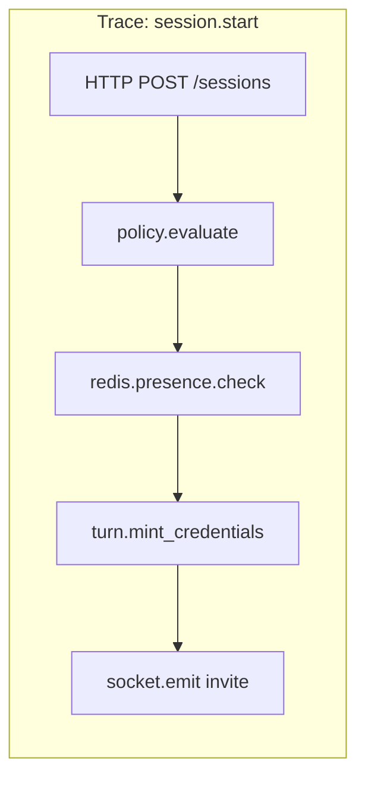

### 15.5 Business Metrics (Product Analytics)

Exported to Prometheus / warehouse for KPI tracking (PRD Section 3.3):

| Metric | Type |
|--------|------|
| `sessions_started_total` | Counter |
| `sessions_connected_total` | Counter (WebRTC ok) |
| `session_time_to_first_frame_seconds` | Histogram |
| `devices_online_gauge` | Gauge |
| `heartbeat_received_total` | Counter |
| `file_transfer_bytes_total` | Counter |

### 15.6 Agent Telemetry

Rust agent batches lightweight metrics to Gateway over Socket.IO (`agent:metrics`) or HTTPS fallback:

- Encode FPS, bitrate, packet loss estimate
- Crash reports (symbolicated offline, no user content)

### 15.7 Incident Response Integration

| Tool | Integration |
|------|-------------|
| **Grafana OnCall / PagerDuty** | Alertmanager webhook |
| **Status page** | Automated from P1 synthetics |
| **Audit** | Session and admin logs queryable by `trace_id` post-incident |

### 15.8 Privacy and Retention

| Data type | Retention |
|-----------|-----------|
| Application logs | 30 days hot, 90 days cold |
| Traces | 7 days sampled (100% errors) |
| Metrics | 13 months |
| Audit events | Per org policy (90d – 7y) |

---

## 16. Data Layer Reference

PostgreSQL schema, tenancy model, and migration rollout are documented separately. This architecture doc owns **runtime behavior** (Redis presence, session orchestration); the data docs own **durability and DDL**.

| Document | Contents |
|----------|----------|
| [DATABASE_SCHEMA.md](./DATABASE_SCHEMA.md) | ERD, entities, enums, indexes, soft delete, session/audit tables, query guidance |
| [MIGRATIONS_PLAN.md](./MIGRATIONS_PLAN.md) | Ordered migrations M001–M040, partition DDL, CI/CD, Coolify migrator job, ops runbooks |

### 16.1 Data Store Responsibilities

| Store | Owns | Does not own |
|-------|------|--------------|
| **PostgreSQL** | Orgs, users, devices (registry), policies, `remote_sessions`, `audit_events`, file transfer metadata | Live online/offline, signaling SDP, media |
| **Redis** | `presence:device:*`, Socket.IO adapter rooms, rate limits, session locks | Long-term audit retention |
| **Object storage** (future) | Session recording blobs | — |

### 16.2 Deploy Order (with schema)

See [MIGRATIONS_PLAN.md §11.3](./MIGRATIONS_PLAN.md#113-coolify-deployment-order): run **migrator** before API/Gateway so NestJS entities match live DDL.

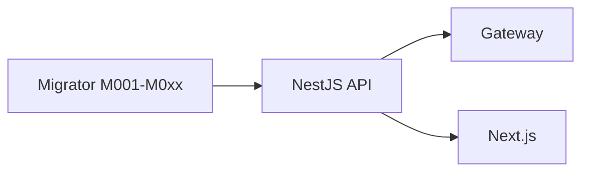

### 16.3 Partition Maintenance

Monthly partition creation and retention jobs are **operational**, not application boot — see [MIGRATIONS_PLAN.md §6.4–6.5](./MIGRATIONS_PLAN.md#64-monthly-partition-provisioning-ops-script).

---

## 17. Appendices

### 17.1 Sequence Index

| Diagram | Section |
|---------|---------|
| High-level platform | [3](#3-high-level-architecture) |
| API routing | [4.3](#43-api-gateway-and-routing) |
| Socket.IO auth | [5.2](#52-connection-and-authentication-flow) |
| Cross-replica relay | [5.4](#54-cross-replica-message-flow) |
| WebRTC signaling | [6.2](#62-end-to-end-signaling-sequence) |
| Heartbeat pipeline | [7.2](#72-heartbeat-pipeline) |
| Session state machine | [8.1](#81-state-machine) |
| Redis pub/sub | [10.3](#103-pubsub-flow-diagram) |
| Trust zones | [11.1](#111-trust-zones) |
| Production deploy | [12.2](#122-production-service-layout) |
| Observability | [14.1](#141-observability-pillars) |

### 17.2 Port Reference

| Service | Port (internal) | Public |
|---------|-----------------|--------|
| Next.js | 3000 | 443 via proxy |
| NestJS API | 4000 | 443 |
| Gateway | 4001 | 443 |
| PostgreSQL | 5432 | No |
| Redis | 6379 | No |
| coturn | 3478, 5349 | Yes (UDP critical) |

### 17.3 Architecture Decision Records (Summary)

| ADR | Decision | Rationale |
|-----|----------|-----------|
| ADR-001 | Socket.IO over raw WS | Room semantics, Redis adapter maturity, fallback transport |
| ADR-002 | NestJS modular monolith | Team velocity; clear module splits for later extraction |
| ADR-003 | Rust agent | Memory safety, performance for capture/encode |
| ADR-004 | coturn | Industry-standard TURN; simple credential model |
| ADR-005 | Redis for presence hot path | Protect PostgreSQL from heartbeat storm |
| ADR-006 | Coolify-first deploy | Self-hosted PaaS aligns with SaaS + private cloud PRD |
| ADR-007 | TypeORM migrations + partitioned audit | See [MIGRATIONS_PLAN.md](./MIGRATIONS_PLAN.md); `synchronize: false` always |

### 17.4 Open Architecture Questions

| ID | Question | Impact |
|----|----------|--------|
| AQ-1 | Separate `ws.*` hostname at MVP or path-based `/socket.io`? | Routing complexity |
| AQ-2 | BullMQ vs Redis Streams for audit? | Durability |
| AQ-3 | libwebrtc vs webrtc-rs in agent? | Platform support matrix |
| AQ-4 | Single NestJS process vs split API/Gateway at MVP? | Ops overhead vs scale headroom |

### 17.5 Document Approval

| Role | Name | Date |
|------|------|------|
| Principal Architect | | |
| Engineering Lead | | |
| Security | | |
| DevOps / SRE | | |

---

*End of Document*
